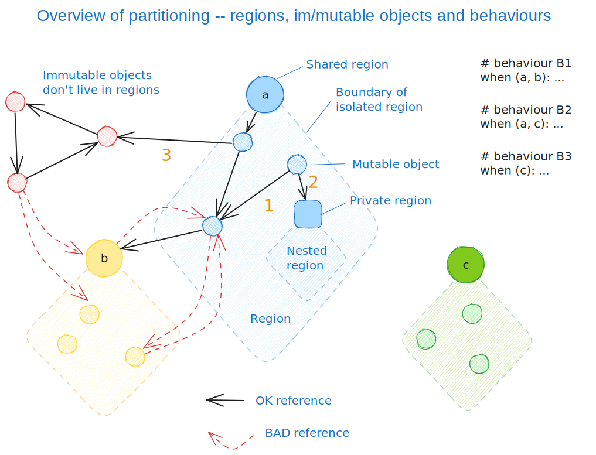

PEP: 9999
Title: The FrankenPEP for Venice and BoC
Author: Matthew Johnson, Matthew Parkinson, Sylvan Clebsch, Tobias Wrigstad
Status: Draft
Type: Standards Track
Content-Type: text/x-rst
Created: 16-Jun-2023
Python-Verson: TBD

Abstract
========

The PEP proposes an extension to Python with "Behaviour-oriented
Concurrency", a new concurrency model that is safe (in the sense
of being guaranteed to be free from data races) and does not 
require a GIL.

The PEP extends Python with tree new concepts: *behaviours*,
*regions* and *region objects*.

We divide objects into two categories, mutable and immutable. All
mutable objects in a program are divided into isolated regions. Each 
region is reified as a region object that allows explicit region
manipulation. Regions can be *shared* or *private*. Private regions
can be manipulated synchronously, whereas shared regions can be 
manipulated only asynchronously. A dynamic check ensures that  
the contents of a shared region is accessed by at most one running 
task at a time. Finally, a behaviour is a task that operates on
zero or more regions.

The isolation of regions ensure that accesses to objects are never
contended.

This picture may seem complicated, it contains everything 
we need to explain all aspects of this PEP.

Proposal
========

Summary:

* Add the new concept `behaviour`_ 
* Add the new concepts `region`_, `shared region`_, `private region`_ and `region object`_
* Add a new runtime component for scheduling and running behaviours
* Add new dynamic checking to enforce isolation

The following description first discusses the rationale for
adopting a new concurrency model in Python. The rest of the
description then takes a bottom-up approach. It starts by defining
regions and their reification in Python as region objects, and
operations on region objects. It then distinguishes private and
shared regions and introduces behaviours and how behaviours are
exposed to Python programmers in form of the ``when`` language
construct.

Rationale
---------

Behaviour-oriented Concurrency (BoC for short) is a concurrency
model where programs are comprised of tasks that we call
*behaviours*. A behaviour only has access to immutable objects,
objects created inside the behaviour, and objects inside regions
passed to the behaviour at the time of its creation.

A region is a set of mutable objects. We refer to the reified set
as a *region object*. Regions do not overlap, so the intersection
of two regions is always empty. Furthermore, objects inside a
region can only be pointed to by other objects in the same region.

A regions is either private or shared. Shared regions can form any
topology. Private regions always form a forest topology. If a
private region object is only referenced from stack variables or
from "its own objects", it is a *root*, and has no enclosing
region. If a private region is referenced from objects other than
its own, those objects must all be in the same region. We refer to
this enclosing region as the *parent region*. The forest topology
is enforced by dynamic checking.

Regions are created as private but may be shared using an explicit
operation. 

Accessing the contents of a region requires *opening* the region.
A private region can be opened synchronously. A shared region can
only be opened asynchronously by spawning a behaviour. The runtime
ensures that behaviours that open the same region never run at the
same time. 

Unlike e.g. a finish/async model, behaviours do not return values
or join at a particular program point. Such a model encourages a
fork/join style way of building programs, which have a hard time
saturating multicore machines due to Amdahl's law. In BoC,
programs "continue" by behaviours spawning more behaviours, and
coordination happens when behaviours operate on the same regions.

Spawning a behaviour can be likened with an asynchronous method
call to a method that has no return value, and whose arguments are
zero or more shared regions.

In order to transition from spawned to running, a behaviour needs
to *acquire* all its shared regions. (If the behaviour has no
parameter, it can transition to running immediately.) The runtime
ensures that only one behaviour at a time can acquire a shared
region. The implementation guarantees that multiple spawned
behaviours whose parameters include the same regions will not
deadlock, and that only one of such behaviours will be able to run
at a time.

Thus, inside a running behaviour, all accessible regions are
effectively private. In other words, the behaviour has exclusive
access to all mutable state that it can reach. Therefore, it
cannot race with concurrent behaviours.

When a behaviour finishes, it `releases`_ all shared regions so
that they can be acquired by other scheduled behaviours. (It is
not possible to manually release a region, nor to release it
before a behaviour finishes.)

One of the key features of BoC is that it allows happens-before
relations between behaviours to be expressed easily in a readable
way by tying it to program order and how shared regions are
chained across behaviours. In combination with the data-race
freedom from isolation, this makes it considerably easier to
reason about concurrent programs, than less structured models. See
`Examples`_.

Regions and Region Objects
--------------------------

A region is a set of mutable objects that are isolated from the
mutable objects in the rest of the program. Isolation means that
an object in a region can only be referenced by objects in the
same region. Every region has a unique *region object* that serves
as the entry point into a region. In addition to references from
the region itself, the region object can have a single incoming
reference from another region.

We distinguish mutable objects from `immutable objects`_. The latter 
do not live in regions and can be referenced freely from any region.
For now, we will concentrate on mutable objects only as they are
the one's requiring special treatment (to preserve `region isolation`_).

Below, we will use the functions ``region(o)``, ``is_region_obj(r)``
and ``is_immutable(o)`` to explain properties of the system. These
functions are not part of the programming model, just useful in this
documentation. 

The function ``region(o)`` returns the region object for the region
that contains the mutable object ``o``, or ``None`` if ``o`` is 
immutable. 
The function ``is_region_obj(r)`` tests whether ``r`` is a region
object (and if so returns ``True``).
The function ``ìs_immutable(o)`` tests whether ``o`` is immutable or
not.

With these functions in place, we can explain region isolation 
using the following code example, which is guaranteed to return 
``True`` if ``o`` is a mutable object::
  
   def example(o):
     r1 = region(o)
     r2 = region(o.f)     # Assume o.f is defined and not None
     return r1 == r2 or \                       # (1)
            is_region_obj(r2) or \              # (2)
            (r2 == None and is_immutable(o.f))  # (3)

The numbers in the cases above refer to the orange number in the
overview picture at the start of the PEP.

Region Isolation
~~~~~~~~~~~~~~~~

Region isolation is enforced by runtime checking. A write to a field
will raise an exception if the object stored in the field belongs to
another region. When called with objects belonging to different
regions, the following function returns ``True``::
  
   def example(o1, o2):
     assert region(o1) != region(o2)
     try:
       o1.f = o2
     except RegionIsolationError:
       return True
     return False

Region Creation
~~~~~~~~~~~~~~~

Regions are created by creating a region object::
  
  r = Region("optional name")

This creates a new region which is empty except for the region
object itself. The optional name is used in messages in exceptions
for debugging purposes.

To add an object in a region, we first open the region (see below), 
allocate the object we want to add, and then store the object in a field 
in the region object, or in a field of another object in the
region. 

Opening and Closing Regions
~~~~~~~~~~~~~~~~~~~~~~~~~~~

Regions have two states: *open* and *closed*. Regions are closed
upon creation. When a region is closed, its objects (and `nested
regions`_) are not accessible to the program::
  
  x = r.field         # raises RegionIsolationError
  r.field = object()  # -''-

Regions are opened using the standard ``with`` construct::
  
  r = Region("my region")
  # r is now closed
  with r:
    # r is now open
    x = r.field         # OK, read r's root into stack variable x
    r.field = object()  # OK, store new object in r's root
  # r is now closed again

**TODO** How should we guard against the following situation?

  ::

    r1 = Region("r1")
    x = None
    with r1:
      r1.field = { 'key' : 'value '}
      x = r1.field
    print(x)  # Accesses object inside closed region

One possible solution is to perform a trivial escape analysis 
on code at import time and insert a dynamic error where we 
detect the leak, possibly guarded by a dynamic check. This will
avoid false positives and only trigger an error when it actually
occurs.

The Current Region
~~~~~~~~~~~~~~~~~~

We refer to the most recently opened region as the *current*
region. All allocations take place in the current region. The
following code creates two regions, ``r1`` and ``r2`` and
creates one object in each region::
  
  r1 = Region("r1")
  r2 = Region("r2")
  with r1:
    o1 = object()   # Created in r1
  with r2:
    o2 = object()   # Created in r2

In the drawing notation of above, this can be illustrated thus:

The following code snippet is equivalent to the one above::
  
  r1 = Region("r1")
  r2 = Region("r2")
  with r1:
    o1 = object()    # Created in r1
    with r2:
      o2 = object()  # Created in r2

The difference between the two last examples is that in the
second, ``r1`` and ``r2`` are both open simultaneously on
the line where ``o2`` is created. 

A region can be opened multiple times, so the following code
is legal::

  with r1:
    with r2:
      with r1:
        r1.field = object()

Note how storing the new object in ``r1.field`` creates a reference
from the region object to the new object. Unless an object is reachable
from the region object, it will become garbage once the region closes,
since there can be no local variables that may reference it.

(Note: there is no need to open a region multiple times but allowing
it makes code more compositional.)

.. _nested regions:
.. _nested:

Nesting Regions
~~~~~~~~~~~~~~~

Regions can be *nested* -- this happens automatically when an
object in a region stores a region object. The following code
creates a region with a list object whose elements are all
region objects::

  r1 = Region("r1")
  with r1:
    r1.field = [Region("r%d") % i for i in range(2,5)]

If region ``r1`` is nested inside region ``r2``, we say that
``r2`` is the (direct) parent or ``r1``. A region that is not
nested inside another is called *independent*. All regions are
created as independent.

Only an independent region may be nested inside another region. An
attempt at nesting a region twice inside the same region or inside
multiple regions will raise a ``NestingException``::

  r1 = Region("r1")
  r2 = Region("r2")
  r3 = Region("r3")
  with r1:
    r1.field1 = [r3]       # OK, nests r3 in r1
  with r2:
    r2.field2 = r3         # raises NestingException
  with r1:
    append(r1.field1, r3)  # raises NestingException

Changing the nesting topology is possible by first detaching the
region before the second nesting. Detaching a region makes it
independent::
  
  ...
  with r1:
    r1.field1 = None   # detaches r3 from r1, r3 becomes independent
  with r2:
    r2.field2 = r3     # OK

Python's swap semantics is supported::

  ...
  with r1:
    with r2:
      r1.field1, r2.field2 = r2.field2, r1.field1

**Note:**
The reason why we do not allow a region to be nested multiple
times inside the same region is to make it easy to move a region 
and change the topology. A more relaxed design is possible where
we count how many times a region *r* is nested in its parent, and 
decrement *r*'s counter each time a field containing a *r* is 
overwritten by some other value. In this case detachment happens
only when the counter reaches 0.

Opening a nested region is only permitted if its parent region is open.
Thus, the following code leads to a ``NestingException``::

  r1 = Region("r1")
  r2 = Region("r2")
  with r1:
    r1.field = r2  # Nest r2 directly inside r1
  with r2:         # raises a NestingException since r1 is closed
    ...            # unreachable code
      
    
Merging Regions
~~~~~~~~~~~~~~~

A closed region can be *merged* into an open region::
  
  # r1 is an open region, r2 is closed
  x = r2.merge(r1)

The code above *moves* all objects in ``r2`` into ``r1``. The
variable ``x`` is a list (if necessary) of all the contents 
of all variables in ``r2``. 

After merging, the ``r2`` region still exists but is empty --
all its fields are ``None`` etc.

Merging a region is *shallow*, meaning that nested regions are
unaffected.

Merging from an open region or into a closed region raises a
``MergeException``.

Freezing Regions
~~~~~~~~~~~~~~~~

A region's entire contents can be turned `immutable`_ by
*freezing* it::

  x = r2.freeze()

Freezing a region is *deep*, meaning that nested regions are also
frozen. Freezing removes all frozen region objects from the
frozen object graph. Consider the following code::

  r2 = Region("r2")
  r3 = Region("r3")
  with r2:
    r2.field = [47, r3]
    with r3:
      r3.field = 11
  x = r2.freeze()

The resulting value in ``x`` is the list ``[47, 11]`` stored in
``r2``, with the frozen content of the nested region ``r3``
as the second element. As a side-effect of the above, the region
objects ``r2`` and ``r3`` become empty and independent.

Freezing an open region raises a ``FreezeException``.

Note that freezing avoids several of the problems that led to
the `rejection <https://mail.python.org/pipermail/python-dev/2006-February/060793.html>`_ 
of `PEP 351 <https://peps.python.org/pep-0351/>`_:

- The side-effects of freezing a region are known because the 
  region is isolated
- You only freeze a closed region, meaning there are no variables
  etc. that can reach the contents of the region and can witness
  the change in mode
- Freezing is in-place, not by copy

.. _immutable:

Immutable Objects
-----------------

An immutable object's observable state cannot be changed.
(Unobservable state such as its reference count can change.)
An immutable object may only reference other immutable objects.

All attempts to change an immutable object, e.g. a write to a
field, will raise a ``ImmutabilityException``, and the object will
be left unchanged.

Concurrent Owner
----------------

A concurrent owner (cown for short) is a *resource* that is only 
accessible from within behaviours that have successfully acquired
it. A cown can be acquired by at most one behaviour at a time.

A cown is a thin wrapper around a `region object`_. A cown must be
created from an `independent region`_ (otherwise a
``CownCreationException`` is raised)::

  c = cown(Region("r1"))

A region inside a cown is `nested`_ inside that cown, so cannot be used
to create another cown, or be nested inside some other region while 
it is in the cown.

Cowns can be freely stored in fields without creating a nesting
relation between the region of the object and the region in the cown::

  c = cown(Region("r1"))
  r2 = Region("r2")
  r3 = Region("r3")
  with r2:
    with r3:
      r1.field = c  # OK
      r2.field = c  # OK

A cown's region can be accessed in two ways: *moving* and *borrowing*::

  r1 = c.move()
  r2 = c.borrow()

As the names imply, moving takes a region out of the cown whereas
borrowing keeps a region in the cown. Taking a region out of a cown
detaches it from the cown, and makes the region independent. This
allows the region to be nested in another region, used to create 
another cown, etc. 

A cown's region can be updated by the method ``install()``::

  r = Region("r")
  c.install(r)

Calls to ``move()``, ``borrow()`` or ``install()`` on a cown that is
not acquired by the current behaviour raises a ``CownNotAcquiredException``.

Behaviours
----------

A behaviour can be thought of as a task with a set of cowns that must
be acquired by the runtime before the task can run. A behaviour
has no return value.

We refer to behaviours whose cown sets are overlapping as *overlapping
behaviours*. The runtime guarantees that overlapping behaviours are
serialised. 

Behaviours are created (we say spawned) using a new syntactic construct
called ``when``. The following code example spawns a behaviour that 
must acquire the cown ``c1`` to run (this is handled automatically 
by the runtime)::

  when (c1):
    r = c1.borrow()
    with r:
      ...

The following code spawns a behaviour that swaps the contents of two
cowns::

  when (c1, c2):
    r1, r2 = c1.move(), c2.move()
    c2.install(r1)
    c1.install(r2)

Ordering Behaviours
-------------------

The program order of spawns of overlapping behaviours controls the 
happens-before relation between them. In the following example, 
behaviour *b1* is guaranteed to run before *b2* but not before *b3*::

  when (c1, c2):   # b1
    ... 

  when (c2):       # b2
    ...

  when (c3):       # b3, does not overlap with b1 or b2
    ...

To ensure that *b3* does not run before *b1*, we can either introduce
a temporary cown to make them overlapping::

  c4 = cown()          # Empty cown
  when (c1, c2, c4):   # b1
    ... 

  when (c2):           # b2 -- can run as soon as b1 finishes
    ...

  when (c3, c4):       # b3 -- can run as soon as b1 finishes
    ...

or we can spawn *b3* at the end of *b1*::

  when (c1, c2):   # b1
    ... 
    when (c3):     # b3
      ...

  when (c2):       # b2
    ...

Note that program order refers to order of execution in a single 
behaviour. In the following case, *b2* may run before or after *b4*::

  c = cown(Region("r"))
  when ():     # b1
    when (c1): # b2
      ...

  when ():     # b3
    when (c1): # b4
      ...

Examples
========

TODO

Glossary
========

.. _independent region:

independent region
  A region that does not have a parent region.

nested regions
  The region *c* is nested inside the region *p* if an object
  in *p* has a field that points to *c*, or if *p*'s root is *c*.  

.. _region:

region
  A set of mutable objects including a region object.

.. _region object:

region object
  A single instance of the class ``Region`` that acts as a 
  frontend for a region.

root or root field
  A field in a region object that holds a mutable object in
  the region. Access to a region's root field requires that
  the region is open.

open region
  A region r is open if there is a `with r` block on the 
  stack. An open region can grown (new objects allocated in
  the region), shring (objects in the region are deallocated),
  and read and written.

closed region
  Objects in a closed region are not accessible to the program 
  without first opening the region. 

.. _cown:

cown or concurrent owner
  TODO

cown set
  The set of cowns that must be acquired by a behaviour in order
  for it to run.

.. _behaviour:
.. _behaviours:

behaviour
  TODO
  
spawning a behaviours
  TODO

happens-before relation
  TODO

.. _acquire:

acquire a cown
  A behaviour implicitly acquires all cowns in its cown set before
  transitioning to the running state. The runtime ensures that
  acquisition is deadlock and livelock free.

Open Questions
==============

- What is the semantics of opening? order? nesting?
- How do we ensure that an object isn't stored in a local variable whose lifetime is longer than the open-scope of its region?
- Merging, freezing and nesting is sound because we only allow a region object to be referenced from one field
- Can an immutable object have a mutable class?
