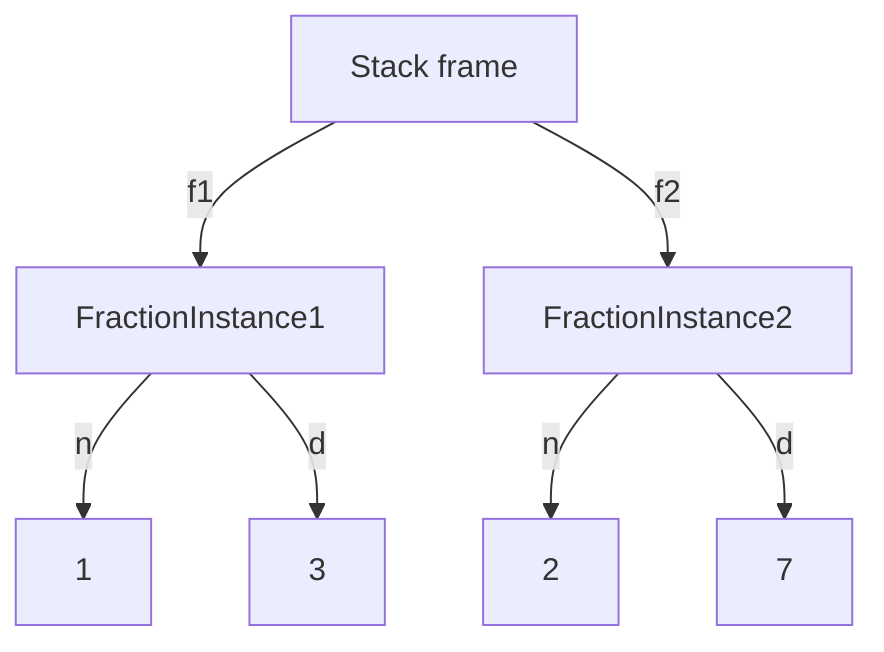
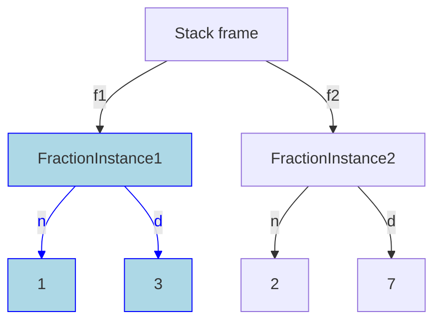
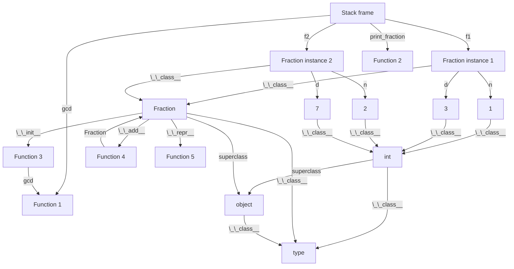
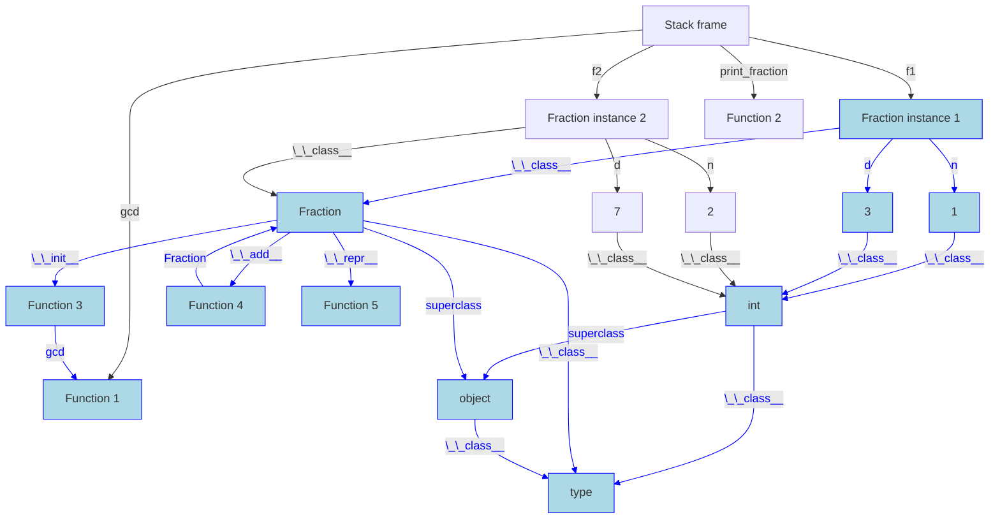
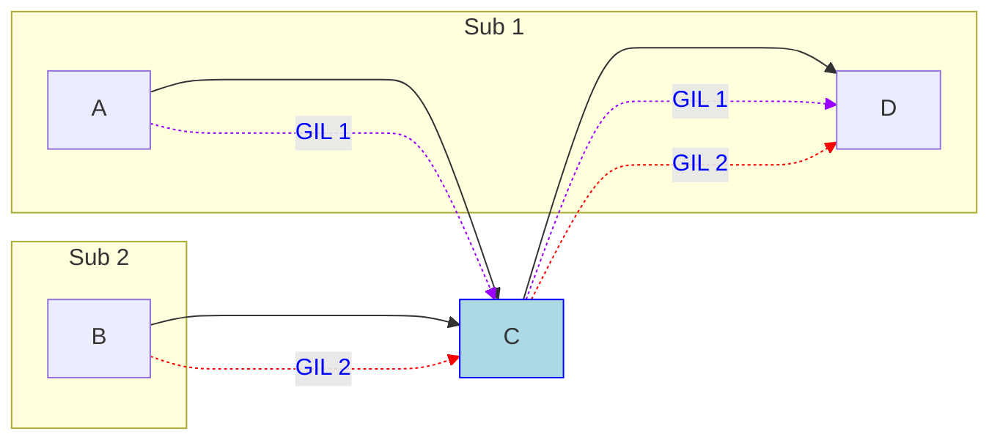
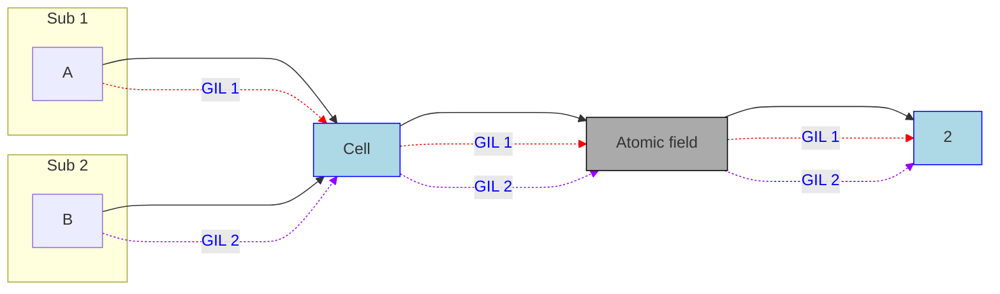
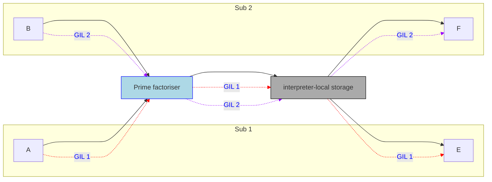
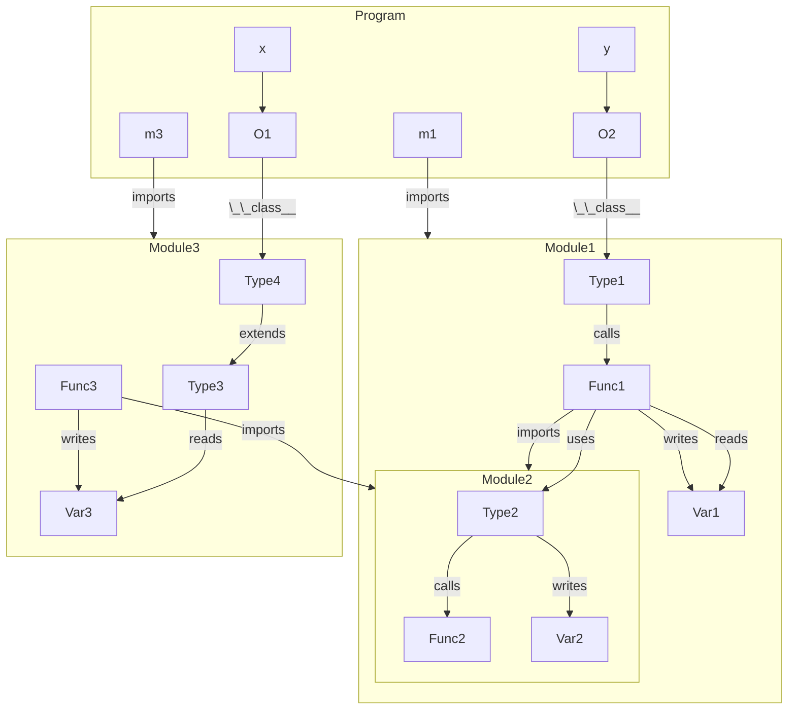

# Deep Immutability for Efficient Sharing and Concurrency Safety

This PEP proposes that Python objects can be made immutable after
which attempts to mutate them results in an exception. We will
refer to the act of making an object immutable as "freezing it".
There is no way to make an immutable object mutable again.
However, one can make a mutable copy of an immutable object.

The motivation for immutability is four-fold: 

1. Immutable objects is a very useful concept in programming that
   simplifies programming. In particular immutable objects are
   safe to share between concurrent threads without any
   synchronisation in the program.
2. Immutable objects can be shared directly by reference across
   subinterpreters. This is a big performance boost for as Python
   currently requires objects to be transferred across
   subinterpreters by pickling. This also simplifies programming
   with subinterpreters.
3. Since immutable objects are safe from data races, it is
   possible to avoid some of the overhead surrounding field access
   that is needed for correct reference counting in free-threaded
   Python.
4. Memory for immutable objects can be safely managed without leaks
   without cycle detection, even when there are cycles in the 
   immutable objects. This takes pressure off normal cycle 
   detection in both subinterpreters and free-threading.

In this PEP, we strive to create a semantics for immutable
objects that is consistent across both subinterpreters and
free-threaded Python. This is a difficult problem as
subinterpreters rely on isolation plus a per-interpreter GIL for
correctness, whereas free-threading has no GIL.


# Semantics of Immutability

This section describes the immutability semantics. All user-facing
functions in this PEP are in the module `immutable`. The most
important function is `freeze()` that makes an object immutable.
Note that freezing is *in-place*; `freeze(obj)` freezes `obj` and
for convenience also returns a reference to (now immutable) `obj`.

```python
class Person:
    def __init__(self, name):
        self.name = name

monty = [Person("Eric"), Person("Graham"), Person("Terry")]
freeze(monty)

monty.append(Person("John")) # throws exception because monty is immutable
monty.pop()                  # --''--

monty[0].name = "John"       # throws exception because all person objects 
                             # in monty are immutable too
```

Making an object immutable means that subsequent attempts to write
to its fields will raise an exception. (The attempt to append or
pop above will both result in `TypeError: object of type list is
immutable`.) Furthermore, by default, immutability is **deep**.
This means that an immutable object is only permitted to point to
other immutable objects. This has consequences in Python as
functions, modules and types are objects too. We will use the
following running example to explain the semantics of freezing:

```python
def gcd(a, b):
    while b:
        a, b = b, a % b
    return a

def print_fraction(f):
    counter += 1
    print("Fraction: {f} (fractions printed in total: {counter})")

class Fraction:
    def __init__(self, numerator, denominator):
        d = gcd(numerator, denominator)
        self.n = numerator // d
        self.d = denominator // d

    def __add__(self, other):
        num = self.n * other.d + other.n * self.d
        den = self.d * other.d
        return Fraction(num, den)

    def __repr__(self):
        return f"{self.n}/{self.d}"

f1 = Fraction(1, 3)
f2 = Fraction(2, 7)
freeze(f1)
f1 = f1 + f2
```

Let us first focus on "normal Python objects" that the user has
explicitly created, meaning we ignore modules, functions, and
types.

Right before freezing, we have the following object graph.



After we have executed `freeze(f1)`, the "ice blue" objects will have
been frozen:



Lines drawn in blue denote references that are stored in a field of an
immutable object. Thus, the contents of `f1.n` and `f1.d` cannot change,
but the stack variable `f1` can be made to point to an entirely different
object. (As happens in the next line of the code `f1 = f1 + f2`.)

Let's now bring in functions, modules, and types. To reduce
clutter, we will not draw the full object graph, since there are
lots of other default functions e.g. `__eq__` in every type, etc.
So with some simplifications, the object graph of our example
above looks like this right before freezing:



Note the line from `Function 3` (`Fractions.__init__`) to `Function 1` (`gcd`).
This is the reference that `__init__` captures to the declaration of
`gcd` in the enclosing state. If `gcd` was the result of an import,
the result would have been the same.

To see what should be the effect of freezing, we can go back to
the first sentence in the second paragraph of this section which
says that (by default), an object that is immutable may not point
to an object which is mutable. Thus, we can start by following
`f1` to its object, colour it "ice blue", and then keep following
pointers and colour the objects we discover (and lines) to see
what gets frozen as a consequence of `freeze(f1)`. Here is the
result:



The figure above shows that freezing the object pointed to by `f1`
freezes the objects in its fields (`1` and `3`), as well as the
object representing the `Fraction` class at run-time. Making a
class immutable means that operations that adds, removes, or
changes functions in the class will subsequently fail, and will
also make any state in the class immutable. Since the `Fraction`
class object has a pointer to the supertype object, `type`, `type`
also becomes immutable. Similarly, freezing the numerator and
denominator `1` and `3` causes the `int` class to become
immutable.

Making `Fraction` immutable also makes all
method/function/etc. objects, `__init__`, `__add__`, and
`__repr__` immutable. Making a function object immutable
means that the function is not permitted to capture
mutable state. Of the three functions in `Fraction`,  only
`__init__` captures external state: a reference to `gcd`.
This means that the `gcd` function must be made immutable
too. Notably, `__add__` has a reference to `Fraction`
which would  also have to be made immutable, but is alredy
immutable in this example. (It's becoming immutable is what
causes `__add__` to become immutable in the first place.)

Note that the `gcd` variable in the stack frame did not become
immutable, although it is pointing to an immutable object. It is
still possible to reassign that variable. Also note that while a
Python class technically has a reference to all its subclasses, we
do not freeze subclasses, only superclasses, when a class is
frozen. We will return to this later and explain when it is
possible to make exceptions such as this one.

This PEP will make certain Python objects immutable by default.
This will be discussed in a separate section below. These objects
include `type`, `object` and `int` as well as all integers like
`1`, `2`, `3` and `7`. Thus, out of the objects frozen by
`freeze(f1)` in the example, 4 would already have been frozen.

**In summary:**

* Making an object immutable blocks subsequent mutation of the object
* Making a class immutable makes its functions and any class state immutable, and blocks changes to the class
* An immutable object may only point to other immutable objects (modulo escape hatches discussed below)
* An immutable function may only capture references to immutable objects (including other functions that it calls, modulo escape hatches) -- note that immutable functions may freely mutate any mutable state they can reach

Finally, let us consider modules. Let's say that `gcd` was
imported from the module `useful_stuff` like so:
`from useful_stuff import gcd`. In this case, `gcd` would be
made immutable just like above. If `gcd` captured parts of its
defining module, then those parts would be made immutable too.

What if `gcd` had been called from `__init__` like this:
`useful_stuff.gcd()`? A possible implementation would have first
frozen the entire module object, which would have propagated to
`gcd`. We follow a different path: when we freeze `__init__`,
we extract `gcd` from `useful_stuff`, and ignore the module object
altogether (unless `gcd` internally captures the module object).
This design limits freeze propagation. Note that if the program
does `useful_stuff.gcd = other_function`, this will not affect
`__init__`, which will retain the behaviour at the time it was
made immutable.


## Design considerations due to subinterpreters

Note: in this PEP, when we talk about subinterpreters, we always
mean subinterpreters configured to use their own GIL
(`PyInterpreterConfig_OWN_GIL`) so as to permit efficient use of
multiple cores in a Python program. Quoting from Python/C API
Reference manual, the section on Initialization, Finalization, and
Threads:

> Sub-interpreters are most effective when isolated from each
> other, with certain functionality restricted

The restriced functionality notably includes that subinterpreters
may not share objects by reference -- each subinterpreter should
be isolated. This isolation permits a subinterpreter to use its
own GIL to ensure that reference manipulation and cycle detection
cannot be corrupted due to concurrency in the Python program.
Quoting again from the same source as above:

> If you preserve isolation then you will have access to proper
> multi-core computing without the complications that come with
> free-threading. Failure to preserve isolation will expose you to
> the full consequences of free-threading, including races and
> hard-to-debug crashes.

This PEP will enhance subinterpreters so that immutable objects
can be shared directly. The technical aspects of making this
possible will be discussed further down in this document, but in
essence, the fact that an object is immutable permits the object
to be shared and accessed without a GIL, and its memory managed
safely without using the subinterpreters' cycle detectors. This is
not the case for mutable objects, and if a mutable object could be
accessed by multiple subinterpreters, the Python VM could crash or
be susceptible to use-after-free bugs that could corrupt data
silently. If immutability could be circumvented, the same would be
true for immutable objects. This motivates a rather strict
interpretation of immutability, where the mutable and immutable
"worlds" are kept apart. (Although see esacpe hatches below.)

This explains (at a high-level) why an immutable function may only
call other immutable functions. Recall that all mutable objects
live inside their creating subinterpreter. Assume it is possible
to share an immutable object (including function) with a reference
to a mutable object O in one subinterpreter, Sub 1, with another
subinterpreter, Sub 2. Now both Sub 1 and Sub 2 can access the
shared mutable object -- Sub 1 uses its GIL to ensure that
manipulations of O are carried out correctly, while Sub 2 uses its
GIL. Since these GIL's are different, operations that must be
atomic may in fact not be.

The picture below shows the situation above pictorially -- each
yellow box shows one subinterpreter's heap. Objects A and D are
mutable and reside in the heap of Sub 1. Object B is mutable and
resides in the heap of Sub 2. A and B both point to an immutable
shared object. To avoid confusion, note that **the reference from
C to D is not legal in this PEP**, and this example shows what
happens if it was allowed. The colours on the dashed arrows show
which subinterpreter is using a reference to access an object. We
annotate the accesses with what GIL is used to synchronise actions
on the object. Because of the reference from C to D, it is
possible to have two accesses with different GILs, meaning these
accesses to not synchronise. This can cause the D object to become
prematurely collected, etc. If we forget about cycle detection,
the problem with the different GILs not synchronising can be
mitigated by very stringent locking in the program around accesses
to D (that notable must not even permit multiple concurrent
readers since this this could lead to a race on reference count
manipulations), but now improper locking can lead to corrupting
memory and/or crashing the interpreter, which is unacceptable.




## The `Fraction` example vs. `fractions.Fraction`

The standard Python class `fractions.Fraction` is a more capable
implementation than our small example above. Instances of
`fractions.Fraction` are effectively immutable in Python today,
but the library `fractions.Fraction` uses caching for performance,
which needs mutable state to grow the cache incrementally. As we
have seen just above, escaping from the immutable world back into
the mutable world is not easy in subinterpreters. Even though the
fraction instances are themselves immutable, the fact that they
can reach mutable state is problematic since we want to avoid the
problem above.

We have two approaches to solving problems like this which we also
make available through the `immutable` library that is part of
this PEP. When the objects that needs caching are all immutable,
they are all safe to share across subinterpreters. In that case we
only need to add one piece of mutable state that holds on to the
immutable state. When the objects that need caching are mutable,
each object must only be accessible to its defining interpreter.
Thus, we can solve this by an interpreter-local indirection,
similar to `threading.local()`. We describe these two escape
hatches below.

(In the case of `fractions.Fraction` one cache is in `ABCMeta`
implemented in C, and one cache is an LRU cache from functools.
The challenges and solutions laid out below are the same as
what will be applied to these.)


# Escape Hatches

Sometimes deep immutability can be too strict. To this end, we
provide two escape hatches:

1. Atomic fields which can only hold immutable objects
2. Interpreter-local fields, which may hold mutable objects

An atomic field is shared across subinterpreters, which means that
the field holds the same content regardless of the subinterpreter
that is accessing the field. Since only immutable objects can be
shared across subinterpreters, that means that atomic fields can
only contain immutable objects. This is checked by the field on
assignment, and throws an exception if the value is mutable. The
field takes care of synchronisation if multiple subinterpreters
read or write the field at the same time.

An interpreter-local field `f` transparently behaves as multiple
fields, one per subinterpreter in the program, and each
subinterpreter will only ever read or write "its field". This
ensures that two subinterpreters accessing the same field
concurrently will not race on the value in the field, since they
are accessing different objects.


## Atomic Fields

Atomic fields are implemented as an object indirection. The atomic
field is part of the `immutable` module that this PEP provides.
Here is an example that shows what programming with an atomic
field might look like. The example shows a class maintaining a
mutable instance counter, that keeps working even after the class
has been frozen.

```python
import immutable  # library this PEP provides

class Cell:
    counter = immutable.atomic_field(0)

    def __init__(self, a):
        self.value = a
        while True:
            old = self.__class__.counter.get()
            new = old + 1
            immutable.freeze(new)  # atomic fields can only hold immutable objects
            if self.__class__.counter.set(old, new): # stores new in counter if counter's value is old
                return  # break out of loop on success

    def __repr__(self):
        return f"Cell({self.imm}) instance number {self.__class__.counter.get()})"

c = Cell(42)
immutable.freeze(c)        # Note: freezes Cell
immutable.is_frozen(Cell)  # returns True
print(c)   # prints Cell(42) instance number 1
d = Cell(4711)
print(d)   # prints Cell(4711) instance number 2
```

Note that in free-threaded Python, it would be technically safe to
permit an atomic field to store mutable objects, as the problem
with multiple subinterpreters accessing a mutable value under
different GILs does not exist. However, we believe in keeping the
programming model the same regardless of whether subinterpreters
or free-theading is used.

Let's use the same diagrams as when explaining the problem with having
a reference to mutable state from immutable state above, to show how the
atomic field is different. Let us again use two subinterpreters that 
both have a reference to a shared immutable counter declared as above:



Notably, there are no references from immutable state to mutable
state inside a subinterpreter, which we have seen causes problems.
While the atomic field object poses as an immutable object in the
system, it is really mutable, which is why it is drawn in gray. As
it uses its own synchronisation internally, and only manipulates
immutable objects, it is not a problem that concurrent accesses do
not synchronise with each other (which they don't since they use
different GILs to synchronise).


## Interpreter-local fields

Interpreter-local fields are analogous to `threading.local()` in
Python, but keeps one value per interpreter, as opposed to one
value per thread. Thus, if two different subinterpreters read the
same field, they may read different values; two threads in the
same subinterpreter will always read the same value (provided
there has been no interleaving mutation).

Interpreter-local fields can store both mutable and immutable
objects. In the case of a mutable object, this object will be
guaranteed to live on the heap of the subinterpreter that accesses
the field. It is therefore safe to store mutable objects in such a
field.

The `immutable` module contains the class for interpreter-local
fields. Here is what programming with such a field might look
like:

```python
import immutable # library this PEP provides

class PrimeFactoriser:
    def __init__(self):
        self.cache = immutable.local({ 2: [2], 3: [3], 4: [2, 2] })
    def factorise(self, number):
        if self.cache.has_key(number):
            return self.cache[number]
        else:
            factors = ... # perform calculation
            self.cache[number] = factors
            return factors

pf = PrimeFactoriser()
immutable.freeze(pf)
pf.factorise(7) # will update the cache as side-effect (on the current interpreter)
```

The example above maintains a mutable dictionary as part of a
cache. Despite `pf` being frozen, we can still mutate the cache,
but the mutations and the cache are only visible on the current
interpreter. Another interpreter trying to factorise 7 will have
to redo the calculations and populate its own cache.

While interpreter-local fields cannot be used to implement a
global instance counter, we can use an atomic field to implement
the caching. Since an atomic field cannot hold mutable objects, we
would have to freeze the dictionary before storage, and to update
the cache we would have to first make a mutable copy of the
current cache, add to it, and then freeze it again before storing
it back into the field. On the other hand, we only need to cache
prime factors once as opposed to once-per-interpreter, as the
cache is global.

We can illustrate the difference between the interpreter-local
escape hatch and atomic fields pictorally:



The interpreter-local field ensures that accesses from Sub 1
yield the reference to E, whereas accesses from Sub 2 yield the
reference to F. Thus, all accesses to a mutable object on one
interpreter's heap is always synchronising on the same GIL.

As one more example of how atomic fields and interpreter-local
fields complement each other, we revisit the list of references
from a superclass object to its subclasses that we are not
freezing. We can implement this using an atomic field in
combination with an interpreter-local field. Consider the
immutable class A, to which we want to add a new *immutable*
subclass B and a new *mutable* subclass C. Since immutable
subclasses are shared, we add an atomic field with an immutable
list of references to immutable subclasses. Every time we add to
that list, we create a new list from the old, add the new
reference, freeze the new list and stick it back into the atomic
field. In contrast to B, the mutable subclass C should only be
visible to the subinterpreter that defined it. Thus, we use an
interpreter-local field to keep a (mutable) list of the mutable
subclasses of A. Together, these two lists store the subclasses
of a class.


## Initialisation of interpreter-local fields

Interpreter-local fields can hold mutable objects which can only
be initialised from the interpreter to which the field belongs. To
permit the interpreter that defines the field to control the
initialisation of the field, the constructor `local` accepts a
frozen function object as input. The function gets the
interpreter-local field as argument and can install (possibly
mutable) values. Here is an example:

```python
from immutable import local
sharable_field = local(freeze(lambda f : f.start = 0))
```

The first time the sharable field is loaded by a subinterpreter,
that subinterpreter will call the lambda function with
`sharable_field` as its argument, which in this example causes
`sharable_field.start` to be initialised to 0.


## Escape hatches and modules

The interpreter-local field permits an immutable object to store
pointers to mutable objects without compromising safety in the
subinterpreters model. This can be used together with modules and
functions to permit an immutable function to call functions that
rely on mutating state. For example, let us define a module for
logging thus:

```python
# logger.py
messages = []

def log(msg):
    messages.append(msg)

def flush(file):
    file.writelines(messages)
    messages = []
```

And let's use the module:

```python
import logger

def simulate_work():
    logger.log("simulate")

for _ in range(0, 10):
    simulate_work()

with open("log.txt", "w") as f:
    logger.flush(f)
```

If we wanted to freeze `simulate_work()` and pass it around so
that any subinterpreter could call it, we have to do some
refactoring of the module first. For example, it is not
thread-safe right now, meaning that concurrent calls to log could
drop some messages, etc. But more importantly, it is not safe for
different subinterpreters to manipulate the same mutable
`messages` list object.

Let's go through our options. For completeness, we start with
some options that do *not* rely on escape hatches. These all involve
rethinking the `logger` design.


## Do nothing

While this is not an option here, for completenes, let us explore
doing nothing. If we simply make `logger` immutable, the
`messages` list becomes immutable and calls to `log` result in a
exception on attempt tp append to `messages`, which means we have
"incapacitated the module". For a module which is stateless, or
that only had immutable constants, this would have worked.


## Make the module stateless

We can refactor the module to become stateless:

```python
# logger.py

def log(msg):
    print(msg)

def flush(file):
    """Deprecated, should no longer be used"""
    pass
```

This is probably not what we want to do, but shows that printing
from an immutable function is not a problem (because the `print`
method is considered frozen in this PEP). This strategy might work
in some cases, but not all.


## Move the module's state out of the logger module

We can refactor the module to use external state which is passed
in to the logger. The code below permits the module to be used as
before, but now switches behaviour to rely on the user passing in
a mutable list to `log` and `flush` if `messages` are immutable.

```python
# logger.py
from immutable import is_frozen
messages = []

def log(msg, msgs=None):
    if is_frozen(messages):
        if msgs is None:
            raise "Nowhere to log messages"
        else:
            msgs.append(msg)
    else:
        messages.append(msg)


def flush(file, msgs=None):
    if is_frozen(messages):
        if msgs:
            file.writelines(msgs)
    else:
        file.writelines(messages)
        messages = []
```

This is a rather large refactoring, and probably not what we
want in this case, but maybe in others.

The remaining cases use our escape hatches to permit the module
to hang on to some mutable state.


## Move the module's state out of subinterpreter isolation

Keeping the module's state but moving it out of subinterpreter
isolation requires that all objects in the state, except for the
escape hatch, are immutable.

```python
# logger.py
from immutable import atomic_field, freeze
messages = atomic_field(freeze([]))

def log(msg):
    new_messages = messages.get()[:]
    new_messages.append(msg)
    freeze(new_messages)
    messages.set(new_messages)

def flush(file):
    file.writelines(messages.get())
    messages.set(freeze([]))
```

This module can now be frozen without incapacitating it -- the
`messages` variable will effectively remain mutable (through an
indirection), and can be updated with new messages. Importantly,
there will now only be a single logger shared across all
subinterpreters. (To that end, we should add a lock or a
compare-and-set loop to `log` but that is standard concurrency and
not specific to this PEP. Locks are considered immutable so pose
no problem.)


## Keep one logger per subinterpreter

If we have a multi-phase initialization module, it may make more
sense to have one logger state per subinterpreter. There are two
ways to go about this. Let's start with the analog of the above
solution using an interpreter-local field.

```python
# logger.py
from immutable import local
messages = local(freeze(lambda f : f.msgs = []))

def log(msg):
    messages.msgs.append(msg)

def flush(file):
    file.writelines(messages.msgs)
    messages.msgs.set([])
```

The interpreter-local field is initialised on first access using a
frozen lambda function. The function needs to be frozen to be
shared across subinterpreters. When the function is called it
creates a mutable empty list and stores it in `messages.msgs`.

We change `log` and `flush` to go through `messages.msgs` but the
logic is otherwise unchanged. Now freezing log and flush is
unproblematic as freezing does not propagate through `messages`. A
call to the shared `log` function from a subinterpreter will store
the log message on that subinterpreter's `message` list.

We can achieve the same effects as above without changing the
logger module, but instead change how we import it. Let's first
do that manually, and then introduce some tools that are part of
the `immutable` library in this PEP.

```python
def import_and_wrap(module):
    from immutable import local
    
    def setup_wrapper():
        tmp_module = __import__(module)
        for name in dir(module):
            setattr(module, name, getattr(tmp_module, name))
        return module
        
    return local(freeze(setup_wrapper))

logger = import_and_wrap("logger")
# everything below unchanged

def simulate_work():
    logger.log("simulate")

for _ in range(0, 10):
    simulate_work()

with open("log.txt", "w") as f:
    logger.flush(f)
```

The `import_and_wrap` function wraps the module object for the
logger module in an interpreter-local field. Thus, `logger.log`
will not be frozen when we freeze `simulate_work`. The first time
a subinterpreter tries to access the shared `logger` object as
part of a call to `logger.log()` inside `simulate_work`, the
subinterpreter will import the module and install proxies for all
its defined functions etc.

To ensure that any library that imports `logger` automatically
gets the wrapper, it is possible to replace the entry in
`sys.modules['logger']` with the wrapper. The `immutability`
library in the PEP provides utilities for importing and wrapping,
wrapping an already imported module, and ensuring that subsequent
`import` statements import the wrapper.


# Controlling the propagation of freezing

A recurring theme when discussing this proposal on DPO has been
concerns that freezing an object will propagate beyond the
intension, and cause objects to be frozen accidentally.

To enable sharing of immutable objects across subinterpreters,
immutability must be deep. Making freezing shallow and forcing
objects to be frozen one by one is not a viable option for two
main reasons:

1. It does not permit cyclic structures to be frozen, since
   freezing such a structure bit by bit will always violate
   deep immutability during the freezing.
2. It is very inconvenient for the programmer. We believe that
   this would lead to programmers having to constantly reinvent
   the freezing logic that we describe in this PEP.

Below is an example of a program with some objects and modules
with types, functions and state. We will use this example to talk
about the various design alternatives for propagation of freezing
below.




We begin by defining the most permissive model, after which we
introduce limitations to freeze propagation.

## Baseline: The most permissive model

The most permissive definition of freezing walks the object graph
from the argument to the `freeze` call and make every reachable
object immutable. (This was the semantics described at the top of
this PEP, with our home-rolled `Fraction` class.) In terms of our
example graph above, `freeze(y)` under this model would freeze
`O2` and all the contents of `Module1` including the nested
`Module2`. Since `Func1` writes `Var1`, this function should no
longer be called. The same holds for all the functions in `Type2`
that write `Var2`.

For clarity, we can describe the freeze function using Python:

```python
import gc

def freeze(obj):
    if is_frozen(obj):
        return

    mark_as_frozen(obj)

    for ref in gc.get_referents(obj):
        freeze(ref)
```

Note: If an object in the reachable object graph fails to freeze,
the entire freeze operation fails and all objects remain mutable.
(This was not shown in the code above.)

We now discuss possible strategies for limiting the propagation
of freezing.


## What we propose (Alternative 1)

The most conservative approach to freezing only permits
freezing types which are already effectively immutable in
Python today. This will allow subinterpreters to immutably
share things like strings, integers, tuples, dictionaries of
strings, integers, and tuples etc. This is expressive enough
to for example express JSON-like structures, but notably
does not support sharing arbitrary objects of user-defined
type, and not functions.

Note that this does not entirely protect against freezing
accidentally incapacitating a module. Freezing a list object
that happens to be part of a module's state that should stay
mutable will incapacitate the module. Arguably, the module
probably should not have exposed its internal state to begin
with.

The main downside of this most conservative model is that it
imposes a very strict limitation on what can be frozen and
shared across subinterpreters. The upside is that this PEP
can be simplified considerably. For example, since we do
not need to freeze user-defined functions, we do not need
any escape hatches. We also do not need to worry about
freezing modules, etc.


## What we propose (Alternative 2)

The second alternative takes the most permissive model
as its starting point, but introduces limitations on the
propagation of freezing. This means that freezing objects
becomes a little more involved since freezing may involve
multiple steps, but also limits the freeze propagation.
In summary, we distinguish between freezing "objects"
and "declarations" (e.g. types, functions, methods, and
modules).

- Freezing an object may propagate to other objects,
  but not to declarations.
- Freezing a function or method may propagate to other
  functions or methods. If a function is defined in a
  module that does not explicitly permits freezing, or if
  the function captures mutable state, freezing will fail.
- Freezing a type may propagate to its super types and
  functions in the type and supertypes. If the type is
  defined in a module that does not explicitly permit
  freezing, or if it explicitly defines mutable state,
  freezing will fail.
- Freezing a module object may propagate to any object
  or declaration.
- Module objects must opt-in to support freezing.
- Functions, methods, and types "inherit" their support
  for freezing from its declaring module. This can be
  overridden.
- Objects "inherit" their support for freezing from its
  class. This can be overridden.

See below for additional details and examples.


### Freezing objects

An object can be frozen if it satisfies *all* of the
constraints below:

- It does not explicitly opt-out of support for freezing
- Its class is immutable
- All the objects reachable from the object can be frozen

Opting out of freezable can be done through a field
`__freezable__` that holds any other value than `1`.


### Freezing functions

A function can be frozen if it satisfies *all* of the
constraints below:

- It is declared in a module that opts-in support for
  freezing and the function itself does not opt-out of freezing,
  or the function explicitly opts-in support for freezing
- It does not capture any external mutable state with the
  exception of other functions
- Any state that the function captures can be frozen
- Any default parameters are immutable

If a function captures another function that is not frozen,
the second function will be frozen implicitly. Aside from
that exception, to freeze a function that captures external
mutable state, that state must *already* be frozen. This
design decision is motivated by a desire to limit freeze
propagation. This means that each of the following functions
can be frozen by a simple call to `freeze`:

```python
# opt-in to support freezing
__freezable__ = 1

# pure function OK to freeze
def function1(a, b):
    return a + b

# only captures other function so freeze propagates
def function2(a, b):
    return frunction1(a, b)

x = freeze(something)
# only captures immutable state
def function3(a):
    a.append(x)

# only captures immutable state
def function4(a):
    x.append(a) # Note -- will throw exception always
```

Freezing `function3` and `function4` will succeed only if
the current value of `x` is immutable. Furthermore, it "locks"
the value of `x` in the frozen functions, so even if `x` is
reassigned in the outer scope, the frozen functions will
still see the old frozen value.

Also note that `function1` will be frozen as a side-effect
of freezing `function2`. The final example shows that
this analysis does not try to reason about the meaning of
freezing a function. Clearly, freezing `function4` means
that the function will always throw an exception as it tries
to append to a mutable list. (For the record, this kind of
reasoning is not possible in the general case and the most
consistent behaviour is to simply freeze the function.)
To ensure that freezing `function4` cannot be frozen, the
`immutable` library provides a `@unfreezable` decorator.

If class `Foo` defines an instance method `bar` or a static
method `bar`, then `Foo.bar` is a function object. Thus, the
following succeeds:

```python
# opt-in to support freezing
__freezable__ = 1

class Foo:
    def bar(self):
        self.variable = 42
        return self.variable

freeze(Foo.bar) # succeeds
foo = Foo()
foo.bar() # OK, returns 42
```

If a frozen function object is bound to a method object, the
method object is mutable, and the "self" object can be mutable
too.


### Freezing methods

Method objects are wrappers for function objects and the
object to which the method is bound, the "self". A method
object can be frozen if the function **can be** frozen,
and the self object **is already** immutable. Thus, the
following example will fail to freeze:

```python
# opt-in to support freezing
__freezable__ = 1

class Foo:
    def bar(self):
        self.variable = 42
        return self.variable

foo = Foo()
freeze(foo.bar) # fails because foo is not immutable
```

### Freezing types

A type can be frozen if it satisfies *all* of the
constraints below:

- It is declared in a module that opts-in support for
  freezing and the type itself does not opt-out of freezing,
  or the type explicitly opts-in support for freezing
- It does not declare any class state
- All its supertypes can be frozen

Note that while functions can be reassigned we do not count
this as class state. We also do not consider implicitly
defined mutable state such as the `__bases__` field or the
`__class__` field.

Note the absence of a requirement that all functions defined
in the class can be frozen. **If a function fails to freeze,
it will not be possible to call that function on the frozen
type.** This alternative is preferrable to failing to freeze
if not all functions can be frozen.

Thus, in the example below, `Foo` can be frozen, but
`Foo.method1` cannot be called from that point on, because
the function failed to freeze.

```python
# opt-in to support freezing
__freezable__ = 1

def function1(a): # can be frozen
    return a

x = 42
def function2(a): # cannot be frozen
    x = x + a

class Foo(object):
    def __init__(self, a): # can be frozen
        self.a = function1(a)
    def method1(self): # cannot be frozen
        function2(self.a)

freeze(Foo) # OK
foo = Foo() # OK
foo.method1() # raises exception -- method1 not safe to call when Foo is frozen
```


### Overview of the design so far

In this design, freezing a type, function, or method will
never propagate to normal objects in the program. In other words,
freezing such _declarations_ should not lead to the freezing of
_program state_. Freezing a function cannot "escalate" to freeze
types or modules, and freezing a type cannot escalate beyond its
supertypes.

There are two ways to freeze state:

1. Explicitly call `freeze` on a non-declaration object
2. Explicitly call `freeze` on a module object

Because module objects opt-out of freezing by default, it should
be hard to accidentally incapacitate a module. The module has to
explicitly turn on that support. Creating a module with some types
or functions that support freezing is possible by explicitly
opting in to freezing in those declarations. If these declarations
capture mutable module state, then freezing will fail. The module
implementer needs to either make that state immutable or use an
escape hatch.

For concreteness, let us go back to the diagram with program
and three modules and assume that all modules opt-in to
freezing, and nothing opts out. Now, `freeze(y)` will fail
unless `Module1.Type1` is immutable. To make `Module1.Type1`
immutable, we can either do `freeze(Module1)` which
will freeze everything in `Module1` or we can just do
`freeze(Module1.Type1)`. The latter will attempt to freeze
`Func1` which will fail because it captures the state in
`Var1`. We are still allowed to freeze `Type1`, but not
call `Func1`. We could go in and freeze `m1.Var1` to resolve
this, but we might be discouraged by a "private name" etc.
Freezing `Module3.Type4` will freeze `Module3.Type3`, but
cannot end up freezing `Func3` or `Var3`. Finally, freezing
`Func3` explicitly cannot propagate through the import to
`Module3` since freezing a function cannot escalate to a
module.


### Dealing with cyclic dependencies

Since freezing a type can only propagate to other types that are
super types of the first type, we need a way to deal with cyclic
dependencies such as this:

```python
class A:
    def foo(self):
        self.value = B()

class B:
    def bar(self):
        self.value = A()
```

Notably, freezing `A` freezes `A.foo` which captures `B`. However,
since `B` has not been frozen, freezing `A.foo` will fail according
to the rules above. Trying to first freeze `B` does not solve the
problem, as `B.bar` fails to freeze. The solution to this problem
is to let `freeze` take multiple arguments which can be used to
resolve these kinds of situations: `freeze(A, B)` will permit
`A.foo` to capture `B` because it sees that `B` is in the list of
things which will be frozen. (And if `B` would fail for some other
reason, the effects of the entire call will be made undone.)


### Preventing an instance from being frozen

To prevent a specific instance of a freezable type from being
frozen, simply set `__freezable__ = 0` (or any other value than 1).
The `immutable` module that this PEP provides contains a 
context manager that one can use to set `__freezable__ = 0` at
the start of a block, and remove it at the end:

```python
with immutable.off(obj):
    # implicitly does obj.__freezable__ = 0
    ...
    call_into_some_library(obj)
    ...
    # implicitly does del obj.__freezable__
```


## Opting in to immutability

For a type or a module to be freezable, immutability must be
explicitly supported by declaring `__freezable__ = 1`.

A C extension must **TODO**.

Additionally, this PEP proposes that all types which are already
immutable in CPython are made PEP795-immutable and shared across
subinterpreters. For clarity, these are:

**TODO Matt Johnson to check**

- `int`
- `float`
- `bool`
- `complex`
- `str`
- `bytes`
- `tuple` (if all elements are themselves immutable)
- `frozenset`
- `range`
- `slice`
- `dict`
- `list`
- `NoneType` (`type(None)`)
- `ellipsis` (`type(...)`)
- `NotImplementedType` (`type(NotImplemented)`)
- `code` (`types.CodeType`)
- `function` (`types.FunctionType`)
- `builtin_function_or_method` (`types.BuiltinFunctionType`)
- `method_descriptor` (e.g. `str.upper`)
- `wrapper_descriptor` (e.g. `int.__add__`)
- `member_descriptor` (e.g. `__slots__` members)
- `staticmethod`
- `classmethod`
- `property`
- `type`
- `function`
- `object`

In addition to these, the following types should support
immutability out-of-the-box:

- **TODO**
- `fractions.Fraction`
- ...
- `threading.Lock`
- `threading.RLock`
- `threading.Semaphore`
- `threading.Condition`

Permitting lock objects to be frozen is key to permit concurrent
subinterpreters to coordinate their actions. While this is not
necessary to avoid data races, it may be needed to correctly
capture the intended program logic.


# C extensions

# Builtin functions

Can we call print etc.

# Backwards Compatibility

# Specification


- What can be frozen implicitly?
- Do object follow type pointers?
- Modules?
- Write a section on the virality of freezing
- Locks are considered immutable
