# Deep Immutability for Efficient Sharing and Concurrency Safety

This PEP proposes support for deeply immutable objects in
Python. This PEP distinguishes between objects which are
**mutable**, **deeply immutable**, or **freezable**. Mutable
objects can be updated and reference both mutable and
deeply immutable objects. Deeply immutable objects cannot
be updated, and may only point to other deeply immutable
objects. Freezable objects behave like mutable objects until
they are frozen; after that point they behave like deeply
immutable objects.

From now on, we will use immutable to mean deeply immutable,
and use **shallow immutability** to mean the protection
offered by tuples and frozen sets in Python 3.14. For
example, `(42, (4711, None))` is deeply immutable, but `(42,
[4711, None])` is only shallowly immutable, because the list
constructor creates a mutable object.

We refer to the act of making a freezable object immutable
as "freezing it". There is no way to make an immutable
object mutable again. However, one can make a mutable copy
of an immutable object.


## Motivation

The motivation for immutability is four-fold: 

1. Immutability is a very useful concept in programming that
   simplifies programming. In particular immutable objects are
   safe to share between concurrent threads without any
   synchronisation in the program.
2. With the semantics of immutability that this PEP proposes,
   immutable objects can be shared directly by reference
   across subinterpreters. This is a big performance boost
   for subinterpreters as Python currently requires objects
   to be transferred across subinterpreters by pickling.
   This also simplifies programming with subinterpreters.
   To make this safe, some changes are necessary with
   respect to how a Python interpreter manages the memory of
   immutable objects.
3. Since immutable objects are safe from data races, it is
   possible to avoid some of the overhead surrounding field access
   that is needed for correct reference counting in free-threaded
   Python.
4. Memory for immutable objects can be safely managed without leaks
   without cycle detection, even when there are cycles in the 
   immutable objects. This takes pressure off normal cycle 
   detection in both subinterpreters and free-threading, and
   is key to sharing objects between subinterpreters without
   needing substantial changes to cycle detection.

In this PEP, we strive to create a semantics for immutable
objects that is consistent across both subinterpreters and
free-threaded Python. This is a difficult problem as
subinterpreters rely on isolation plus a per-interpreter GIL for
correctness, whereas free-threading has no GIL.

In a future PEP, we will propose a scheme for sharing
*mutable* objects by reference across subinterpreters.
There is a short note about this at the end of this
document.


## About the structure of this PEP

This PEP describes three stages of immutability support
in Python. Each stage permit more objects to be immutable.
Permitting more objects to be immutable requires more
changes to the Python interpreter, and additionally come
with design considerations at the language level. While
we foresee no technical problems with getting to the third
stage already in Python 3.15, discussions at DPO prompted
the split of this PEP into stages to clarify the "return on
investement" for each step and also permitting this change
to be rolled out across multiple releases to give the Python
community more time to get accustomed to immutability.
At a high-level, the three stages are:

1. Objects and types which are de-facto immutable in Python 3.14 are immutable according to this PEP
2. Extend immutability to user-defined types and their instances -- but no monkey patching of types
3. Permit monkey patching of types before they become immutable

This PEP is a complete rewrite of the original PEP after
discussions on DPO and elsewhere. Based on feedback from DPO
this rewrite:

* Focuses more on programming model, not just implementation details
* Aims to be clearer about what the costs are for different parts of the design, both in terms of complexity for programmers and implementers of this PEP
* Aims to make the semantics of freezing clearer, and provide more examples of how freezing propagates
* Adds a new design that limits freeze propagation
* Adds escape hatches
* Motivates the design by linking it clearer to sharing objects across subinterpreters
* Aims to be clearer about the semantics of frozen functions (and why they are unavoidable)
* Discusses the role of types and future plans for types
* Includes direct sharing of immutable objects across subinterpreters, rather than making a separate PEP for this


## Design considerations due to subinterpreters

Because this PEP makes immutable objects directly sharable across
subinterpreters, the design is influenced by constraints in the
subinterpreter model. This section explains those at a high-level.

In this PEP, when we talk about subinterpreters, we always
mean subinterpreters configured to use their own GIL
(`PyInterpreterConfig_OWN_GIL`) so as to permit efficient use of
multiple cores in a Python program. Quoting from Python/C API
Reference manual, the section on Initialization, Finalization, and
Threads:

> Sub-interpreters are most effective when isolated from each
> other, with certain functionality restricted

The restriced functionality notably includes that subinterpreters
may not share objects by reference -- each subinterpreter should
be isolated. This isolation permits a subinterpreter to use its
own GIL to ensure that reference count manipulation and
cycle detection cannot be corrupted due to concurrency in
the Python program. Quoting again from the same source as
above:

> If you preserve isolation then you will have access to proper
> multi-core computing without the complications that come with
> free-threading. Failure to preserve isolation will expose you to
> the full consequences of free-threading, including races and
> hard-to-debug crashes.

This PEP will enhance subinterpreters so that immutable objects
can be shared directly. The technical aspects of making this
possible will be discussed further down in this document, but in
essence, the fact that an object is immutable permits the object
to safely forego isolation and be accessed outside of the
protection offered by a single a GIL, and its memory managed
safely without using the subinterpreters' cycle detectors.
This is not the case for mutable objects, and if a mutable
object could be accessed by multiple subinterpreters, the
Python VM could crash or be susceptible to use-after-free
bugs that could corrupt data silently. If immutability
could be circumvented, the same would be true for immutable
objects. This motivates a rather strict interpretation of
immutability, where the mutable and immutable "worlds" are
kept apart. (Although see esacpe hatches below.)

This explains (at a high-level) why an immutable object may only
refer to other immutable objects. Recall that all mutable objects
live inside their creating subinterpreter. Assume it was possible
to share an immutable object (including function) with a reference
to a mutable object O in one subinterpreter, Sub 1, with another
subinterpreter, Sub 2. Now both Sub 1 and Sub 2 can access the
shared mutable object -- Sub 1 uses its GIL to ensure that
manipulations of O are carried out correctly, while Sub 2 uses its
GIL. Since these GIL's are different, operations that must be
atomic may in fact not be.

The picture below shows the situation above pictorially -- the
boxes labelled Sub 1 and Sub 2 show the heaps of
subinterpreters 1 and 2. Objects A and D are mutable
and reside in the heap of Sub 1. Object B is mutable and
resides in the heap of Sub 2. A and B both point to an
immutable shared object C. A subinterpreter assumes that
accesses to the objects in its heap are protected by its
GIL. Note that object C does not belong to either
subinterpreter, which is why it is drawn outside of their
heaps. To avoid confusion, note that
**the reference from C to D is not legal in this PEP**,
and this example shows what happens if it was allowed.
The colours on the dashed arrows show which subinterpreter
is using a reference to access an object. We annotate the
accesses with what GIL is used to synchronise actions on
the object. Because of the reference from C to D, it is
possible to have two accesses with different GILs, meaning
these accesses to not synchronise. This can cause the D
object to become prematurely collected, etc. If we forget
about cycle detection, the problem with the different GILs
not synchronising can be mitigated by very stringent locking
in the program around accesses to D (that notable must not
even permit multiple concurrent readers since this this
could lead to a race on reference count manipulations), but
now improper locking can lead to corrupting memory and/or
crashing the interpreter, which is unacceptable.

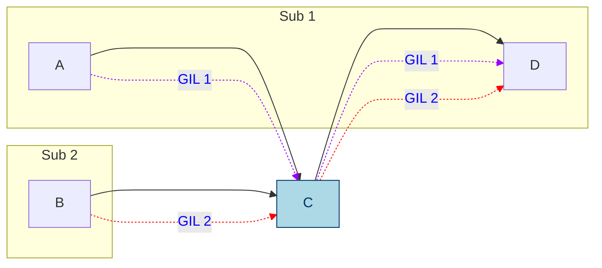
**Figure 1:** Illegal reference from immutable to mutable object.

In a nutshell, to make objects sharable directly across
subinterpreters, we must ensure that accesses to shared
objects do not need synchronisation. This in turn means
that we cannot rely on normal cycle detection for immutable
objects, unless we stop all subinterpreters to collect
garbage. To avoid such pauses, this PEP will instead remove
immutable objects from cycle detection. This can be
done without memory leaks or giving up on promptness of
reclamation.


# Semantics of immutability

This PEP distinguishes between objects which are
**mutable**, **immutable**, or **freezable**. Mutable
objects can be updated and reference both mutable and
immutable objects. Immutable objects cannot be updated, and
may only point to other immutable objects. Freezable objects
behave like mutable objects until they are frozen; after
that point they behave like immutable objects.

Sometimes it may be necessary for an immutable object
to point to mutable data or support some limited form of
mutation. This will be supported through escape hatches
which are described further down in this document.

This section proceeds by introducing three stages of
increasing support for making objects immutable, where
each stage builds on the previous.


## Stage 1 -- inherently immutable objects

In stage 1, we consider only objects and types which
are immutable in Python 3.14, i.e. all instances of
the following type: `int`, `float`, `complex`, `bool`,
`str`, `tuple`, `frozenset`, `bytes`, `NoneType`,
`ellipsis`, `range`, `slice`, and named tuples. While
tuples, frozensets, and named tuples offer only shallow
immutability, they can be used to create deeply immutable
objects. Note also that the types objects for all these
listed types are immutable, meaning they cannot be modified
by metaprogramming. (This is already the case in Python
today.)

With this design, immutability is always established at the
point of creation, which means that there is no need for an
operation that takes a mutable object and makes it immutable
(this is necessary in stage 2 and 3).

**Listing 1:** Creating immutable (and one mutable) objects.
```python
from immutable import is_frozen

p = ("this", 15, "an", "ex parrot")
is_frozen(p) # returns True -- all subobjects are immutable

n = ({'x' : 'parrot'}, None)
is_frozen(n) # returns False -- dict is mutable so n is only shallow immutable

from collections import namedtuple
Person = namedtuple('Person', ['name'])

monty = (Person("Eric"), Person("Graham"), Person("Terry"))
is_frozen(monty) # returns True -- all subobjects are immutable
```

For clarity, while all of the objects above except for the
dictionary are de-facto immutable today in Python, these
cannot be safely shared across subinterpreters without
the changes proposed by this PEP. As the `n` tuple contains
a mutable dictionary it is **not** deeply immutable and
therefore not safe to share between subinterpreters even
with the changes this PEP proposes.


### Sharing of types

As all immutable objects' types are also immutable, they
can be shared across subinterpreters, and an object's
`__class__` references another immutable object. This is
consistent with the definition of deep immutability -- as
soon as we follow a reference from a mutable object inside
a subinterpreter's heap to an immutable object, we leave the
subinterpreter's heap, and there are no references that we
may follow that lead back to a subinterpreter heap.

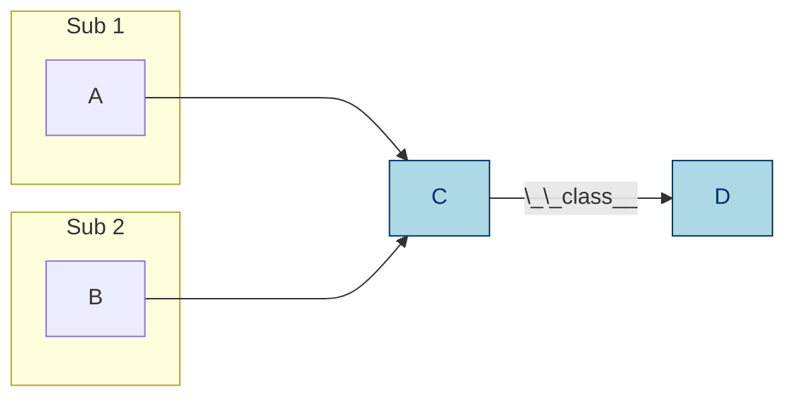

### Dealing with cycles

When objects are immutable at creation, immutable object
graphs cannot contain cycles. Therefore, immutable objects
do not need to participate in cycle detection. This is
important, as each subinterpreter operates under the
assumption that the objects traversed by the cycle
detector are not mutated by program threads while the
cycle detector is running. While making it impossible
to have immutable cycles is limiting the power of
immutability, it avoids a technical problem in memory
management. 


### Summary

* A deeply immutable object may only point to other immutable objects (modulo escape hatches discussed below), including its class object
* Deeply immutable objects can be created from objects which are already immutable in Python today -- note that for tuples, named tuples and frozen sets, this require that their constituent parts are deeply immutable too
* Immutable objects are always immutable at the point of creation
* Immutable object graphs are tree shaped


## Stage 2 -- supporting user-defined types and freezing mutable isolated subgraphs

Stage 2 adds support for immutable user-defined types and
function objects and freezable instances of user-defined
types. That a function is immutable means that it may
not capture any mutable state. An immutable function may
still mutate any mutable state it can get a reference to.
An immutable type also may not capture mutable state, and
additionally does not permit adding, removing or changing
functions. Immutable types may not inherit from mutable
types, but may have mutable subtypes. (For clarity, the
`object` type is immutable.)

Instances of immutable types are mutable by default, but can
be made immutable by freezing them through an explicit call
to a `freeze()` function. This notably permits the creation
of a mutable list, which is made immutable at a later point
in the program. To limit freeze propagation, an object graph
can only be made immutable if it **is self-contained**,
meaning there are no references into the object graph from
outside the object graph, except the reference passed to
`freeze()`. For example, `freeze(x)` below will fail because
of the reference to `D` in `y`. However, if that reference
is removed, or if `D` was already immutable, `freeze(x)`
will succeed.

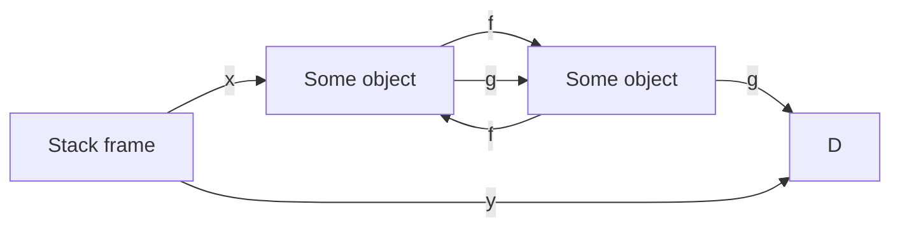

In other words, freezing requires that all incoming
references to objects that will become frozen as a result
of a call `freeze(x)` originate from the object graph
rooted at `x`. This ensures that a mutable object will not
suddenly become immutable "under foot". After an object of
type T has been made immutable, subsequent attempts to write
to its fields will result in "TypeError: object of type T
is immutable".)

Note that in stage 2, types and functions are either
inherently immutable or inherently mutable (at creation).
Freezing objects can never lead to types or functions
becoming immutable. By extension, that means that objects
with mutable types cannot be made immutable themselves, as
each object has a reference to its type.

To declare an immutable function or type we use a `@frozen`
decorator, which will be explained shortly. Immutable
functions are necessary as type objects typically consist
mostly of function objects.

The major challenge with immutable declarations can be
illustrated easily through an example. What if the following
program was legal?

**Listing 2:** An illegal frozen function.
```python
import random
from immutability import frozen, is_frozen

@frozen
def die_roll():
    return random.randint(1, 6) # captures external random object

is_frozen(die_roll) # True in this hypothetical example
send_to_other_subinterpreter(die_roll) # Problem
```

The `die_roll()` function above captures the `random` module
object of its defining subinterpreter. If we pass the
`die_roll` function object to another subinterpreter, we have
successfully recreated the problematic situation in Figure
1 where C is `die_roll` and D is `random`. **In stage 2, a
function which is declared `@frozen` may only capture
immutable objects.** The code above will raise an exception
saying that `die_roll()` cannot be frozen. Note that freezing
a module object is not possible since the `module` type
object is mutable. This is not ideal, but unavoidable
for now. Later, we will show how escape hatches can be used
to permit the code above to work by using a proxy for the
`random` module that directs calls to `randint()` to the
correct subinterpreter.

When a type is declared `@frozen`, all its containing
methods are implicitly declared `@frozen` as well.

**Listing 3:** A valid immutable class.
```python
from immutability import freeze, frozen, is_frozen

@frozen
class Die:
    def __init__(self, sides=6):
        self.set_sides(sides)
    def set_sides(self, sides):
        self.sides = sides
    def roll(self):
        # Clunky but just to illustrate that this is OK
        import random
        return random.randint(1, self.sides)

is_frozen(Die) # True
is_frozen(Die.roll) # True

d = Die(6)
is_frozen(d) # False
d.roll() # will return a number in [1,6]
d.change_sides(12) # OK

freeze(d) # turns the object d points to immutable
is_frozen(d) # True
d.roll() # will return a number in [1,12]
d.change_sides(6) # will raise an exception
```

Listing 3 creates a `Die` type which is immutable at
creation. Neither the `Die` class nor its functions capture
any external mutable state, so this declaration is valid.
The import inside of `roll()` is clunky but illustrates that
this is not problematic. Note that the default `sides`
argument in `__init__` is supported since the value is
immutable.

Right before `freeze(d)`, we have the following object graph
(with some simplifications to reduce clutter).

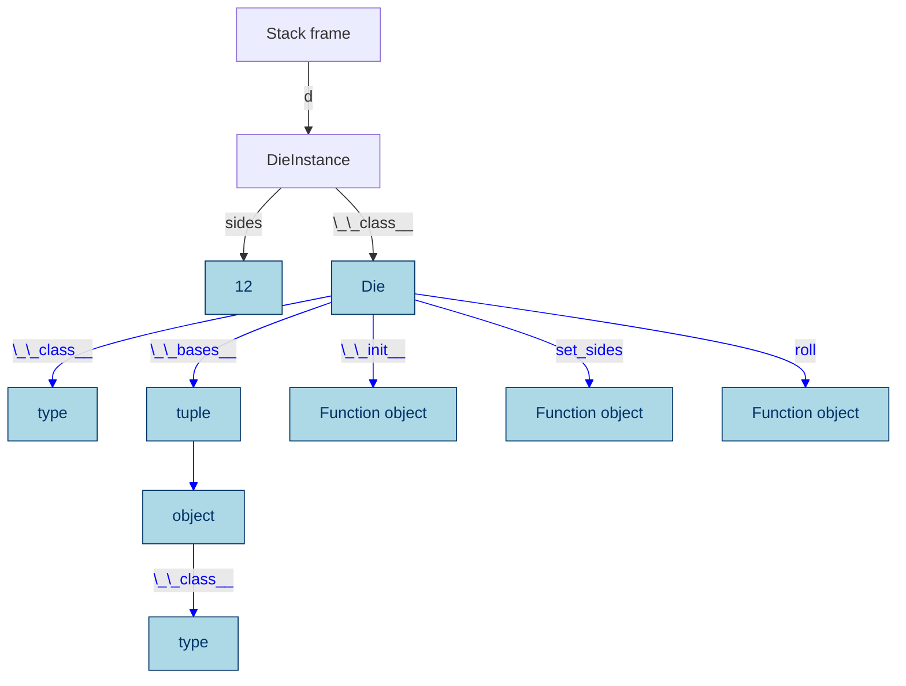
**Figure 2:** Before freezing `d` -- immutable objects drawn
in "ice blue" and references from immutable objects drawn
in blue.

Note that the instance of `Die` pointed to by `d` is
a normal mutable Python object. Thus we are allowed to
change the number of sides from 6 to 12. However, after
we freeze the object, an attempt to change its sides
will raise an exception, since the object is immutable.
Note that freezing `d` will not prevent the value stored
in the `d` variable to change. However, as indicated by
the blue reference arrow, `sides` inside the immutable
`Die` instance is fixed for life.


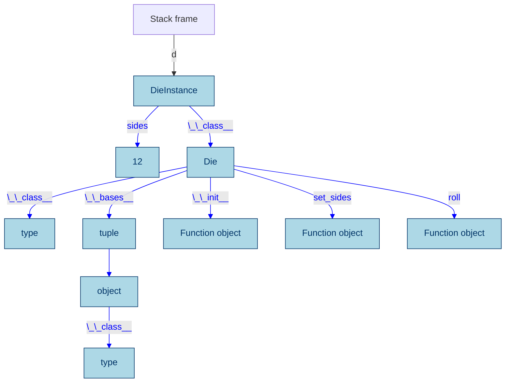
**Figure 3:** Right after freezing `d` -- immutable objects drawn
in "ice blue" and references from immutable objects drawn
in blue.

Note that freezing is *in-place*; `freeze(obj)` freezes
`obj` and for convenience also returns a reference to (now
immutable) `obj`.


### Summary

In addition to stage 1:

* Declarations (types and functions) can be made immutable at creation
* Immutable declarations may not capture references to mutable state
* An immutable class' functions are all immutable, and methods cannot be added, removed, or changed
* Instances of immutable types are mutable at creation but can be made immutable
* Making a mutable object graph immutable fails if the object graph is not self-contained
* Making an object immutable blocks subsequent mutation of the object


## Stage 3 -- more dynamic freezing to permit monkey patching

Stage 3 adds support for freezable types and functions, and
adds new rules for how freezing can propagate.

As a companion to the `@frozen` decorator, stage 3 adds
a `@freezable` annotation which permits the creation
of mutable classes and functions, which may be e.g.
"monkey-patched" before eventually becoming immutable. It
also adds an `@unfreezable` decorator to explicitly opt-out
of support for freezing. A module may declare all its
members freezable by setting a `__freezable__` field to the
value `1`.

**Listing 4:** Freezing mutable objects.
```python
@freezable
class Person:
    def __init__(self, name): # "inherits" @freezable from Person
        self.name = name

monty = [Person("Eric"), Person("Graham"), Person("Terry")]
is_frozen(Person) # False
is_frozen(monty) # False

freeze(Person)
is_frozen(Person) # True
is_frozen(monty) # False

freeze(monty)
is_frozen(Person) # True
is_frozen(monty) # True

monty.append(Person("John")) # throws exception because monty is immutable
monty.pop()                  # --''--

monty[0].name = "John"       # throws exception because all person objects 
                             # in monty are immutable too
```

Making an object immutable means that subsequent attempts
to write to its fields will raise an exception. (The attempt
to append or pop above will both result in `TypeError:
object of type list is immutable`.) As in stage 1 and 2,
immutability is deep. We will use the following running example to
explain what happens when we freeze types and functions in
stage 3. We start by explaining the simplest and most
permissive model of freezing, and later discuss how to limit
how freezing may propagate through a program.

**Listing 5:** Fraction class.
```python
...

__freezable__ = 1 # make gcd, print_fraction and Fraction @freezable

def gcd(a, b):
    while b:
        a, b = b, a % b
    return a

def print_fraction(f):
    counter += 1
    print("Fraction: {f} (fractions printed in total: {counter})")

class Fraction:
    def __init__(self, numerator, denominator):
        d = gcd(numerator, denominator)
        self.n = numerator // d
        self.d = denominator // d

    def __add__(self, other):
        num = self.n * other.d + other.n * self.d
        den = self.d * other.d
        return Fraction(num, den)

    def __repr__(self):
        return f"{self.n}/{self.d}"

f1 = Fraction(1, 3)
f2 = Fraction(2, 7)
freeze(f1)
f1 = f1 + f2
```

Let us first focus on "normal Python objects" that the
user has explicitly created, meaning we ignore "declaration
objects" such as functions and types. We will use
the same drawing notation as in previous figures.

Right before freezing, we have the following object graph.

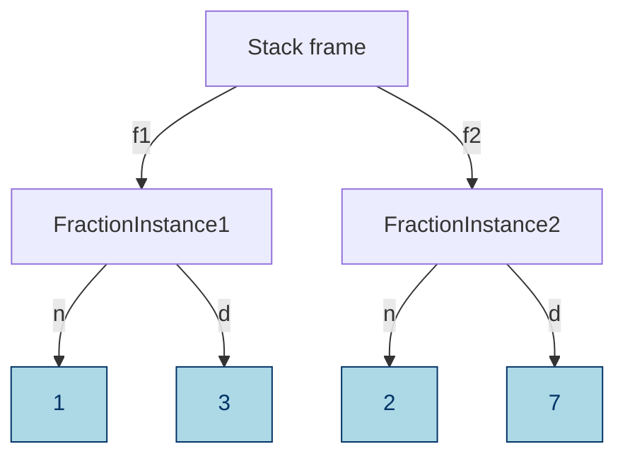
**Figure 4:** Right before `freeze(f1)`.

After we have executed `freeze(f1)`, the "ice blue" objects will have
been frozen:

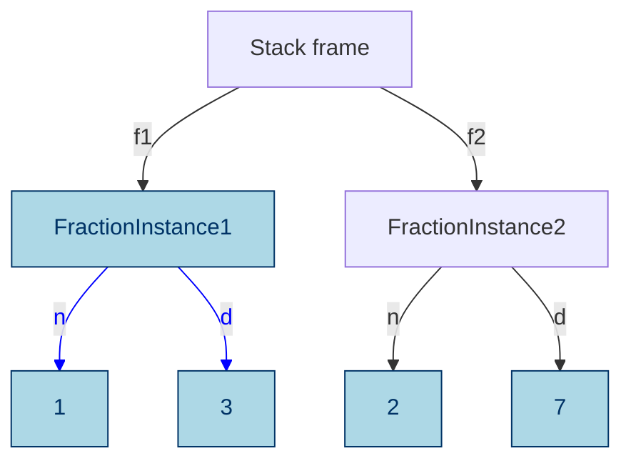
**Figure 5:** Right after `freeze(f1)`.

Lines drawn in blue denote references that are stored in a field of an
immutable object. Thus, the contents of `f1.n` and `f1.d` cannot change,
but the stack variable `f1` can be made to point to an entirely different
object. (As happens in the next line of the example `f1 = f1 + f2`.)

Let's now bring in functions, modules, and types. To reduce
clutter, we will not draw the full object graph, since there are
lots of other default functions e.g. `__eq__` in every type, etc.
So with some simplifications, the object graph of our example
above looks like this right before freezing:

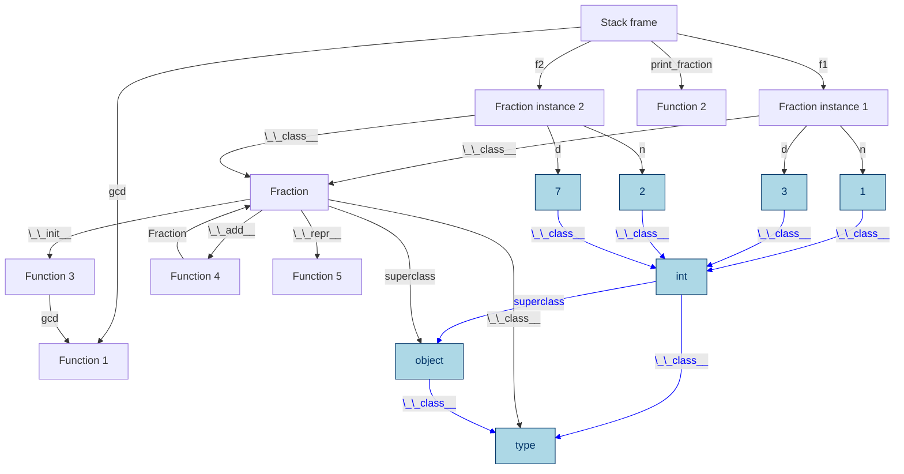
**Figure 6:** Almost full object graph, right before freezing.

Note the line from `Function 3` (`Fractions.__init__`) to `Function 1` (`gcd`).
This is the reference that `__init__` captures to the declaration of
`gcd` in the enclosing state. If `gcd` was the result of an import,
the result would have been the same.

To see what should be the effect of successfully freezing, we can
walk the object graph from the starting point of the call to `freeze()`
and follow all outgoing references and freeze all mutable objects
that we discover, and continue until there are no more mutable objects
to freeze. Here is the result:

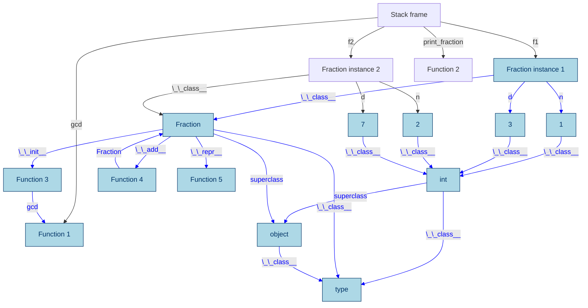
**Figure 7:** Almost full object graph, right after freezing.

Note that we are not trying to define what should become
immutable due to a call to `freeze(f1)`. Later in this
document, we will describe our proposal for how freezing
can propagate from objects to declarations and vice versa.

When the `Fraction` class is made immutable all its function
objects, such as `__init__`, `__add__`, and `__repr__` must
be immutable too, or they are no longer callable. Of the
three functions in `Fraction`,  only `__init__` captures
external state: a reference to `gcd`. This means that
the `gcd` function must be made immutable too. Notably,
`__add__` has a reference to `Fraction` which would  also
have to be made immutable, but is alredy immutable in this
example. (It's becoming immutable is what causes `__add__`
to become immutable in the first place.)

Note that the `gcd` variable in the stack frame did not
become immutable, although it is pointing to an immutable
object. It is still possible to reassign that variable. Also
note that while a Python class technically has a reference
to all its subclasses, we do not freeze subclasses, only
superclasses, when a class is frozen. We will return to this
later and explain when it is possible to make exceptions
such as this one.


### Summary

In addition to stage 2:

* Support for freezable types and functions that permits delaying freezing until after monkey patching 
* Making a freezable class immutable makes its functions and any class state immutable, and blocks changes to the class; functions that could not be made immutable are no longer callable
* A module may declare all its members freezable


# Escape Hatches

## The stage 3 `Fraction` example vs. `fractions.Fraction`

The standard Python class `fractions.Fraction` is a more capable
implementation than our example in stage 3. Instances of
`fractions.Fraction` are effectively immutable in Python today,
but the library `fractions.Fraction` uses caching for performance,
which needs mutable state to grow the cache incrementally. As we
have seen just above, escaping from the immutable world back into
the mutable world is not easy in subinterpreters. Even though the
fraction instances are themselves immutable, the fact that they
can reach mutable state is problematic since we want to avoid the
problem above.

We have two approaches to solving problems like this which we also
make available through the `immutable` library that is part of
this PEP. When the objects that needs caching are all immutable,
they are all safe to share across subinterpreters. In that case we
only need to add one piece of mutable state that holds on to the
immutable state. When the objects that need caching are mutable,
each object must only be accessible to its defining interpreter.
Thus, we can solve this by an interpreter-local indirection,
similar to `threading.local()`. We describe these two escape
hatches below.

(In the case of `fractions.Fraction` one cache is in `ABCMeta`
implemented in C, and one cache is an LRU cache from functools.
The challenges and solutions laid out below are the same as
what will be applied to these.)


## Relaxing deep immutability

As illustrated by the `fractions.Fraction` example, deep
immutability can sometimes be too strict. To this end, we
provide two escape hatches:

1. Shared fields which can only hold immutable objects
2. Interpreter-local fields, which may hold mutable objects

A shared field is shared across subinterpreters, which means that
the field holds the same content regardless of the subinterpreter
that is accessing the field. Since only immutable objects can be
shared across subinterpreters, that means that shared fields can
only contain immutable objects. This is checked by the field on
assignment, and throws an exception if the value is mutable. The
field takes care of synchronisation if multiple subinterpreters
read or write the field at the same time.

An interpreter-local field `f` transparently behaves as multiple
fields, one per subinterpreter in the program, and each
subinterpreter will only ever read or write "its field". This
ensures that two subinterpreters accessing the same field
concurrently will not race on the value in the field, since they
are accessing different objects.


## Shared fields

Shared fields are implemented as an object indirection. The shared
field is part of the `immutable` module that this PEP provides.
Here is an example that shows what programming with a shared
field might look like. The example shows a class maintaining a
mutable instance counter, that keeps working even after the class
is made immutable.

**Listing 6:** Cell implemented using a shared field.
```python
import immutable  # library this PEP provides

class Cell:
    counter = immutable.shared(0)

    def __init__(self, a):
        self.value = a
        while True:
            old = self.__class__.counter.get()
            new = old + 1
            immutable.freeze(new)  # shared fields can only hold immutable objects
            if self.__class__.counter.set(old, new): # stores new in counter if counter's value is old
                return  # break out of loop on success

    def __repr__(self):
        return f"Cell({self.imm}) instance number {self.__class__.counter.get()})"

c = Cell(42)
immutable.freeze(c)        # Note: freezes Cell
immutable.is_frozen(Cell)  # returns True
print(c)   # prints Cell(42) instance number 1
d = Cell(4711)
print(d)   # prints Cell(4711) instance number 2
```

Note that in free-threaded Python, it would be technically safe to
permit a shared field to store mutable objects, as the problem
with multiple subinterpreters accessing a mutable value under
different GILs does not exist. However, we believe in keeping the
programming model the same regardless of whether subinterpreters
or free-theading is used. (Programming with immutable objects is
also less prone to subtle errors.)

Let's use the same diagrams as when explaining the problem with having
a reference to mutable state from immutable state above, to show how the
shared field is different. Let us again use two subinterpreters that 
both have a reference to a shared immutable counter declared as above:

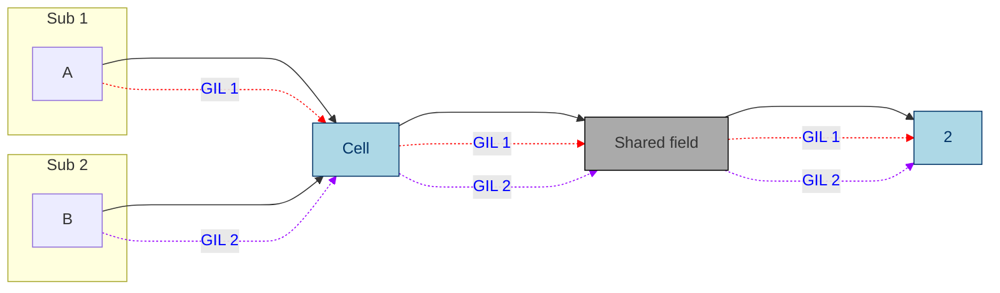
**Figure 8:** Shared field.

Notably, there are no references from immutable state to mutable
state inside a subinterpreter, which we have seen causes problems.
While the shared field object poses as an immutable object in the
system, it is really mutable, which is why it is drawn in gray. As
it uses its own synchronisation internally, and only manipulates
immutable objects, it is not a problem that concurrent accesses do
not synchronise with each other (which they don't since they use
different GILs to synchronise).


## Interpreter-local fields

Interpreter-local fields are analogous to `threading.local()` in
Python, but keeps one value per interpreter, as opposed to one
value per thread. Thus, if two different subinterpreters read the
same field, they may read different values; two threads in the
same subinterpreter will always read the same value (provided
there has been no interleaving mutation).

Interpreter-local fields can store both mutable and immutable
objects. In the case of a mutable object, this object will be
guaranteed to live on the heap of the subinterpreter that accesses
the field. It is therefore safe to store mutable objects in such a
field.

The `immutable` module contains the class for interpreter-local
fields. Here is what programming with such a field might look
like:

**Listing 7:** Cache in prime factorised implemented using an interpreter-local field.
```python
import immutable # library this PEP provides

class PrimeFactoriser:
    def __init__(self):
        self.cache = immutable.local({ 2: [2], 3: [3], 4: [2, 2] })
    def factorise(self, number):
        if self.cache.has_key(number):
            return self.cache[number]
        else:
            factors = ... # perform calculation
            self.cache[number] = factors
            return factors

pf = PrimeFactoriser()
immutable.freeze(pf)
pf.factorise(7) # will update the cache as side-effect (on the current interpreter)
```

The example above maintains a mutable dictionary as part of a
cache. Despite `pf` being frozen, we can still mutate the cache,
but the mutations and the cache are only visible on the current
interpreter. Another interpreter trying to factorise 7 will have
to redo the calculations and populate its own cache.

While interpreter-local fields cannot be used to implement a
global instance counter, we can use a shared field to implement
the caching. Since a shared field cannot hold mutable objects, we
would have to freeze the dictionary before storage, and to update
the cache we would have to first make a mutable copy of the
current cache, add to it, and then freeze it again before storing
it back into the field. On the other hand, we only need to cache
prime factors once as opposed to once-per-interpreter, as the
cache is global.

We can illustrate the difference between the interpreter-local
escape hatch and shared fields pictorally:

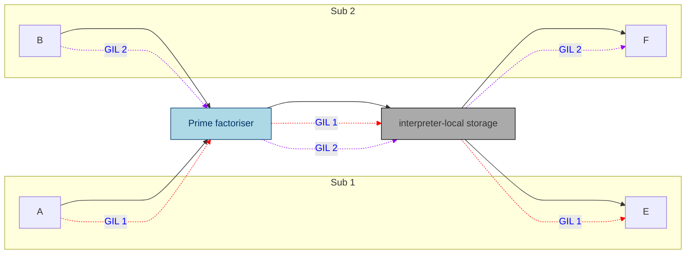
**Figure 9:** Interpreter-local field.

The interpreter-local field ensures that accesses from Sub 1
yield the reference to E, whereas accesses from Sub 2 yield the
reference to F. Thus, all accesses to a mutable object on one
interpreter's heap is always synchronising on the same GIL.

As one more example of how shared fields and interpreter-local
fields complement each other, we revisit the list of references
from a superclass object to its subclasses that we are not
freezing. We can implement this using a shared field in
combination with an interpreter-local field. Consider the
immutable class A, to which we want to add a new *immutable*
subclass B and a new *mutable* subclass C. Since immutable
subclasses are shared, we add a shared field with an immutable
list of references to immutable subclasses. Every time we add to
that list, we create a new list from the old, add the new
reference, freeze the new list and stick it back into the shared
field. In contrast to B, the mutable subclass C should only be
visible to the subinterpreter that defined it. Thus, we use an
interpreter-local field to keep a (mutable) list of the mutable
subclasses of A. Together, these two lists store the subclasses
of a class.


## Initialisation of interpreter-local fields

Interpreter-local fields can hold mutable objects which can only
be initialised from the interpreter to which the field belongs. To
permit the interpreter that defines the field to control the
initialisation of the field, the constructor `local` accepts a
frozen function object as input. The function gets the
interpreter-local field as argument and can install (possibly
mutable) values. Here is an example:

**Listing 8:** Initialising an interpreter-local field.
```python
from immutable import local
sharable_field = local(freeze(lambda f : f.start = 0))
```

The first time the sharable field is loaded by a subinterpreter,
that subinterpreter will call the lambda function with
`sharable_field` as its argument, which in this example causes
`sharable_field.start` to be initialised to 0.


# Escape hatches and modules

Let us come back to modules. Assume that the `gcd` function
in the fractions example from stage 3 was imported from the
module `useful_stuff` like so: `from useful_stuff import
gcd`. In this case, `Fraction.__init__` would capture just the
`gcd` function object which would be made immutable if we
freeze the `Fraction` class.

Let us see what would happen if `gcd` had been called from
`__init__` like this: `useful_stuff.gcd()`? While this is
not very different from the less common form above, the
ability to reliably analyse Python code without access
to the source stops at capturing state, which can be
queried directly from the function object. Thus, we have
no other option than to freeze the module object, which
will propagate to `gcd`. This is not a perfect solution.

Luckily, the interpreter-local field permits an immutable
object to store pointers to mutable objects without
compromising safety in the subinterpreters model. This can
be used together with modules and functions to permit an
immutable function to call functions that rely on mutating
state. For example, let us define a module for logging thus:

**Listing 9:** Running module example.
```python
# logger.py
messages = []

def log(msg):
    messages.append(msg)

def flush(file):
    file.writelines(messages)
    messages.clear()
```

And let's use the module:

**Listing 10:** Running module example -- use-site.
```python
import logger

def simulate_work():
    logger.log("simulate")

for _ in range(0, 10):
    simulate_work()

with open("log.txt", "w") as f:
    logger.flush(f)
```

If we wanted to freeze `simulate_work()` and pass it around so
that any subinterpreter could call it, we have to do some
refactoring of the module first. For example, it is not
thread-safe right now, meaning that concurrent calls to log could
drop some messages, etc. But more importantly, it is not safe for
different subinterpreters to manipulate the same mutable
`messages` list object.

Let's go through our options. For completeness, we start with
some options that do *not* rely on escape hatches. These all involve
rethinking the `logger` design.


## Do nothing

While this is not an option here, for completeness, let us
explore doing nothing. If we simply make `logger` immutable,
the `messages` list becomes immutable and calls to `log`
will result in exceptions on every attempt to append to
`messages`, which means we have "incapacitated the module".
For a module which is stateless, or that only had immutable
constants, this would have worked.


## Make the module stateless

We can refactor the module to become stateless:

**Listing 11:** Stateless logger module.
```python
# logger.py

def log(msg):
    print(msg)

def flush(file):
    """Deprecated, should no longer be used"""
    pass
```

This is probably not what we want to do, but shows that
printing from an immutable function is not a problem
(because the `print` method is considered frozen in
this PEP). This strategy might work in cases that can be
rewritten in terms of immutable builtins, but is not a
general solution.


## Move the module's state out of the logger module

We can refactor the module to use external state which is passed
in to the logger. The code below permits the module to be used as
before, but now switches behaviour to rely on the user passing in
a mutable list to `log` and `flush` if `messages` are immutable.

**Listing 12:** Logger module with external state.
```python
# logger.py
from immutable import is_frozen
messages = []

def log(msg, msgs=None):
    if is_frozen(messages):
        if msgs is None:
            raise "Nowhere to log messages"
        else:
            msgs.append(msg)
    else:
        messages.append(msg)


def flush(file, msgs=None):
    if is_frozen(messages):
        if msgs:
            file.writelines(msgs)
            msgs.clear()
    else:
        file.writelines(messages)
        messages.clear()
```

This is a rather large refactoring, and probably not what we
want in this case, but maybe in others.

The remaining cases use our escape hatches to permit the module
to hang on to some mutable state.


## Move the module's state out of subinterpreter isolation

Keeping the module's state but moving it out of subinterpreter
isolation requires that all objects in the state, except for the
escape hatch, are immutable.

**Listing 13:** Logger module with shared field.
```python
# logger.py
from immutable import shared, freeze
messages = shared(freeze([]))

def log(msg):
    new_messages = messages.get()[:]
    new_messages.append(msg)
    freeze(new_messages)
    messages.set(new_messages)

def flush(file):
    file.writelines(messages.get())
    messages.set(freeze([]))
```

This module can now be frozen without incapacitating it
-- the `messages` variable will effectively remain mutable
(through an indirection), and can be updated with new
messages. Importantly, there will now only be a single
logger shared across all subinterpreters. (To that end, we
should add some synchronisation to `log` and `flush` but
that is standard concurrency and not specific to this PEP.
On a related note, locks are considered immutable so pose no
problem -- imagine implementing them using a shared field
to get an idea of how they could work.)


## Keep one logger per subinterpreter

If we have a multi-phase initialization module, it may make more
sense to have one logger state per subinterpreter. There are two
ways to go about this. Let's start with the analog of the above
solution using an interpreter-local field.

**Listing 14:** Logger module with interpreter-local field.
```python
# logger.py
from immutable import local
messages = local(freeze(lambda f : f.msgs = []))

def log(msg):
    messages.msgs.append(msg)

def flush(file):
    file.writelines(messages.msgs)
    messages.msgs.set([])
```

The interpreter-local field is initialised on first access using a
frozen lambda function. The function needs to be frozen to be
shared across subinterpreters. When the function is called it
creates a mutable empty list and stores it in the current
subinterpreter's `messages.msgs`.

We change `log` and `flush` to go through `messages.msgs` but the
logic is otherwise unchanged. Now freezing log and flush is
unproblematic as freezing does not propagate through `messages`. A
call to the shared `log` function from a subinterpreter will store
the log message on that subinterpreter's `message` list.


## Keep one logger per subinterpreter -- take 2

We can achieve the same effects as above without changing the
logger module, but instead change how we import it. Let's first
do that manually, and then introduce some tools that are part of
the `immutable` library in this PEP.

**Listing 15:** Sketching support for wrapping modules behind immutable proxies.
```python
@frozen("")
def import_and_wrap(module):
    from immutable import local
    
    @frozen("") # note -- assumes module is immutable
    def local_import():
        return __import__(module)
        
    return local(local_import)

logger = import_and_wrap("logger")
# everything below unchanged

def simulate_work():
    logger.log("simulate")

for _ in range(0, 10):
    simulate_work()

with open("log.txt", "w") as f:
    logger.flush(f)
```

The `import_and_wrap` function wraps the module object for the
logger module in an interpreter-local field. Thus, `logger`
will not be frozen when we freeze `simulate_work`. The first time
a subinterpreter tries to access the shared `logger` object as
part of a call to `logger.log()` inside `simulate_work`, the
subinterpreter will import the module and subsequent calls on
the local field will be forwarded to the module object.

To ensure that any library that imports `logger` automatically
gets the wrapper, it is possible to replace the entry in
`sys.modules['logger']` with the wrapper. The `immutability`
library in the PEP provides utilities for importing and wrapping,
wrapping an already imported module, and ensuring that subsequent
`import` statements import the wrapper.

The `immutable` module provided by this PEP contains one
function for wrapping a module object in an immutable proxy
and another function for installing a proxy in `sys.modules`
so that subsequent `import` statements get the proxy.


# Controlling the propagation of freezing

A recurring theme when discussing this proposal on DPO has been
concerns that freezing an object will propagate beyond the
intension, and cause objects to be frozen accidentally. This is
an inherent effect in immutability systems at witnessed by e.g.
`const` in C and C++. Annotating a variable or function with
`const` typically propagates in the source code, forcing the
addition of additional `const` annotations, and potentially
changes to the code. In C and C++, this happens at
compile-time, which helps understanding the propagation.
(See also the section on static typing for immutability later
in this document.)

## Freeze propagation in stage 1

The stage 1 support for immutability only supports immutable
objects which are constructed from de-facto immutable
objects in Python 3.14. As objects can only be immutable at
creation-time, there is no freeze propagation. Object graphs
must be constructed inside out from immutable building
blocks. This can be cumbersome, but the result is never
surpising.
 
This will allow subinterpreters to immutably share things
like strings, integers, tuples, named tuples etc. This
is expressive enough to for example express JSON-like
structures, but notably does not support sharing arbitrary
objects of user-defined type, and not functions.

**Propagation rules:**

- There is no such thing as freeze propagation.

**Freezing rules:**

- An object which is an instance of a type that is de-facto
  immutable in Python 3.14 is immutable at creation; unless
  it references data that is not immutable.

**Immutability invariant:**

- An immutable object only references other immutable
  objects.


## Freeze propagation in stage 2

Stage 2 adds support for making objects immutable which
are instances of immutable types, which in turn consist of
immutable function objects.

Stage 2 introduces freeze propagation as it adds a
`freeze()` function to turn mutable objects immutable.
However, in stage 2, freezing is limited to only tree-shaped
data. This ensures that the following will never raise an
exception due to a mutation error on the last assignment
to `y.f`:

**Listing 16:** In stage 2, freeze propagation cannot affect shared state.
```python
y.f += 1
freeze(x) # if succeeds, guaranteed to not have affected y
y.f += 1 
```

If freezing `x` could propagate to `y`, then the object
graph rooted in `x` is not self-contained, which will cause
`freeze(x)` to fail. Similarly, since passing a reference
to a function guarantees that the reference at the call-site
remains, a function cannot freeze its arguments. 
Notably, this avoids freezing accidentally incapacitating
a module. Freezing a list object that happens to be part of
a module's state that should stay mutable will incapacitate
the module will fail because the list is not self-contained.

This is a guarantee that "cuts both ways": it is very hard
to pass an object around without losing its ability to be
frozen.

**Propagation rules:**

- Declaring a type as frozen propagates to its
  functions, but not to any other types or functions, or
  non-declaration objects.
- Freezing an object propagates to other objects, but not
  to declarations.

**Freezing rules:**

- Objects that are instances of immutable types
  are freezable by default, but freezing an object graph
  will fail unless the graph is self-contained.
- An object can be made impossible to freeze by setting
  `__freezable__ = 0`.

**Immutability invariant:**

- An immutable object only references other immutable
  objects, with the exception of mutable objects that
  preserve subinterpreter isolation but are nevertheless
  marked as immutable in the system. (For example escape
  hatches.)


## Freeze propagation in stage 3

While stage 3 is the most expressive, we take several
steps to limit propagation of freezing. This means that
freezing objects becomes a little more involved since
freezing may involve multiple steps. Again, we
distinguish between freezing "objects" and "declarations"
(e.g. types, functions, methods, and modules), and try to
limit propagation based on these distinctions:

**Propagation rules:**

- Freezing an object propagates to other objects,
  but not to declarations.
- Freezing a function or method propagates to other
  functions or methods.
- Freezing a type propagates to its super types and
  functions in the type and supertypes.
- Freezing a module object propagates to any object
  or declaration reachable from the module object,
  directly or indirectly. (Notably, this may include
  submodules.)
- Freezing a declaration decorated with `@freezable`
  may propagate to objects (causing them to be frozen).

**Freezing rules:**

- Module objects must opt-in to support freezing.
- Freezing a declaration inside a module that does not
  support freezing will fail unless the declaration is
  decorated with @freezable.
- Freezing a declaration that captures mutable state will fail
  unless the declaration is decorated with `@freezable`.
- Objects "inherit" their support for freezing from its
  class. This can be overridden.

**Immutability invariant:**

- An immutable object only references other immutable
  objects, with the exception of mutable objects that
  preserve subinterpreter isolation but are nevertheless
  marked as immutable in the system. (For example escape
  hatches.)

Defining a type or function that is frozen right after
creation is possible using the `@frozen` decorator.

See below for additional details and examples.


### Freezing objects

In stage 2 and 3, an object can be frozen if it satisfies
*all* of the constraints below:

- It's type is immutable
- Is does not have a field `__freezable__` with a value
  other than 1
- All the objects reachable from the object can be frozen

Failing to satisfy any of the above constraints will
cause freezing to fail, leaving all objects in their
original state. Note that freezing also requires that
the object graph being frozen is self-contained.


### Freezing functions

A function can be frozen if it satisfies *all* of the
constraints below:

- It is declared in a module that opts-in support for
  freezing and the function is not declared `@unfreezable`,
  or the function is declared `@frozen` or `@freezable`
- All function objects the function captures can be frozen
- The function either does not capture any mutable objects,
  or it is declared `@freezable` and any mutable objects it
  captures can be frozen (including default parameters)

If a function captures another function that is not frozen,
the second function will be frozen implicitly. If the function
was declared `@freezable`, any mutable state captured by the
function will be frozen. This includes default arguments.
If the function is not declared `@freezable`, then it may only
capture immutable state. This design decision is motivated
by a desire to limit freeze propagation. This means that
each of the following functions can be frozen by a simple
call to `freeze`:

**Listing 17:** Examples of freezable functions.
```python
# opt-in to support freezing the current module
__freezable__ = 1

# pure function OK to freeze
def function1(a, b):
    return a + b

# only captures other function so freeze propagates
def function2(a, b):
    return frunction1(a, b)

x = freeze(something)
# only captures immutable state
def function3(a):
    a.append(x)

# only captures immutable state
def function4(a):
    x.append(a) # Note -- will throw exception always
```

Freezing `function3` and `function4` will succeed only if
the current value of `x` is immutable. Furthermore, it "locks"
the value of `x` in the frozen functions, so even if `x` is
reassigned in the outer scope, the frozen functions will
still see the old frozen value. If `function3` or `function4`
were declared `@freezable`, they would have implicitly
frozen the contents of `x`.

Also note that `function1` will be frozen as a side-effect
of freezing `function2`. The final example shows that
this analysis does not try to reason about the meaning of
freezing a function. Clearly, freezing `function4` means
that the function will always throw an exception as it tries
to append to a mutable list. (For the record, this kind of
reasoning is not possible in the general case and the most
consistent behaviour is to simply freeze the function.)
To ensure that freezing `function4` cannot be frozen, the
`immutable` library provides a `@unfreezable` decorator.

If class `Foo` defines an instance method `bar` or a static
method `bar`, then `Foo.bar` is a function object. Thus, the
following succeeds:

**Listing 18:** Freezing a function object directly.
```python
# showcase different way of supporting freezing
@freezable
class Foo:
    def bar(self):
        self.variable = 42
        return self.variable

freeze(Foo.bar) # succeeds
foo = Foo()
foo.bar() # OK, returns 42
```

Note that `freeze(foo)` would subsequently cause `foo.bar()`
to fail because `self` inside `foo` would now be immutable.

If a frozen function object is bound to a method object, the
method object is mutable, and the "self" object can be mutable
too.


### Freezing methods

Method objects are wrappers for function objects and the
object to which the method is bound, the "self". A method
object can be frozen if the function **can be** frozen,
and the self object **is already** immutable. Thus, the
following example will fail to freeze:

**Listing 19:** Freezing method objects.
```python
# opt-in to support freezing the current module
__freezable__ = 1

class Foo:
    def bar(self):
        self.variable = 42
        return self.variable

foo = Foo()
freeze(foo.bar) # fails because foo is not immutable
```


### Freezing types

A type can be frozen if it satisfies *all* of the
constraints below:

- It is declared in a module that opts-in support for
  freezing and the type is not declared `@unfreezable`, or
  the type is declared `@freezable`
- All its supertypes can be frozen
- Its meta class can be frozen
- The type either does not define any mutable class state,
  or it is declared `@freezable` and all mutable objects it
  captures can be frozen

Note that while functions can be reassigned we do not count
this as class state. We also do not consider implicitly
defined mutable state such as the `__bases__` field or the
`__class__` field.

Note the absence of a requirement that all functions defined
in the class can be frozen. **If a function fails to freeze,
it will not be possible to call that function on the frozen
type.** This alternative is preferrable to failing to freeze
a type if not all its functions can be frozen.

Thus, in the example below, `Foo` can be frozen, but
`Foo.method1` cannot be called from that point on, because
the function failed to freeze.

**Listing 20:** Module object freezing.
```python
# opt-in to support freezing the current module
__freezable__ = 1

def function1(a): # can be frozen
    return a

x = []
def function2(a): # cannot be frozen
    x.append(a)

class Foo(object):
    def __init__(self, a): # can be frozen
        self.a = function1(a)
    def method1(self): # cannot be frozen
        function2(self.a)

freeze(Foo) # OK
foo = Foo() # OK
foo.method1() # raises exception -- method1 not safe to call when Foo is frozen
```

Note that a class that defines class state may not be frozen
unless the class is explicitly declared `@frozen` or
`@freezable`. This is to avoid accidentally incapacitating
a class by freezing it. Thus, the following class cannot
be frozen:

```python
# opt-in to support freezing the current module
__freezable__ = 1

class Foo:
    constant_state = 3.14
```

To permit it to be frozen, simply opt-in support for immutability
explicitly, for example:

```python
@freezable
class Foo:
    constant_state = 3.14
```

Or make the class immutable right after declaration:

```python
@frozen
class Foo:
    constant_state = 3.14
```

Although `3.14` was already an immutable object, making the
class immutable prevents reassigning the `constant_state`
field. By annotating the class as `@frozen` or `@freezable`,
the programmer explicitly permits turning the mutable field
into a constant.

If the constant state is not an immutable object,
an explicit freeze call is needed:

```python
@frozen
class Foo:
    constant_state = freeze([3.14])
```


### Consequences of this design on freeze propagation

In this PEP, freezing a type or function will
never propagate to normal objects in the program, unless the
programmer gave explicit permission to do so by adding a
`@frozen` or `@freezable` decorator. In other words,
freezing such declarations should not lead to accidental
freezing of program state. Freezing a function cannot
"escalate" to freeze types or modules, and freezing a type
cannot escalate beyond its supertypes (without explicit
permission through use of a decorator).

There are two ways to freeze state:

1. Explicitly call `freeze` on a non-declaration object
2. Explicitly call `freeze` on a module object

Because module objects opt-out of freezing by default, it should
be hard to accidentally incapacitate a module. The module has to
explicitly turn on that support. Creating a module with some types
or functions that support freezing is possible by explicitly
opting in to freezing in those declarations. If these declarations
capture mutable module state outside of the permissions given to
these declarations, then freezing will fail. The module
implementer needs to either make that state immutable or use
an escape hatch (or increase the permissions).

Below is an example of a program with some objects and modules
with types, functions and state. We will use this example for
illustration.

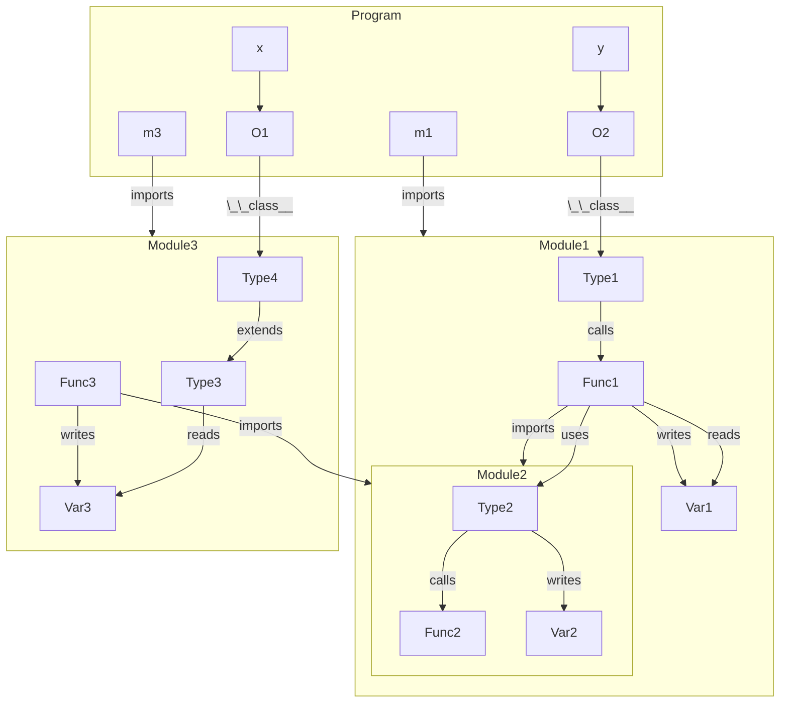
**Figure 10:** Module structure.

For concreteness, assume that all modules opt-in to
freezing, nothing opts out, and nothing is frozen directly
on declaration. Now, `freeze(y)` will fail unless
`Module1.Type1` is immutable. To make `Module1.Type1`
immutable, we can either do `freeze(Module1)` which
will freeze everything in `Module1` or we can just do
`freeze(Module1.Type1)`. The latter will attempt to freeze
`Func1` which will fail because it captures the state in
`Var1`. We are still allowed to freeze `Type1`, but not call
any of its methods that call `Func1`. We could go in and
freeze `Var1` to resolve this, but we might be discouraged
by code comments, documentation, a "private name" etc.
Freezing `Module3.Type4` will freeze `Module3.Type3`, but
cannot end up freezing `Func3` or `Var3`. Finally, freezing
`Func3` explicitly cannot propagate through the import to
`Module3` since freezing a function cannot escalate to a
module (unless `Func3` was declared `@freezable`).

Backing up to our initial example with the `Fraction` class,
here is how we would have approached freezing `f1`:

**Listing 21:** Freezing in steps.
```python
# Step 1: Opt in freezing in the current module (__main__)
__freezable__ = 1

# Step 2: Freeze the type
# The type must be frozen explicitly. This would have
# frozen object and type if they were not already frozen.
# Propagates from Fraction to __init__, __add__, and __repr__,
# and from __init__ to gcd.
freeze(Fraction)

# Step 3: freeze the fraction object
# This freezes Fraction instance 1. The ints 1 and 3 are
# already immutable, and so is the int type.
freeze(f1)
```


### Dealing with cyclic dependencies

Since freezing a type can only propagate to other types that are
super types of the first type, we need a way to deal with cyclic
dependencies such as this:

**Listing 22:** Freezing with cyclic dependencies.
```python
class A:
    def foo(self):
        self.value = B()

class B:
    def bar(self):
        self.value = A()
```

Notably, freezing `A` freezes `A.foo` which captures `B`. However,
since `B` has not been frozen, freezing `A.foo` will fail according
to the rules above. Trying to first freeze `B` does not solve the
problem, as `B.bar` fails to freeze. The solution to this problem
is to let `freeze` take multiple arguments which can be used to
resolve these kinds of situations: `freeze(A, B)` will permit
`A.foo` to capture `B` because it sees that `B` is in the list of
things which will be frozen. (And if `B` would fail for some other
reason, the effects of the entire call will be made undone.)

For the same reason, we cannot make `A` and `B` `@frozen`.
Dealing with cyclic dependencies requires freezing to happen
after all classes involved have been constructed.


### Preventing an instance from being frozen

To prevent a freezable object from being frozen we can
set `__freezable__ = 0` (or any other value than 1).
The `immutable` module that this PEP provides contains a
context manager that one can use to set `__freezable__ = 0`
at the start of a block, and restores it at the end:

**Listing 23:** Making objects temporarily unfreezable.
```python
with immutable.disabled(obj):
    # old = getattr(obj, '__freezable__', 1)
    # obj.__freezable__ = 0
    ...
    call_into_some_library(obj)
    ...
    # implicitly does obj.__freezable__ = old
```


## Immutability out-of-the-box

This PEP proposes that all types which are already immutable
in CPython are made PEP795-immutable and shared across
subinterpreters. For clarity, these are:

- **TODO Matt Johnson**
- `int`
- `float`
- `bool`
- `complex`
- `str`
- `bytes`
- `tuple` (if all elements are themselves immutable)
- `frozenset`
- `range`
- `slice`
- `dict`
- `list`
- `NoneType` (`type(None)`)
- `ellipsis` (`type(...)`)
- `NotImplementedType` (`type(NotImplemented)`)
- `code` (`types.CodeType`)
- `function` (`types.FunctionType`)
- `builtin_function_or_method` (`types.BuiltinFunctionType`)
- `method_descriptor` (e.g. `str.upper`)
- `wrapper_descriptor` (e.g. `int.__add__`)
- `member_descriptor` (e.g. `__slots__` members)
- `staticmethod`
- `classmethod`
- `property`
- `type`
- `function`
- `object`

In addition to these, the following types should support
immutability out-of-the-box:

- **TODO Matt Johnson**
- `fractions.Fraction`
- ...
- `threading.Lock`
- `threading.RLock`
- `threading.Semaphore`
- `threading.Condition`
- functools stuff... LRU cachhe
- meta classes like ABCMeta

Permitting lock objects to be frozen is key to permit concurrent
subinterpreters to coordinate their actions. While this is not
necessary to avoid data races (modulo shared fields), it may
be needed to correctly capture the intended program logic.


# The `immutable` library

In this section we describe the `immutable` library that
contains the user-facing functions of this PEP. Note that
this PEP relies on checking an object's immutability status
before writes, which requires many changes to core Python.
We annotate each section below with the stage where each
definition is added.


## The `freeze` function (stage 2 and 3)

**NOTE: changes semantics slightly from stage 2 to 3 wrt.
requirements on reference count**

The `freeze` function is arguably the most important function
in this PEP. A call to `freeze(obj)` will traverse the object
graph starting in `obj`; it follows the *propagation rules*
to determine how far freezeing `obj` may propagate, and it
follows the *freezing rules* to determine whether an object
can be frozen or not. If in the end, `obj` would fail to meet
the *immutability invariant*, the entire freeze operation
fails, and `obj` is left in state it was right before the call.

When an object is frozen, we set a bit in the object
header that is used to track the immutability status of all
objects. All writes to fields in the object are expected to
check the status of this bit, and raise an exception instead
of carrying out the field write when the bit is set.

As part of freezing, we perform an analysis of the object
graph that finds the strongly connected components in the
graph that gets frozen. A strongly connected component
is essentially a cycle where every object can directly or
indirectly reach all other objects in the component. This
means that all objets in a strongly connected component
will have exactly the same lifetime. This in turns mean that
we can use a single reference count to manage the lifetime
of all the objects in the component. This means that no
cycle detection is needed for immutable objects.

With respect to the implementation, we will select one
object in the component to hold the reference count, and
turn remaining reference counters into pointers to that
object. That means that reference count manipulations on
immutable objects will need one more indirection to find the
actual counter (in the general case).


## The `is_frozen` function (stage 1)

The `is_frozen` function inspects the bit in the object
header set by the `freeze` function and returns `True` if
this bit is set.


## The `NotFreezable` type (stage 3)

This is the exception type that `freeze` or `@frozen` throws
when failing to freeze an object.


## The `disabled` context manager (stage 1)

This is a very simple context manager that adds a field
`__freezable__` to the object at the start of the block with
value 0 (meaning the object isn't freezable), and restores
the original value at the end of the block.


## TODO (stage 3)

**NOTE: come up with good names**
- `make_module_shared`
- `import_as_shared`


## The `@frozen` (stage 2), `@freezable` and `@unfreezable` decorators (stage 3)

The decorator `@unfreezable` turns off support for freezing
a class or function. This decorator is only needed when an
enclosing scope opts-in support for freezing. This allows
excluding a type from a module when the module is frozen,
or a function from a type when the type is frozen.

The `@freezable` decorator turns on support for freezing
a class or function. When the decorator is used without
arguments, it permits anything captured by the decorated
declaration to be frozen. When given arguments, it *limits*
what may be frozen.

The `@frozen` decorator behaves exactly like `@freezable`,
except that is freezes the declaration. This decorator can
be used to define a class that becomes frozen immediately
after its definition has been evaluated.

When used on a class, the decorators propagate to any
directly nested declaration. For example,

```python
@freezable
class Foo:
    def frob(self, a, b, c):
        class Bar:
            pass
    class Baz:
        def quux(self, a, b, c):
            pass
```

is equivalent to

```python
@freezable
class Foo:
    @freezable # from Foo
    def frob(self, a, b, c):
        class Bar:
            pass
    @freezable # from Foo
    class Baz:
        @freezable # from Foo via Baz
        def quux(self, a, b, c):
            pass
```

The reason why the decoration does not propagate to `Bar` is
to avoid complicated source code analysis of functions.
Any arguments to a decorator are propagated along with the
decorator.

Propagation can cause a declaration to become multiply
decorated when an outer decorator is propagated to a nested
declaration. The list below explains what happens in this
case. The leftmost is the outer decorator and the rightmost
the inner.

- `@frozen`      + `@frozen`      = `@frozen`
- `@frozen`      + `@freezable`   = `@frozen`
- `@frozen`      + `@unfreezable` = raises exception
- `@freazable`   + `@frozen`      = `@frozen`
- `@freazable`   + `@freezable`   = `@freezable`
- `@freazable`   + `@unfreezable` = `@unfreezable`
- `@unfreezable` + `@frozen`      = `@frozen`
- `@unfreezable` + `@freezable`   = `@freezable`
- `@unfreezable` + `@unfreezable` = `@unfreezable`

For clarity, the first line means that two `@frozen`
decorators is equivalent to a single `@frozen` decorator.
Note that nesting something `@unfreezable` inside something
that is `@frozen` raises an exception since this is not
meaningful (the `@unfreezable` thing will not be reachable
in the program so this is most likely an error).

Arguments are always joined together, so if `@frozen("a",
"b")` is nested inside `@freezable("b", "c")`, the result is
`@frozen("a", "b", "c")`.


### Decorator arguments

As explained in the rules for freezing, without an explicit
`@frozen` or `@freezable` annotation, freezing a function
will fail if it captures external state.

```python
__freezable__ = 1

x = [47]
y = [11]
def foo(a):
    x.append(a)
    y.pop()
freeze(foo) # fails
```

With an `@freezable` annotation, freezing the function
succeeds:

```python
x = [47]
y = [11]
@freezable
def foo(a):
    x.append(a)
    y.pop()
freeze(foo) # succeeds
```

The above is syntactic sugar for naming all the variables
that the function captures:

```python
x = [47]
y = [11]
@freezable("x", "y")
def foo(a):
    x.append(a)
    y.pop()
freeze(foo) # succeeds
```

Explicitly naming what may be frozen as a side-effect of
freezing a function (or type) can serve as documentation
and could be useful input to a linter. Importantly, it
permits us to detect if something is about to become
immutable that was not explicitly listed. In the function
below, we will be able to detect that freezing `foo` would
lead to freezing the contents of a variable that was not
explicitly permitted to be frozen.

```python
x = [47]
y = [11]
@freezable("x")
def foo(a):
    x.append(a)
    y.pop()
freeze(foo) # will freeze y which isn't listed -- read more below
```

Note that we are looking at variable names and not object
identities, so the below will *not* work even though `x` and
`y` are aliases (or more correctly, happen to be aliases at
the time `freeze` is called).

```python
x = [47]
y = x
@freezable("x")
def foo(a):
    x.append(a)
    y.pop()
freeze(foo) # succeeds
```

Also note that we only care about freezing mutable state. If
we capture a variable outside of the list of permitted
variables, but that variable contains an immutable object,
freezing will not fail. Thus, the second call to `freeze`
below will succeed.

```python
x = [47]
z = [11]
y = z
@freezable("x")
def foo(a):
    x.append(a)
    y.pop()
freeze(z)   # freeze the list object referenced by y and z
freeze(foo) # succeeds
```

Permitting a function to be freezable but with with an **empty
permission set** is written `@freezable("")`.


### Detecting freezing outside of the permitted set

The decorator is an effect annotation, similar to a `throws`
declaration in Java. Now we discuss the meaning of capturing
variables (referencing mutable objects) which were not
explicitly listed as OK to freeze.

**Strict:** throw an exception. If a function evolves so
that freezing it propagates outside of the permitted set,
this is a design error that should be fixed.

**Relaxed:** replace any captured value outside of the
permitted set by a frozen dummy value. This permits the
function to be frozen, but prevents the values we hadn't
explicitly permitted to be frozen from being frozen. This
may cause the function to become incapacitated, but it also
enables writing functions that behave differently depending
on whether they are frozen or not:

```python
x = [47]
y = [11]
@freezable("x")
def foo(a):
    x.append(a)
    if not is_frozen(foo):
        y.pop()
```

Freezing `foo` above will not cause `y` to be frozen, and
the function is implemented in such a way that it does not
try to mutate `y` if it is frozen. Note that it is not
possible to analyse functions to see if they might access
the dummy value if they are frozen. These kinds of errors
will always be caught dynamically.

For `@frozen`, only the strict semantics is meaningful.
For `@freezable`, there are pros and cons with both.

**TODO:** make a decision.


## Shared field (stage 2)

Shared fields permit multiple interpreters to share a
mutable field, which may only hold immutable objects.
It was described in the escape hatch section above.

The code below is not how shared fields are implemented,
but describes the behaviour of a shared field, except
that freezing the field object does not prevent subsequent
assignment to `self.value`. (To be clear: this cannot be
implemented in pure Python since it is not safe for freezing
to exclude `self.value`.)

```python
import threading
import immutable

def shared(initial_value=None):
    @frozen("")
    class SharedField:
        def __init__(self, initial_value):
            # Note, this field stays mutable when freezing
            self.value = initial_value
            self.lock = threading.Lock()

        def set(self, new_value):
            if not is_frozen(new_value):
                raise "Shared fields only store immutable values"
            with self.lock:
                old_value = self.value
                self.value = new_value
            return old_value

        def get(self):
            with self.lock:
                old_value = self.value
            return old_value

        def swap(self, expected_value, new_value):
            if not is_frozen(new_value):
                raise "Shared fields only store immutable values"
            with self.lock:
                old_value = self.value
                if old_value != expected_value:
                    return old_value
                else:
                    self.value = new
                    return expected_value

    return immutable.freeze(SharedField(initial_value))
```


## Local fields (stage 2)

Local fields permits an object to have a field that holds
different (mutable or immutable) values for different
interpreters, i.e the field is "interpreter-local",
analogous to how `threading.local()` works. It was described
in the escape hatch section above.

The code below is not how interpreter-local fields are
implemented, but describes the behaviour of such fields,
except that freezing the field object does not prevent
subsequent updates to the `interpreter_map`. (To be clear:
this cannot be implemented in pure Python since it is not
safe for freezing to exclude `interpreter_map`.)

```python
import immutable

def local(init_func=None):
    interpreter_map = {}

    @frozen("interpreter_map") # abuse of notation, interpreter map is not frozen
    class LocalField:
        def _resolve(self):
            import sys
            current = sys.interpreter_id
            try:
                return interpreter_map[current]
            except KeyError:
                value = init_func()
                interpreter_map[current] = value
                return value

        def __getattr__(self, name):
            target = self._resolve()
            return getattr(target, name)

        def __setattr__(self, name, value):
            target = self._resolve()
            setattr(target, name, value)

        def __delattr__(self, name):
            target = self._resolve()
            delattr(target, name)

        def __call__(self, *args, **kwargs):
            target = self._resolve()
            return target(*args, **kwargs)

        def __repr__(self):
            target = self._resolve().__repr__()

    return immutable.freeze(LocalField())
```


# C extensions

# Builtin functions

Can we call print etc.

# Backwards Compatibility

# Specification


- What can be frozen implicitly?
- Do object follow type pointers?
- Modules?
- Write a section on the virality of freezing
- Locks are considered immutable

# Implementation

## Stage 1

- is_frozen
- the immutable types shared across interpreters
- sharing immutable objects across interpreters
- atomic RC for immutable objects
- remove immutable objects from subinterpreter heap (and put back)
- disabled
- make certain types and objects immutable

## Stage 2

- scc
- freeze function
- @frozen
- shared and local fields
- sharing of frozen modules
- make certain types and objects immutable

## Stage 3

- freeze function (remove constraint)
- NotFreezable
- make_module_shared
- import_as_shared
- @freezable and @unfreezable
- make certain types and objects immutable

# Types

TODO: paste text about types here
