Cuts
----

Stage 3
==========

There are cases where freezing one object means that others do not require the
self-contained checks.  For instance, a class might be implemented such that
if any object of that class is frozen, then its type can be frozen even if it
is not self-contained.  To support this use case, the ``__freezable__`` attribute
can set to contain
a function object that sets the ``__freezable__`` attribute on its type to
``AliasesAllowed`` when any instance of the type is frozen.  This function is
called the **pre-freeze hook**.  The pre-freeze hook should return one of ``True``,
``False`` or ``AliasesAllowed``.

In stage 3, if obj ``o`` has ``o.__freezable__ == True``, freezing is
permitted to propagate to the object regardless of the rules laid
out in stage 2. This means that *freezing is permitted to propagate
from objects to types and declarations, and back again,* and that
*objects can be made immutable even if they have incoming
references from objects that stay mutable* -- but only if programmers
opt-in to these features. Note that by normal
Python semantics, if a class ``C`` has ``C.__freezable__ == True``,
that means that a subclasses ``D`` of ``C`` also has
``D.__freezable__ == True``, and furthermore an instance ``o`` of
``C`` or ``D`` has ``o.__freezable__ == True`` (unless ``D`` or ``o``
create their own ``__freezable__`` field that shadows ``C``'s.
Setting ``__freezable__ == False`` has the effect of *preventing*
freezing. Note that just because freezing is permitted to propagate
to an object, it does not mean that freezing it will succeed. For
example, if object ``o`` references object ``p``, and
``o.__freezable__ == True`` but ``p.__freezable__ == False``, then
``freeze(o)`` will not succeed as an immutable object is not
permitted to reference mutable objects. From now on, when needed,
we will call freezable objects with ``__freezable__ == True``
*strongly freezable objects*.

A decorator ``@freezable`` is added that can be used on class
and function declarations that adds a ``__freezable__`` field
with value ``True``. 

In stage 3, the ``@frozen`` decorator and the new ``@freezable``
decorator now takes an optional white-list argument that permits
identifying captured mutable state to be frozen by the name. A
catch-all argument ``"*"`` can be used to permit freezing to
propagate to any captured mutable state. If an object ``o`` is
named in the white-list of a declaration, freezing that declaration
treats ``o`` as if ``o.__freezable__ == True`` holds.

Finally, the ``module`` type object is made immutable which permits
entire modules to be frozen. A module object may declare itself
freezable by setting the ``__freezable__`` field to the value
``True``.

Another Cut
~~~~~~~~~~~

White-listing can also be used to freeze module objects,
as shown by the example below.

.. code-block:: python
   :caption: **Listing 7:** Example of strongly freezable objects and white-listing to freeze a module object.

   # module utils

   def gcd(a, b):
       while b:
           a, b = b, a % b
       return a

   # other file

   import utils

   # Make Fraction class and instances strongly freezable
   @freezable
   class Fraction:
       # Permit freezing to propagation to the utils module
       @freezable("utils")
       def __init__(self, numerator, denominator):
           d = utils.gcd(numerator, denominator)
           self.n = numerator // d
           self.d = denominator // d

       @freezable
       def __add__(self, other):
           num = self.n * other.d + other.n * self.d
           den = self.d * other.d
           return Fraction(num, den)

       @freezable
       def __repr__(self):
           return f"{self.n}/{self.d}"

   f1 = Fraction(1, 3)
   f2 = Fraction(2, 7)
   freeze(f1) # OK -- freezes class object and instance
   f1 = f1 + f2

Right before freezing, we have the following object graph.

   **Figure 6:** Right before ``freeze(f1)``.

After we have executed ``freeze(f1)``, the “ice blue” objects will be
immutable:

   **Figure 7:** Right after ``freeze(f1)``.

Lines drawn in blue denote references that are stored in a field of an
immutable object. Thus, the contents of ``f1.n`` and ``f1.d`` cannot
change, but the stack variable ``f1`` can be made to point to an
entirely different object. (As happens in the next line of the example
``f1 = f1 + f2``.)

Let’s now bring in functions, modules, and types. To reduce clutter, we
will not draw the full object graph, since there are lots of other
default functions e.g. \ ``__eq__`` in every type, etc. So with some
simplifications, the object graph of our example above looks like this
right before freezing:

   **Figure 8:** Almost full object graph, right before freezing.

Note the line from ``Function 3`` (``Fractions.__init__``) to the
``utils`` module object and the line from that object to
``Function 1`` (``gcd``). This is the reference that ``__init__``
captures to ``utils`` via its call to ``utils.gcd()``.

Because we permit freezing the ``utils`` object (due to the
white-listing in ``@freezable`` on ``__init__``), freezing the
``__init__`` function will succeed, and cause the freezing of
``utils`` and ``gcd``.

   **Figure 9:** Almost full object graph, right after freezing.

The example illustrates an important point: ``freeze(f1)`` is
permitted to propagate to its type object as that object is strongly
freezable. Note that because it is strongly freezable, we are
permitted to freeze ``Fraction`` although it is not self-contained
(it has two incoming references from ``f1`` and ``f2`` and we are
only freezing ``f1``). In stage 2, we would have had to write
``freeze(f1, f2, Fraction)`` to be allowed to freeze ``f1`` and
``Fraction``, i.e. we would have been forced to freeze ``f2`` too.

Thus, stage 3 is now close to the initial version of this PEP:
``freeze(f1)`` suffices to freeze the above. What is different
though is that the programmer had to explicitly make ``Fraction``
strongly freezable, and explicitly permit freezing of 
``__init__`` to propagate to ``utils``.

When the ``Fraction`` class is made immutable all its function
objects, such as ``__init__``, ``__add__``, and ``__repr__`` must
be immutable too, or they are no longer callable. Of the three
functions in ``Fraction``, only ``__init__`` captures external
state: a reference to the module ``utils`` from which we access the
function ``gcd``. Thus the module must be made immutable too, which
propagates to the ``gcd`` function. The white-listing makes this
legal, but the module could also have set ``__freezable__ = True``
internally. Notably, ``__add__`` has a reference to ``Fraction``
which would also have to be made immutable, but is already immutable
in this example.

Note that the ``utils`` variable in the stack frame did not become
immutable, although it is pointing to an immutable object. It is
still possible to reassign that variable. Also note that while a
Python class technically has a reference to all its subclasses, we
do not freeze subclasses, only superclasses, when a class is made
immutable. (Under the hood, we use our escape hatches to make sure
that a mutable class C that is subclassing an immutable class is
only accessible to the subinterpreter where C was defined.)

[I'm still really concerned about freezing modules, I think the content in here
could be made independent of freezing modules, but I am not sure if this is material
that should be in the PEP?  It isn't spec or implementation detail.]

Escape hatches and modules
==========================

Let us come back to modules. Recall the ``gcd`` function in the
fractions example from stage 3 was imported from the module
``utils``. In that particular example, the module did not have any
mutable state, which meant freezing it is unproblematic. However,
in many cases, modules maintain some state and making that state
immutable incapacitates the module.

Luckily, the interpreter-local field permits an immutable object to
store pointers to mutable objects without compromising safety in the
sub-interpreters model. This can be used together with modules and
functions to permit an immutable function to call functions that rely on
mutating state. For example, let us define a module for logging thus:

.. code-block:: python
   :caption: **Listing 11:** Running module example.

   # logger.py
   messages = []

   def log(msg):
       messages.append(msg)

   def flush(file):
       file.writelines(messages)
       messages.clear()

And let’s use the module:

.. code-block:: python
   :caption: **Listing 12:** Running module example – use-site.

   import logger

   def simulate_work():
       logger.log("simulate")

   for _ in range(0, 10):
       simulate_work()

   with open("log.txt", "w") as f:
       logger.flush(f)

If we wanted to freeze ``simulate_work()`` and pass it around so that
any sub-interpreter could call it, we have to do some refactoring of the
module first. For example, it is not thread-safe right now, meaning that
concurrent calls to log could drop some messages, etc. But more
importantly, it is not safe for different sub-interpreters to manipulate
the same mutable ``messages`` list object.

Let’s go through our options. For completeness, we start with some
options that do *not* rely on escape hatches. These all involve
rethinking the ``logger`` design.

Do nothing
----------

While this is not an option here, for completeness, let us explore doing
nothing. If we simply make ``logger`` immutable, the ``messages`` list
becomes immutable and calls to ``log`` will result in exceptions on
every attempt to append to ``messages``, which means we have
“incapacitated the module”. For a module which is stateless, or that
only had immutable constants, this would have worked.

Make the module stateless
-------------------------

We can refactor the module to become stateless:

.. code-block:: python
   :caption: **Listing 13:** Stateless logger module.

   # logger.py

   def log(msg):
       print(msg)

   def flush(file):
       """Deprecated, should no longer be used"""
       pass

    # Mark the module as freezable
    __freezable__ = True

This is probably not what we want to do, but shows that printing from an
immutable function is not a problem (because the ``print`` method is
considered immutable in this PEP). This strategy might work in cases that
can be rewritten in terms of immutable builtins, but is not a general
solution.

Move the module’s state out of the logger module
------------------------------------------------

We can refactor the module to use external state which is passed in to
the logger. The code below permits the module to be used as before, but
now switches behaviour to rely on the user passing in a mutable list to
``log`` and ``flush`` if ``messages`` are immutable.

.. code-block:: python
   :caption: **Listing 14:** Logger module with external state.

   # logger.py
   from immutable import is_frozen
   messages = []

   def log(msg, msgs=None):
       if is_frozen(messages):
           if msgs is None:
               raise RuntimeError("Nowhere to log messages")
           else:
               msgs.append(msg)
       else:
           messages.append(msg)

   def flush(file, msgs=None):
       if is_frozen(messages):
           if msgs:
               file.writelines(msgs)
               msgs.clear()
       else:
           file.writelines(messages)
           messages.clear()

    # Mark the module as freezable
    __freezable__ = True

This is a rather large refactoring, and probably not what we want in
this case, but maybe in others.

The remaining cases use our escape hatches to permit the module to hang
on to some mutable state.

Store the module state in a shared field
----------------------------------------

Keeping the module’s state but moving it out of sub-interpreter
isolation requires that all objects in the state, except for the escape
hatch, are immutable.

.. code-block:: python
   :caption: **Listing 15:** Logger module with shared field. Note, does not show the additional synchronisation needed to protect the shared logger state in ``messages`` as this is not specific to this PEP.

   # logger.py
   from immutable import shared, freeze
   messages = shared(freeze([]))

   # Note: does not protect against races on messages
   def log(msg):
       new_messages = messages.get()[:]
       new_messages.append(msg)
       freeze(new_messages)
       messages.set(new_messages)

   # Note: does not protect against races on messages
   def flush(file):
       file.writelines(messages.get())
       messages.set(freeze([]))

    # Mark the module as freezable
    __freezable__ = True

This module can now be made immutable without incapacitating it -- the
``messages`` variable will effectively remain mutable (through an
indirection), and can be updated with new messages. This allows a single
logger module instance to be used across all sub-interpreters. Locks from
the standard library will support immutability to enable synchronization
across sub-interpreters. This would be needed here to prevent races in the
``log`` and ``flush`` function. But these changes are related to standard
concurrency and not specific to this PEP.

Keep one logger per sub-interpreter
-----------------------------------

If we have a multi-phase initialization module, it may make more sense
to have one logger state per sub-interpreter. There are two ways to go
about this. Let’s start with the analog of the above solution using an
interpreter-local field.

.. code-block:: python
   :caption: **Listing 16:** Logger module with interpreter-local field.

   # logger.py
   from immutable import local
   messages = local(freeze(lambda: []))

   def log(msg):
       messages.append(msg)

   def flush(file):
       file.writelines(messages.get())
       messages.set([])

    # Mark the module as freezable
    __freezable__ = True

The interpreter-local field is initialised on first access using a
immutable lambda function. The function needs to be immutable to be shared
across sub-interpreters. When the function is called it creates a
**mutable** empty list which is stored as the initial value of the
current sub-interpreter’s ``messages`` field.

We do not need to change ``log`` and only change ``flush`` to call
``set()`` and ``get()`` on the messages field – the logic is otherwise
unchanged. Now freezing ``log`` and ``flush`` is unproblematic as freezing does
not propagate through ``messages``. A call to the shared ``log``
function from a sub-interpreter will store the log message on that
sub-interpreter’s ``message`` list.

Keep one logger per sub-interpreter – take 2
--------------------------------------------

We can achieve the same effects as above without changing the logger
module, but instead change how we import it. Let’s first do that
manually, and then introduce some tools that are part of the
``immutable`` library in this PEP.

.. code-block:: python
   :caption: **Listing 17:** Sketching support for wrapping modules behind immutable proxies.

   @frozen
   def import_and_wrap(module):
       from immutable import local

       @frozen # note -- assumes module is immutable
       def local_import():
           return __import__(module)

       return local(local_import)

   logger = import_and_wrap("logger")
   # everything below unchanged

   def simulate_work():
       logger.log("simulate")

   for _ in range(0, 10):
       simulate_work()

   with open("log.txt", "w") as f:
       logger.flush(f)

The ``import_and_wrap`` function wraps the module object for the logger
module in an interpreter-local field. Thus, ``logger`` will not be
made immutable when we freeze ``simulate_work``. The first time a
sub-interpreter tries to access the shared ``logger`` object as part of
a call to ``logger.log()`` inside ``simulate_work``, the sub-interpreter
will import the module and subsequent calls on the local field will be
forwarded to the module object.

To ensure that any library that imports ``logger`` automatically gets
the wrapper, it is possible to replace the entry in
``sys.modules['logger']`` with the wrapper. The ``immutability`` library
in the PEP provides utilities for importing and wrapping, wrapping an
already imported module, and ensuring that subsequent ``import``
statements import the wrapper.

Consequences of this design on freeze propagation
~~~~~~~~~~~~~~~~~~~~~~~~~~~~~~~~~~~~~~~~~~~~~~~~~

[Dropped as self-contained covers this more concisely.]

In this PEP, freezing a type or function will never propagate to
normal objects in the program, unless these objects are strongly
freezable. In other words, freezing declarations should not lead to
*accidental* freezing of program state.

There are two ways to freeze state:

1. Explicitly declare it as ``@frozen`` (which first constructs it and then freezes it in one go)
2. Explicitly call ``freeze`` on it

(Technically, it is also possible to call ``frozen`` as a function
although that it not intended.)

Because module objects opt-out of freezing by default, it should be
hard to accidentally incapacitate a module. The module has to
explicitly turn on that support (which is possible in stage 3).
Creating a module with only some types or functions that support
freezing is possible by explicitly opting out of freezing in those
declarations. Also, if these declarations capture mutable module
state beyond white-listing, then freezing them will fail. The
module implementer needs to either make that state immutable or use
an escape hatch (or increase the permissions).

Below is an example of a program with some objects and modules with
types, functions and state. We will use this example for illustration.

   **Figure 12:** Module structure.

For concreteness, assume that we are in stage 3 and that nothing is
declared immutable. Assume ``Func1`` is declared unfreezable since
it needs to read and write the external ``Var1`` variable. Now,
``freeze(y)`` will fail unless ``Module1.Type1`` is immutable. To
make ``Module1.Type1`` immutable, we can either do
``freeze(Module1)`` which will freeze everything in ``Module1`` or
we can just do ``freeze(Module1.Type1)``. The latter will attempt
to freeze ``Func1`` which will fail as it is unfreezable. We are
still allowed to freeze ``Type1``, but not call its ``Func1``
method. Freezing ``Module3.Type4`` will fail unless we also freeze
``Module3.Type3`` at the same time (or if it is already frozen).
Finally, freezing ``Func3`` cannot propagate through the import to
``Module3`` unless ``Module3`` is strongly freezable.

Types
~~~~~~

In short: the possibility of making objects immutable in-place does not
weaken type-based reasoning in Python on a fundamental level. However,
if immutability becomes very frequently used, it may lead to the
unsoundness which already exists in Python’s current typing story
surfacing more frequently.

There are several challenges when adding immutability to a type system
for an object-oriented programming language. First, self typing becomes
more important as some methods require that self is mutable, some
require that self is immutable (e.g. to be thread-safe), and some
methods can operate on either self type. The latter subtly needs to
preserve the invariants of immutability but also cannot rely on
immutability. We would need a way of expressing this in the type system.
This could probably be done by annotating the self type in the three
different ways above – mutable, immutable, and works either way.

A possibility would be to express the immutable version of a type ``T``
as the intersection type ``immutable & T`` and a type that must preserve
immutability but may not rely on it as the union of the immutable
intersection type with its mutable type ``(immutable & T) | T``.

Furthermore, deep immutability requires some form of “view-point
adaption”, which means that when ``x`` is immutable, ``x.f`` is also
immutable, regardless of the declared type of ``f``. View-point
adaptation is crucial for ensuring that immutable objects treat
themselves correctly internally and is not part of standard type systems
(but well-researched in academia).

