PEP: 795
Title: Deep Immutability for Efficient Sharing and Concurrency Safety
Author: Matthew Johnson <matjoh@microsoft.com>, Matthew Parkinson <mattpark@microsoft.com>, Sylvan Clebsch <sylvan.clebsch@microsoft.com>, Fridtjof Peer Stoldt <fridtjof.stoldt@it.uu.se>, Tobias Wrigstad <tobias.wrigstad@it.uu.se>
Sponsor: Michael Droettboom <mdboom@gmail.com>
Discussions-To: TBD
Status: Draft
Type: Standards Track
Content-Type: text/x-rst
Created: 27-Feb-2025
Python-Version: 3.15
Post-History: 
Resolution:

Abstract
#############

This PEP proposes support for deeply immutable objects in Python. This
PEP partitions all objects into two categories: **mutable** and **deeply
immutable**. Mutable objects can be updated and
reference both mutable and deeply immutable objects. Deeply immutable
objects cannot be updated, and may only point to other deeply immutable
objects. A mutable object can also be **freezable**, meaning that it
can be turned into an immutable object. We refer to the act
of making a freezable object immutable as “freezing it”, and
we will often say "freezable object" to mean a mutable object that
is also freezable.

There is no way to make an immutable object mutable.
However, one can make a mutable copy of an immutable object.
Immutability is tracked by a bit in the object header. We
will use one more bit to handle cyclic immutable garbage.
Both these can be added without increasing the size of the
object header.

From now on, we will use immutable to mean deeply immutable, and use
**shallow immutability** to mean the protection offered by tuples and
frozen sets in Python 3.14. For example, ``(42, ("Spam", None))`` is
deeply immutable, but ``(42, ["Spam", None])`` is only shallowly
immutable, because the list constructor creates a mutable object.

Changes from the previous draft
================================

This PEP is a complete rewrite of the original PEP after `discussions on
DPO`_ and elsewhere. Based on feedback from DPO this rewrite:

.. _discussions on DPO: <https://discuss.python.org/t/pep-795-add-deep-immutability-to-python/96014>

-  Focuses more on programming model, not just implementation details
-  Aims to be clearer about what the costs are for different parts of
   the design, both in terms of complexity for programmers and
   implementers of this PEP
-  Aims to make the semantics of freezing clearer, and provide more
   examples of how freezing propagates
-  Adds a new design that limits freeze propagation in stage 1 and 2
-  Adds escape hatches and clearly points out who implements them
-  Motivates the design by linking it clearer to sharing objects across
   sub-interpreters
-  Aims to be clearer about the semantics of immutable functions (and why
   they are unavoidable)
-  Discusses the role of types and future plans for types
-  Includes direct sharing of immutable objects across sub-interpreters,
   rather than making a separate PEP for this
-  Removes a lot of the rejected alternatives from the original PEP;
   this is motivated by this PEP already being very long, and because
   the inclusion of direct sharing across sub-interpreters motivate many
   of the design decisions

We are very grateful to the many comments and threads on DPO that have
contributed to this PEP.

Motivation
#############

The motivation for immutability is four-fold:

1. With the semantics of immutability that this PEP proposes, immutable
   objects can be shared directly by reference across sub-interpreters.
   This is a big performance boost for sub-interpreters as Python
   currently requires objects to be transferred across sub-interpreters
   by pickling. This also simplifies programming with sub-interpreters.
   To make this safe, some changes are necessary with respect to how a
   Python interpreter manages the memory of immutable objects. (Note
   that this is not possible without *deep* immutability.)
2. Since immutable objects are safe from data races, it is possible to
   avoid some of the overhead surrounding field access that is needed
   for correct reference counting in free-threaded Python.
3. Memory for immutable objects can be managed in a leak-safe manner
   without the need for cycle detection, even when there are cycles in the
   immutable objects. This is the key to sharing objects
   between sub-interpreters without needing substantial changes to cycle
   detection.
   The algorithm we use to perform this assumes that freezing an object
   does not occur in parallel with concurrent mutation. 
4. Immutability is a very useful concept in programming that simplifies
   reasoning about state. In particular immutable objects are safe to
   share between concurrent threads without any synchronisation in the
   program.

In this PEP, we strive to create a semantics for immutable
objects that is consistent across both the per-interpreter GIL and
free-threaded concurrency paradigms.

In a future PEP, we will propose a scheme for sharing *mutable* objects
by reference across sub-interpreters, using region-based ownership to
enforce the invariants necessary for safety. There is a
short note about this at the end of this document.

Design considerations due to sub-interpreters
==============================================

This PEP will enhance sub-interpreters so that immutable
objects can be shared directly by reference between sub-interpreters. This is possible because
immutability permits an object to safely forego isolation and
be accessed outside of the protection offered by a single
a GIL, and its memory managed safely using atomic reference
counting, even for cyclic garbage. This is not the case for
mutable objects, and if a mutable object could be accessed
by multiple sub-interpreters, the Python VM could crash or
be susceptible to use-after-free bugs that could corrupt
data silently. If immutability could be circumvented, the
same would be true for immutable objects. This motivates
a strict interpretation of immutability, where the
mutable and immutable “worlds” are kept apart. (Although see
`Escape hatches`_.)

Immutability is important to allow safe sharing between sub-interpreters.
To illustrate this point, let's assume that it would be possible to
share a mutable object O across two sub-interpreters (Sub 1 and
Sub 2) each with their own GIL. Because each sub-interpreter is
only synchronising with its own GIL, they are not synchronising
with each other.

The picture below shows the situation above pictorially – the boxes
labelled Sub 1 and Sub 2 show the heaps of sub-interpreters 1 and 2.
Objects A and D are mutable and reside in the heap of Sub 1. Object B is
mutable and resides in the heap of Sub 2. A and B both point to an
immutable shared object C. Note that object C
does not belong to either sub-interpreter, which is why it is drawn
outside of their heaps.

   **Figure 1:** Illegal reference from immutable to mutable object. The
   immutable object C is shared between two sub-interpreters, and keeps an
   illegal reference to a mutable object on the heap of one of the
   sub-interpreters.

A sub-interpreter assumes that accesses to
the objects in its heap are protected by its GIL. **Note that the reference
from C to D is not legal in this PEP, and this example shows what
happens if it was allowed.** The colours on the dashed arrows show which
sub-interpreter is using a reference to access an object. We annotate
the accesses with what GIL is used to synchronise actions on the object.
Because of the reference from C to D, it is possible to have two
accesses relying on different GILs for correctness, meaning
these accesses do not synchronise. This may silently corrupt
or crash the Python VM.

Specification
#############

This PEP describes three stages of immutability support in Python.
The first two stages permit more and more objects to be immutable,
and the third stage permits freezing to propagate further.
Permitting more objects to be immutable requires more changes to
the Python interpreter, and additionally comes with design
considerations at the language level. While we foresee no
technical problems with getting to the third stage already in
Python 3.15, discussions at DPO prompted the split of this PEP
into stages to clarify the “return on investment” for each step
and also permitting this change to be rolled out across multiple
releases to give the Python community more time to get accustomed
to immutability. It is also possible to only support the early
stages if the further stages are perceived as too invasive.
At a high-level, the three stages are:

1. **Stage 1: Inherently Immutable Objects**.
   Objects and types which are `de-facto immutable`_ in Python 3.14 are
   immutable according to this PEP. Examples include tuples that only
   contain immutable objects, strings, numbers, booleans, and `None`.
   More information on current Python immutability can be found
   in the `data model documentation`_.
2. **Stage 2: Supporting User-Defined Types**.
   Extend immutability to dicts, lists, sets and user-defined types
   and their instances. Objects of these types will be freezable,
   meaning they will be mutable at creation but may be made immutable.
   Classes are freezable as well. This permits monkey patching, i.e.
   adding and removing methods in a class before freezing which is
   important for many libraries, e.g. dataclasses. Making objects
   immutable is only permitted if there are no references outside
   of the immutable objects that can witness the change from mutable
   to immutable.
3. **Stage 3: Enhancing Freeze Propagation**.
   Empower freezing to make objects immutable in the presence of
   references that can witness the change.

.. _de-facto immutable: https://docs.python.org/3/glossary.html#term-immutable
.. _data model documentation: https://docs.python.org/3/reference/datamodel.html

Semantics of immutability
=========================

This PEP partions objects into the categories **mutable**
and  **immutable**. Mutable objects can be updated and
reference both mutable and immutable objects. Immutable
objects cannot be updated, and may only point to other
immutable objects. Mutable objects can also be **freezable**
meaning they can be turned into immutable objects.

Sometimes it may be necessary for an immutable object to point to
mutable data or support some limited form of mutation. This will be
supported through `escape hatches`_.

Stage 1 – Inherently Immutable Objects
--------------------------------------

In stage 1, we align the deep immutability of this PEP with the shallow
immutability in Python. All types that are immutable in Python 3.14 are
also deeply immutable in the sense of this PEP. Further, all instances
of ``int``, ``float``, ``str``, ``complex``, and ``bool`` and the
``None`` constant are deeply immutable. Instances of
**shallowly immutable** composite objects like ``tuple``,
``namedtuple``, ``frozenset``, ``range`` and ``slice``
are deeply immutable if their nested objects are deeply
immutable.

In this stage, immutability is always established at the point of
creation, which means that there is no need for an operation that takes
a mutable object and makes it immutable (this becomes possible in stage 2
and 3).

.. code-block:: python
   :caption: **Listing 1:** Creating immutable (and one mutable) objects.

   # is_frozen(obj) returns True if obj is deeply immutable
   from immutable import is_frozen

   # Creates immutable object --  all subobjects are immutable
   p = ("this", 15, "an", "ex parrot")
   is_frozen(p) # True

   # Does not create an immutable object -- dict is mutable so n is shallow immutable
   n = ({'x' : 'parrot'}, None)
   is_frozen(n) # False

   from collections import namedtuple
   Person = namedtuple('Person', ['name'])

   # Create deeply immutable tuple of named tuples
   monty = (Person("Eric"), Person("Graham"), Person("Terry"))
   is_frozen(monty) # returns True -- all subobjects are immutable

For clarity, while all of the objects above except for the dictionary
are de-facto immutable today in Python, these cannot be safely shared
across sub-interpreters without the changes proposed by this PEP. As the
``n`` tuple contains a mutable dictionary it is **not** deeply immutable
and therefore not safe to share between sub-interpreters even with the
changes this PEP proposes.

Sharing of Types
~~~~~~~~~~~~~~~~

To share an object it has to be deeply immutable, which includes the
type object stored in the ``__class__`` reference. All types of the
currently de-facto immutable objects are immutable (*i.e.*, the type has
the ``Py_TPFLAGS_IMMUTABLE_TYPE`` set) and can therefore
be made safe to share across sub-interpreters while being consistent with
the definition of deep immutability and not breaking existing code.

 
   **Figure 2:** An immutable instance C and its immutable type D being
   shared across two sub-interpreters.

The figure above introduces our drawing notation. The boxes “Sub 1” and
“Sub 2” are the heaps of the sub-interpreters. A and B are mutable
objects living in the isolated heaps. C and D are immutable objects
living outside the sub-interpreter heaps, and are accessible by all.
Arrows are references.

Dealing with cycles
~~~~~~~~~~~~~~~~~~~

When objects are immutable at creation, immutable object graphs cannot
contain cycles. Therefore, immutable objects do not need to participate
in cycle detection. This is important, as each sub-interpreter operates
under the assumption that the objects traversed by its cycle detector
are not mutated by program threads while the cycle detector is running.
Stage 2 and 3 permits creation of immutable cycles. There we
introduce a :ref:`different technique to handle cycles <scc>`.

There are a handful of types that form cycles in the CPython implementation,
such as ``tuple``, ``type``, and ``object``.  These cycles are part of the static
initialization of the interpreters and are Immortal, so they do not need
to be managed by the cycle detector.

``register_shallow_immutable(typ)``
~~~~~~~~~~~~~~~~~~~~~~~~~~~~~~~~~~~~

To make a user-defined type immutable, it has to be registered
using ``register_shallow_immutable(typ)``. This expresses that the
type does not contain any mutable fields.  This allows C-modules or Python
modules that already have immutable types to register them as such, so that
they can be shared across sub-interpreters.

If a type is incorrectly registered as shallow immutable, this can lead to
undefined behaviour, including crashes and memory corruption, when using 
the type across sub-interpreters.

Summary
~~~~~~~

-  A deeply immutable object may only point to other immutable objects
   (modulo `escape hatches`_), including its class object
-  Deeply immutable objects can be created from objects which are
   already immutable in Python today – note that for tuples, named
   tuples and frozen sets, this requires that their constituent parts are
   deeply immutable too
-  Immutable objects are always immutable at the point of creation
-  Immutable object graphs are tree shaped

Stage 2 – supporting user-defined types and freezing mutable isolated subgraphs
-------------------------------------------------------------------------------

Stage 2 adds support for freezable user-defined types
and function objects and freezable instances of immutable
user-defined types. Instances of immutable types are
freezable, meaning they are mutable, but can be made
immutable by freezing them through an explicit call to a
``freeze()`` function. We also make the instances of ``list``,
``dict``, and ``set`` freezable, meaning lists, dicts and sets
are mutable on creation but can be made immutable later. To make a type
immutable immediately at creation time, a decorator
``@frozen`` can be used. The decorator, the ``freeze()``
function, along with other utilities described later in this
document are in a module called ``immutable``.

An immutable function is a normal function that can be
passed both mutable and immutable arguments. It is free
to mutate newly created objects or any mutable arguments --
but it may not capture a reference to mutable state as
part of the function object.
(Making a function immutable does not prevent optimisations
etc. which rely on mutating the code object.)

An immutable type may not capture mutable state, and
additionally does not permit adding, removing or changing
functions. Immutable types may not inherit from mutable
types, but may have mutable subtypes.

This PEP includes `escape hatches`_ that relax
the restrictions on capturing mutable state in functions and types. Note
that while we did not discuss immutable functions much in
stage 1, they were already there as part of the immutable type objects.
Since those functions in those types are part of core
Python, it is easy to ensure that these are well-behaved
with respect to this PEP.

With freezable objects and ``freeze()`` and ``@frozen`` come the issue of
*freeze propagation*, meaning what freezable objects can be made
immutable as a side-effect of making something else immutable. To limit freeze
propagation, an object graph can only be made immutable if it -- with the
exception of the external reference to the root of the graph -- is
**self-contained**, meaning there are no references into the object
graph from outside the object graph, except the reference passed to
``freeze()``. For example, consider the figure below, ``freeze(x)`` will
fail because of the reference to ``C`` in ``y``. However, if that reference
is removed, or if ``C`` was already immutable, ``freeze(x)`` would succeed.
Note the cycle between A and B – immutable are no longer necessarily tree
shaped.

   
   **Figure 3:** Explaining the meaning of self-contained object graphs in
   freezing.

In other words, freezing requires that all incoming references to
objects that will become immutable as a result of a call ``freeze(x)``
originate from the object graph rooted at ``x``. The motivation behind this
design is that it ensures that a mutable object will never
"suddenly become immutable under foot”. After an object of
type T has been made immutable, subsequent attempts to write
to its fields will result in “TypeError: object of type T
is immutable”.

Finally, it is possible to call ``freeze(x, y)`` to make
the structure in Figure 3 immutable. This is slightly different
from "first freeze ``y``, then freeze ``x``" -- this means freeze
everything reachable from ``x`` and ``y`` at the same time,
regardless of whether the structures overlap or not. Freezing
with ``A`` as a starting point permits one incoming external
reference to ``A`` (the ``x`` variable); freezing with ``C``
as a starting point permits one incoming external reference
to ``C`` (the ``y`` variable). As a result, freezing the entire
structure is permitted despite the two incoming references.

As types and functions are freezable, they can be made
immutable by passing them as arguments to ``freeze()``.
Alternatively, to declare a function or type that will
be immutable at creation, we introduce a ``@frozen``
decorator, which will be explained below (and in additional
detail :ref:`here <frozen>`).

The major challenge with immutable declarations can be illustrated
easily through an example. What if the following program was legal?

.. code-block:: python
   :caption: **Listing 2:** A function that *cannot* be made immutable as it captures mutable state.

   import random
   from immutability import immutable, is_frozen

   @frozen
   def die_roll():
       return random.randint(1, 6) # captures external random object

   is_frozen(die_roll) # True in this hypothetical example
   send_to_other_sub-interpreter(die_roll) # Problem

The ``die_roll()`` function above captures the ``random`` module object
of its defining sub-interpreter. If we pass the ``die_roll`` function
object to another sub-interpreter, we have successfully recreated the
problematic situation in Figure 1 where C is ``die_roll`` and D is
``random``. **In stage 2, a function which is declared @frozen may
only capture immutable objects.** The code above will raise an exception
as the reference to ``random`` means that it is not self-contained.
Note that freezing a module
object is not possible in stage 2 because any used ``module``
object is reachable by importing it, and thus would break the self-contained check.
One workaround is to simply move `import random` into the
function. Another option, which we will show later, is to use
escape hatches to permit the code above to work by using a proxy for the
``random`` module that directs calls to ``randint()`` to the
correct sub-interpreter.

When a type is declared ``@frozen``, all its containing methods are
implicitly declared ``@frozen`` as well.

.. code-block:: python
   :caption: **Listing 3:** A valid immutable class.

   from immutability import freeze, immutable, is_frozen

   @frozen
   class Die:
       def __init__(self, sides=6):
           self.set_sides(sides)
       def set_sides(self, sides):
           self.sides = sides
       def roll(self):
           # Importing a mutable module is OK
           import random
           return random.randint(1, self.sides)

   is_frozen(Die) # True
   is_frozen(Die.roll) # True

   d = Die(6)
   is_frozen(d) # False
   d.roll() # will return a number in [1,6]
   d.change_sides(12) # OK

   freeze(d) # turns the object d points to immutable
   is_frozen(d) # True
   d.roll() # will return a number in [1,12]
   d.change_sides(6) # will raise an exception

Listing 3 creates a ``Die`` type which is immutable at creation.
(An alternative to the ``@frozen`` decorator is to call ``freeze(Die)``
right after the class declaration -- this is equivalent.) As neither
the ``Die`` class nor its functions capture any external mutable state,
this declaration is valid. The import inside of ``roll()`` 
illustrates the major difference between the function importing the
current sub-interpreter’s ``random`` module on each call and a function
capturing and always calling into a specific sub-interpreter’s random
module. The default ``sides`` argument in ``__init__`` is supported
since the value is immutable.

Right before ``freeze(d)``, we have the following object graph (with
some simplifications to reduce clutter – recall that immutable objects
can only reference other immutable objects).

   **Figure 4:** Before freezing ``d`` – immutable objects drawn in “ice
   blue” with dashed borders and references from immutable objects drawn
   with thicker blue lines.

Note that the instance of ``Die`` pointed to by ``d`` is a normal
mutable Python object. Thus we are allowed to change the number of sides
from 6 to 12. However, after we freeze the object, an attempt to change
its sides will raise an exception, since the object is immutable. Note
that freezing ``d`` will not prevent the value stored in the ``d``
variable to change. However, as indicated by the blue reference arrow,
``sides`` inside the immutable ``Die`` instance is fixed for life.

   **Figure 5:** Right after freezing ``d`` – immutable objects drawn in “ice
   blue” with dashed borders and references from immutable objects drawn
   with thicker blue lines.

Note that freezing is *in-place*; ``freeze(obj)`` freezes ``obj``.

Immutable functions
~~~~~~~~~~~~~~~~~~~

As explained above, that a function is immutable means that it
is safe to share across sub-interpreters. This means that the function
may not capture a direct reference to mutable state. The function may
be passed mutable state, and may even get access to mutable state through
module imports -- this is all permitted.

To limit the side-effects of freezing a function, we decouple any
captured variable inside a function from its defining scope at the
point of freezing. In the code below, you can witness how freezing
the ``foo`` function effectively gives ``foo`` its own copy of the
``x`` *variable*, which initially shares its *value* with the enclosing
``x``:

.. code-block:: python
   :caption: **Listing 4:**

   x = 42
   @frozen
   def foo():
       return x

   is_frozen(foo) # True
   foo() # returns 42
   x = 4711 # OK
   print(x) # prints 4711
   foo() # returns 42

Without this design, we would not be able to freeze ``foo`` as it
would not be self-contained.

Unfreezable
~~~~~~~~~~~

Sometimes an function or object should not be freezable as
there is no sensible use case for making it immutable.  Consider a
function that increments a ``nonlocal`` variable.  This function
can never be used safely once it has been made immutable.

To support this use case, we introduce a ``set_freezable`` function
that can set the freezable status of an object.  In stage 2, this
function can be passed the special value ``Never``, which prevents
the object from being frozen.  The ``@unfreezable`` decorator is
built on top of this function:

.. code-block:: python
   :caption: **Listing 5:** Examples of opting out of freezing.

   def unfreezable(obj):
       set_freezable(obj, Never)
       return obj

   x = 42
   @unfreezable
   def foo():
       nonlocal x
       x += 1
       return x

   is_frozen(foo) # False
   freeze(foo) # Fails "foo is unfreezable"

   class Cell:
       def __init__(self, value):
           self.value = value

   c = Cell(42)
   unfreezable(c)
   freeze(c) # Fails "object is unfreezable"

``register_freezable(typ)``
~~~~~~~~~~~~~~~~~~~~~~~~~~~

To make a user-defined type freezable, it has to be registered
using ``register_freezable(typ)``. This is to avoid
accidentally making a type freezable that should not be.
This can be used from C or Python code to register that instances
of a type are freezable, and that any C code that mutates
instances of the type correctly checks that the instances are 
not immutable before mutating them.

Stage 2 will add some core types as freezable.

.. _summary-1:

Summary
~~~~~~~

In addition to stage 1:

-  Making an object immutable blocks subsequent mutation of the object.
-  Making a mutable object graph immutable fails if the object graph is
   not self-contained.
-  Declarations (types and functions) can be made immutable, either by
   calling ``freeze()`` or by declaring them ``@frozen``.
-  Immutable declarations may not capture references to mutable state
-  An immutable class’s functions are all immutable, and methods cannot
   be added, removed, or changed.
-  Instances of immutable types are mutable at creation but can be made
   immutable.

Stage 3 – enhancing freeze propagation
--------------------------------------

The self-contained checks in stage 2 lead to the least surprises for existing
code as it is not possible for an object to suddenly become immutable
under foot. However, this may be too restrictive in some cases. Stage 3 allows
objects to explicitly opt-out of the self-contained checks.  This is done using
the ``set_freezable`` function.  We extend it to take an additional special value ``AliasesAllowed``.
When this has been called on an object, then the object does not need the
self-contained check to be frozen.
We refer to objects in this state as *strongly freezable objects*.

.. code-block:: python
   :caption: **Listing 6:** Freezing propagates.

   def freezable(obj):
       set_freezable(obj, AliasesAllowed)
       return obj

   monty = []
   freezable(monty) # make monty strongly freezable

   @freezable
   class Person:
       def __init__(self, name):
           self.name = name
           monty.append(self)

   eric = Person("Erik")
   graham = Person("Graham")
   terry = Person("Terry")

   is_frozen(Person) # False
   is_frozen(monty) # False

   freeze(Person) # Freeze the Person type
   is_frozen(Person) # True
   is_frozen(monty) # False
   eric.name = "Eric" # OK

   freeze(eric) # Freeze an instance of Person
   is_frozen(graham) # True - graham is reachable from monty, and monty is reachable from eric.
   is_frozen(monty) # True

   monty.append(Person("John")) # throws exception because monty is immutable
   monty.pop()                  # --''--

   terry.name = "John"          # throws exception because all person objects 
                                # in monty are immutable too

The example above shows that because all instances of ``Person``
capture the contents of the ``monty`` variable, freezing any person
object freezes the list of persons, along with all persons in the
list.

Pre-freeze hook
~~~~~~~~~~~~~~~
Sometimes it is necessary to run some code just before an object
is frozen. This can be done by calling ``set_pre_freeze_hook`` with a callable that will be
invoked just before freezing the object. The callable will be passed
the object that is about to be frozen as its only argument. The callable
may call ``set_freezable`` on this object, or its contained objects to affect
whether freezing will succeed or not.

This can be used to enable ``AllowAliases`` on contained objects at the last moment,
so that it only comes from a particular object being frozen, and not from other references.

If a freeze fails because at least one object is not allowed to be frozen, then the system
will ensure none of the objects are frozen.  However, the effects of the pre-freeze hook
will not be undone.

On user defined types, the definition can directly define a ``__pre_freeze__`` method that
will be called as the pre-freeze hook.

.. _summary-2:

Summary
~~~~~~~

In addition to stage 2:

- Objects can be made *strongly
  freezable* by calling ``set_freezable`` with the value ``AllowAliases``.
- We also provide a pre-freeze hook that can be used to run code
  just before an object is frozen. This can be used to set ``AllowAliases``
  on contained objects at the last moment.

Escape hatches
==============

Deep immutability can sometimes be too strict. (Examples of this has
come up in DPO discussions – for example, a class might use a mutable
cache internally, even though all its instances are technically
immutable.) To this end, we provide two escape hatches, both in the form
of a field that stays mutable even when the object containing the field
is immutable:

1. **Shared fields** which can only hold immutable objects.
2. **Interpreter-local fields**, which may hold both mutable and
   immutable objects.

A shared field’s value is visible to all sub-interpreters that read the
field. Since only immutable objects can be shared across
sub-interpreters, that means that shared fields can only contain
immutable objects. This is checked by the field on assignment, and
attempts to store a mutable objects in a shared field throws an
exception. The field takes care of synchronisation if multiple
sub-interpreters read or write the field at the same time, and ensures
that reference count manipulations are correctly handled.

An interpreter-local field ``f`` transparently behaves as multiple
fields, one per sub-interpreter in the program, and each sub-interpreter
will only ever read or write “it's field”. This ensures that two
sub-interpreters accessing the same field concurrently will not race on
the value in the field, since they are accessing different objects. When
a mutable value is stored in an interpreter-local field, it will only be
accessible to the sub-interpreter that stored it. Thus, supporting
mutable values is safe.

Shared fields
-------------

Shared fields are implemented as an object indirection. The ``shared`` object
is part of the ``immutable`` module that this PEP provides. Here is an
example that shows what programming with a shared field might look like.
The example shows a class maintaining a mutable instance counter, that
keeps working even after the class is made immutable.

.. code-block:: python
   :caption: **Listing 8:** Cell implemented using a shared field.

   import immutable  # library this PEP provides

   class Cell:
       counter = immutable.shared(0)

       def __init__(self, a):
           self.value = a
           while True:
               old = self.__class__.counter.get()
               new = old + 1
               immutable.freeze(new)  # shared fields can only hold immutable objects
               if self.__class__.counter.set(old, new): # stores new in counter if counter's value is old
                   self.id = new
                   return  # break out of loop on success

       def __repr__(self):
           return f"Cell({self.value}) instance number {self.id})"

   c = Cell(42)
   immutable.freeze(c)        # Note: freezes Cell
   immutable.is_frozen(Cell)  # returns True
   print(c)   # prints Cell(42) instance number 1
   d = Cell(4711)
   print(d)   # prints Cell(4711) instance number 2

Note that in free-threaded Python, it would be technically safe to
permit a shared field to store mutable objects, as the problem with
multiple sub-interpreters accessing a mutable value under different GILs
does not exist. However, we believe in keeping the programming model the
same regardless of whether sub-interpreters or free-theading is used.
(Programming with immutable objects is also less prone to subtle
errors.)

Let’s use the same diagrams as when explaining the problem with having a
reference to mutable state from immutable state above, to show how the
shared field is different. Let us again use two sub-interpreters that
both have a reference to a shared immutable counter declared as above:

   **Figure 10:** Shared field.

Notably, there are no references from immutable state to mutable state
inside a sub-interpreter, which we have seen causes problems. While the
shared field object poses as an immutable object in the system, it is
really mutable, which is why it is drawn in gray. As it uses its own
synchronisation internally, and only manipulates immutable objects, it
is not a problem that concurrent accesses do not synchronise with each
other (which they don’t since they use different GILs to synchronise).

Interpreter-local fields
------------------------

Interpreter-local fields are analogous to ``threading.local()`` in
Python, but keeps one value per interpreter, as opposed to one value per
thread. Thus, if two different sub-interpreters read the same field,
they may read different values; two threads in the same sub-interpreter
will always read the same value (provided there has been no interleaving
mutation). This escape hatch provides an cleaner way to implement the 
de-facto solution today for sharing functionality across sub-interpreters,
*i.e.*, having copies of shared modules, types, and functions loaded
individually on a per-interpreter basis.

Interpreter-local fields can store both mutable and immutable objects.
In the case of a mutable object, this object will be guaranteed to live
on the heap of the sub-interpreter that accesses the field. It is
therefore safe to store mutable objects in such a field.

The ``immutable`` module contains the class for interpreter-local
fields. Here is what programming with such a field might look like:

.. code-block:: python
   :caption: **Listing 9:** Cache in prime factorised implemented using an interpreter-local field.

   import immutable # library this PEP provides

   class PrimeFactoriser:
       def __init__(self):
           self.cache = immutable.local(freeze(lambda: { 2: [2], 3: [3], 4: [2, 2] }))
       def factorise(self, number):
           if self.cache.has_key(number):
               return self.cache[number]
           else:
               factors = ... # perform calculation
               self.cache[number] = factors
               return factors

   pf = PrimeFactoriser()
   immutable.freeze(pf)
   pf.factorise(7) # will update the cache as side-effect (on the current interpreter)

The example above maintains a mutable dictionary as part of a cache.
Despite ``pf`` being immutable, we can still mutate the cache, but the
mutations and the cache are only visible on the current interpreter.
Another interpreter trying to factorise 7 will have to redo the
calculations and populate its own cache. (The immutable lambda function is
used to initialise the local storage on each sub-interpreter on first
access.)

While interpreter-local fields cannot be used to implement a global
instance counter, we can use a shared field to implement the caching.
Since a shared field cannot hold mutable objects, we would have to
freeze the dictionary before storage, and to update the cache we would
have to first make a mutable copy of the current cache, add to it, and
then freeze it again before storing it back into the field. On the other
hand, we only need to cache prime factors once as opposed to
once-per-interpreter, as the cache is global.

We can illustrate the difference between the interpreter-local escape
hatch and shared fields pictorally:

   **Figure 11:** Interpreter-local field.

The interpreter-local field ensures that accesses from Sub 1 yield the
reference to E, whereas accesses from Sub 2 yield the reference to F.
Thus, all accesses to a mutable object on one interpreter’s heap is
always synchronising on the same GIL.

As one more example of how shared fields and interpreter-local fields
complement each other, we revisit the list of references from a
superclass object to its subclasses that we are not freezing. We can
implement this using a shared field in combination with an
interpreter-local field. Consider the immutable class A, to which we
want to add a new *immutable* subclass B and a new *mutable* subclass C.
Since immutable subclasses are shared, we add a shared field with an
immutable list of references to immutable subclasses. Every time we add
to that list, we create a new list from the old, add the new reference,
freeze the new list and stick it back into the shared field. In contrast
to B, the mutable subclass C should only be visible to the
sub-interpreter that defined it. Thus, we use an interpreter-local field
to keep a (mutable) list of the mutable subclasses of A. Together, these
two lists store the subclasses of a class.

Initialisation of interpreter-local fields
------------------------------------------

Interpreter-local fields can hold mutable objects which can only be
initialised from the interpreter to which the field belongs. To permit
the interpreter that defines the field to control the initialisation of
the field, the constructor ``local`` accepts an immutable function object as
input. The function gets the interpreter-local field as argument and can
install (possibly mutable) values. Here is an example:

.. code-block:: python
   :caption: **Listing 10:** Initialising an interpreter-local field.

   from immutable import local
   sharable_field = local(freeze(lambda: 0))

The first time the sharable field is loaded by a sub-interpreter, that
sub-interpreter will call the lambda function and store its result in
the value of the local field for that sub-interpreter. (If the initial
value is an immutable object, one could also consider passing in the
object straight, rather than a function that returns it.)

Cycles involving escape hatches
---------------------------------

Cycles that involve these escape hatches will not be collected
unless they are manually broken.  This is because the cycle detector
is per interpreter, and thus without adding a stop all subinterpreters
collector it is not possible to find cycles that involve either shared
fields or interpreter-local fields.

In the free-threaded build, the new cycle stop the world cycle detector
will find cycles involving shared fields, but not interpreter-local fields.

Controlling the propagation of freezing
=======================================

A recurring theme when discussing this proposal on DPO has been concerns
that freezing an object will propagate beyond the programmers intention, and cause
objects to be made immutable accidentally. This is an inherent effect in
immutability systems at witnessed by e.g. ``const`` in C and C++.
Annotating a variable or function with ``const`` typically propagates in
the source code, forcing the addition of additional ``const``
annotations, and potentially changes to the code. In C and C++, this
happens at compile-time, which helps understanding the propagation. (See
also the section on static typing for immutability later in this
document.

To address these discussions we have staged 
the introduction of features to make clear what can be changed. 
Stage 1, restricts deep immutability to 
objects that are immutable at creation time, and therefore
there is no freeze propagation. Stage 2 introduces freeze propagation,
but limits the propagation to self-contained object graphs. Self-contained 
addresses the concerns about surprise and accidental freezing.
Stage 3 introduces the ability to opt-out of self-contained checks
to permit more freeze propagation where objects explicitly opt-in to
this.

Freeze propagation in stage 1
-----------------------------

The stage 1 support for immutability only supports immutable objects
which are constructed from de-facto immutable objects in Python 3.14. As
objects can only be immutable at creation-time, there is no freeze
propagation. Object graphs must be constructed inside out from immutable
building blocks. This can be cumbersome, but the result is never
surpising.

This will allow sub-interpreters to immutably share things like strings,
integers, tuples, named tuples etc. This is expressive enough to for
example express JSON-like structures, but notably does not support
sharing arbitrary objects of user-defined type, and not functions.

**Propagation rules:**

-  There is no such thing as freeze propagation. Objects are immutable from
   the leaves up, at construction-time. There is no ``freeze()``
   function.

**Freezing rules:**

-  An object which is an instance of a type that is de-facto immutable
   in Python 3.14 is immutable at creation; unless it references data
   that is not immutable. Notable exception: instances of ``type``
   create mutable objects; only the type objects we have explicitly
   listed are immutable.

**Immutability invariant:**

-  An immutable object only references other immutable objects.

Freeze propagation in stage 2
-----------------------------

Stage 2 adds support for user-defined immutable types and functions,
plus dicts, lists, and sets. These types and instances of these types
are *freezable* meaning they are mutable objects that can be made
immutable. An immutable object cannot be made mutable, but it is
possible to create a mutable copy.

Stage 2 introduces freeze propagation as it uses a
``freeze()`` function or a ``@frozen`` decorator to make
mutable objects, types, and functions immutable.

Freezing is only supported for self-contained object graphs
meaning that there may be no incoming reference to an object
that gets frozen from outside the set of objects that get
frozen, except for the reference used to call ``freeze()``.
This ensures that the code in Listing 18 will never raise
an exception due to a mutation error on the last assignment
to ``y.f``.

.. code-block:: python
   :caption: **Listing 18:** In stage 2, freeze propagation cannot affect shared state.

   y.f = 41
   freeze(x) # if succeeds, guaranteed to not have affected y
   y.f += 1 

If freezing ``x`` could propagate to ``y``, then the object graph rooted
in ``x`` is not self-contained, which will cause ``freeze(x)`` to fail.
Similarly, since passing a reference to a function guarantees that the
reference at the call-site remains, a function cannot freeze its
arguments. Notably, this avoids freezing accidentally incapacitating a
module. Freezing a list object that happens to be part of a module’s
state that should stay mutable will incapacitate the module will fail
because the list is not self-contained.

This is a guarantee that “cuts both ways”: it is very hard to pass an
object around without making it impossible to freeze.

**Propagation rules:**

-  Freezing an object propagates to other objects that it can reach.
   This includes the type of the object, the functions in the type,
   and any objects referenced from the object.
-  Freezing will only succeed if the entire object graph that
   will be made immutable is self-contained, meaning there are no
   incoming references from outside the object graph, except for
   the reference passed to ``freeze()``.

**Freezing rules:**

-  Objects that are instances of types that have been `registered_freezable` may be frozen,
   but freezing an object graph may fail if it contains
   objects which may not be frozen.
-  An individual object can be made impossible to freeze by setting
   ``set_freezable(obj, Never)``. A convenience decorator ``@unfreezable``
   installs this field in declarations.

**Immutability invariant:**

-  An immutable object only references other immutable objects, with the
   exception of mutable objects that preserve sub-interpreter isolation
   but are nevertheless marked as immutable in the system. (For example
   escape hatches.)

Freeze propagation in stage 3
-----------------------------

Stage 3 permits users to allow freezing to propagate further. In
particular, it adds the notion of a *strongly freezable object*
which always permits freezing and does not fail to freeze due to
incoming references from mutable objects.

A declaration can be made strongly freezable by decorating it
with ``@freezable``. Instances of strongly freezable types are
strongly freezable by default.

The ``@frozen`` and ``@freezable`` decorators now take (optional)
arguments that permits treating captured mutable objects as if they
were strongly freezable. We refer to this as "white-listing".
The special argument ``"*"`` is a catch-all white-list that
permits any object encountered during freezing to be frozen.

Note that freezing a strongly freezable object may still fail, for
example because it holds on to some other object that cannot be
frozen. Think of it as a license to call ``freeze()`` on it, not a
guarantee that the call will succeed.

**Propagation rules:**

- The rules for freeze propagation follows stage 2, but may
  additionally propagate to strongly freezable object. This permits
  freezing an object to propagate to freezing its type, etc.
- Freezing a declaration decorated with ``@frozen`` or
  ``@freezable`` may treat captured objects as strongly freezable
  if explicitly permitted to do so by the programmer.

**Freezing rules:**

- Module objects can be made strongly freezable.
- Freezing a declaration that captures mutable state will fail unless
  the mutable state is in the declarations's white-list or the mutable
  state is strongly freezable.
- Instances of and subclasses of a strongly immutable class are
  also strongly immutable. This can be overridden either by setting
  ``__freezable__`` to ``False`` (meaning they become
  *unfreezable*) or any other value except ``True`` or ``False``
  (making them *freezable*, but not strongly).

[TODO: Need some changes above.]

**Immutability invariant:**

-  An immutable object only references other immutable objects, with the
   exception of mutable objects that preserve sub-interpreter isolation
   but are nevertheless marked as immutable in the system. (For example
   escape hatches.)

Details and discussion
----------------------

Below, we refer to an object (including declarations) with a field
``__freezable__`` with value ``False`` as *unfreezable*.

Freezing objects
~~~~~~~~~~~~~~~~

In stage 2 and 3, an object can become immutable if it satisfies *all* of the
constraints below:

- It is not unfreezable.
- All the objects reachable from the object can become immutable (or are
  permitted to be freezen), including classes and functions in classes.
- Unless the object is strongly freezable, all references it has are
  stored in objects being made immutable at the same time as the
  object, with the exception of the argument to the ``freeze``
  call.

Failing to satisfy any of the above constraints will cause freezing to
fail, leaving all objects in their original state.

Freezing functions
~~~~~~~~~~~~~~~~~~

A function can become immutable if it satisfies *all* of the constraints below:

- All the constraints on freezing objects above. 
- All objects the function captures are immutable or are can become
  immutable. (The latter requires the objects to be strongly
  freezable.) Note that default arguments are
  always permitted to freeze.

Each of the following functions can be made immutable by a simple call to
``freeze``:

.. code-block:: python
   :caption: **Listing 19:** Examples of freezable functions.

   # pure function OK to freeze
   def function1(a, b):
       return a + b

   # only captures other function so freeze propagates
   def function2(a, b):
       return function1(a, b)

   x = freeze(something)
   # only captures immutable state
   def function3(a):
       a.append(x)

   # only captures immutable state
   def function4(a):
       x.append(a) # Note -- will throw exception always when called

Freezing ``function3`` and ``function4`` will succeed only if the
current value of ``x`` is immutable. Furthermore, it detaches from the value
of ``x`` in the outer scope, so even if ``x`` is reassigned in the
outer scope, the immutable functions will still see the old immutable value.

The final example shows that freeze propagation can make a function
unusable. However, because of the rules of freeze propagation,
``freeze(function4)`` will not work unless ``x`` is already
immutable, strongly freezable, or white-listed, so a programmer
needs to perform multiple steps to end up in this situation. To
prevent ``function4`` from becoming immutable, we can use the
``@unfreezable`` decorator that the ``immutable`` library provides.

If class ``Foo`` defines an instance method ``bar`` or a static method
``bar``, then ``Foo.bar`` is a function object. Thus, the following
succeeds:

.. code-block:: python
   :caption: **Listing 20:** Freezing a function object directly.

   # showcase different way of supporting freezing
   @freezable
   class Foo:
       @freezable
       def bar(self):
           self.variable = 42
           return self.variable

   freeze(Foo.bar) # succeeds
   foo = Foo()
   foo.bar() # OK, returns 42

Note that ``freeze(foo)`` would subsequently cause ``foo.bar()`` to fail
because ``self`` inside ``foo`` would now be immutable.

If an immutable function object is bound to a method object, the method
object is mutable, and the “self” object can be mutable too.

Freezing methods
~~~~~~~~~~~~~~~~

Method objects are wrappers for function objects and the object to which
the method is bound, the “self”. A method object can become immutable if the
function **can become** (or is already) immutable, and the self object **is already**
immutable. Thus, the following example will fail to freeze:

.. code-block:: python
   :caption: **Listing 21:** Freezing method objects.

   class Foo:
       def bar(self):
           self.variable = 42
           return self.variable

   foo = Foo()
   freeze(foo.bar) # fails because foo is not immutable

Freezing types
~~~~~~~~~~~~~~

A type can become immutable if it satisfies *all* of the constraints below:

-  It is not unfreezable.
-  All its supertypes are immutable or strongly freezable.
-  Its namespace dictionary is immutable or can be frozen.
-  Its meta class either is or can become immutable. (We will expand on this at a later date.)
-  The type either does not contain any mutable class state, or that state
   is strongly freezable

Note that while functions can be reassigned we do not count this as
class state, meaning we happily freeze functions when a class is
frozen. 

Note the absence of a requirement that all functions defined in the
class must be able to become immutable. **If a function fails to freeze, it will not be
possible to call that function on the immutable type.** This alternative is
preferrable to failing to freeze a type if not all its functions can become
immutable.

Thus, in the example below, ``Foo`` can become immutable, but ``Foo.method1``
cannot be called from that point on, because the function failed to
freeze.

.. code-block:: python
   :caption: **Listing 22:** When methods fail to freeze.

   def function1(a): # can become immutable
       return a

   x = []
   def function2(a): # cannot become immutable
       x.append(a)

   class Foo(object):
       def __init__(self, a): # can become immutable
           self.a = function1(a)
       def method1(self): # cannot become immutable
           function2(self.a)

   freeze(Foo) # OK
   foo = Foo() # OK
   foo.method1() # raises exception -- method1 not safe to call when Foo is immutable

Note that a class that defines class state may not be made
immutable unless the state is strongly freezable, explicitly
permitted to be frozen through white-listing, or the mutable state
is implemented through an escape hatch. This is to avoid
accidentally incapacitating a class by freezing it. Thus, the
following class *cannot* be made immutable:

.. code-block:: python

   class Foo:
       constants = { 'pi' : 3.14 }

This can be solved by freezing the contents of class variables
on creation or before freezing:

.. code-block:: python

   @frozen
   class Foo1:
       constants = frozen({ 'pi' : 3.14 })

   class Foo2:
       constants = { 'pi' : 3.14 }

       @classmethod
       def prep_for_freeze(cls):
           freeze(cls.constants)

   Foo2.prep_for_freeze()
   freeze(Foo2)

Note that the following works without white-listing because ``3.14``
is an immutable object:

.. code-block:: python

   class Foo:
       my_class_variable = 3.14

Although ``3.14`` was already an immutable object, making the class
immutable prevents reassigning the ``my_class_variable`` field. If the
programmer did not intend for ``my_class_variable`` to be a constant
variable, then freezing ``Foo`` will incapacitate the class object.

Dealing with cyclic dependencies
~~~~~~~~~~~~~~~~~~~~~~~~~~~~~~~~

Since freezing a type can only propagate to other types that are
strongly freezable, we need a way to deal with cyclic dependencies
such as this:

.. code-block:: python
   :caption: **Listing 23:** Freezing with cyclic dependencies.

   class A:
       def foo(self):
           self.value = B()

   class B:
       def bar(self):
           self.value = A()

Notably, freezing ``A`` freezes ``A.foo`` which captures ``B``. However,
since ``B`` is not immutable, freezing ``A.foo`` will fail according
to the rules above. Trying to first freeze ``B`` does not solve the
problem, as ``B.bar`` fails to freeze. The solution to this problem is
to let ``freeze`` take multiple arguments which can be used to resolve
these kinds of situations: ``freeze(A, B)`` will permit ``A.foo`` to
capture ``B`` because it sees that ``B`` is in the list of things which
will be made immutable. (And if ``B`` would fail for some other reason, the
effects of the entire call will be made undone.)

For the same reason, we cannot mark ``A`` and ``B`` with ``@frozen``. Dealing
with cyclic dependencies requires freezing to happen after all classes
involved have been constructed.

Preventing a freezable instance from becoming immutable
~~~~~~~~~~~~~~~~~~~~~~~~~~~~~~~~~~~~~~~~~~~~~~~~~~~~~~~

To prevent a freezable object from becoming immutable we can set
``__freezable__ = False``. The ``immutable`` module that this PEP
provides contains a context manager that one can use to set
``__freezable__ = False`` at the start of a block, and restores it at
the end:

.. code-block:: python
   :caption: **Listing 24:** Making objects temporarily unfreezable.

   with immutable.disabled(obj):
       # old = getattr(obj, '__freezable__', True)
       # obj.__freezable__ = False
       ...
       call_into_some_library(obj)
       ...
       # implicitly does obj.__freezable__ = old

Immutability out-of-the-box
---------------------------

Stage 1 of this PEP proposes that all types which have the ``Py_TPFLAGS_IMMUTABLETYPE`` flag
and which are considered immutable for hashability will be automatically made PEP795-immutable,
either in all cases or if constructed from PEP795-immutable objects. In the
case of the core language and standard library, these types consist of the following:

- ``int``
- ``float``
- ``True``, ``False``
- ``complex``
- ``str``,
- ``bytes``
- ``memoryview``
- ``range``
- ``slice``
- ``None``
- ``decimal.Decimal``

And if constructed from PEP795-immutable objects:

- ``tuple``,
- ``namedtuple``
- ``frozenset``

No additional work is required on the part of the programmer to take advantage of
the immutability of these objects, our immutability simply extends the properties of
these objects to allow sharing across subinterpreters without need for pickling or
copying.

Stage 2 will expand this list to collections and (via the ``@frozen`` decorator)
various hashable Python types, including:

- ``dict``
- ``list``
- ``set``
- ``collections.defaultdict``
- ``collections.deque``
- ``array.array``
- ``ctypes`` (existing and programmer derived)
- ``xml.etree.ElementTree.Element``
- ``fraction.Fraction``
- ``ipaddress.IPv4Address``, ``ipaddress.IPv4Interface``, ``ipaddress.IPv6Address``, ``ipaddress.IPv6interface``
- ``uuid.UUID``

Whereas some of these will be like the types above and simply immutable at creation (*e.g.*, ``decimal.Decimal``)
others will require object instances to be marked as immutable (*e.g.*, all the collections).

Stage 3 consists of changes to many types in the standard library to make them
amenable to being made immutable. In particular, the use of mutable objects on
the type object (*e.g.*, caching objects) will be modified to be either shared or
interpreter local. However, no further types are made immutable by default.

The ``immutable`` library
=========================

In this section we describe the ``immutable`` library that contains the
user-facing functions of this PEP. Note that this PEP relies on checking
an object’s immutability status before writes, which requires many
changes to core Python. We annotate each section below with the stage
where each definition is added.

The ``freeze`` function (stage 2 and 3)
---------------------------------------

The ``freeze`` function is arguably the most important function in this
PEP. A call to ``freeze(obj)`` will traverse the object graph starting
in ``obj``; it follows the *propagation rules* to determine how far
freezeing ``obj`` may propagate, and it follows the *freezing rules* to
determine whether an object can become immutable or not. If in the end, ``obj``
would fail to meet the *immutability invariant*, the entire freeze
operation fails, and ``obj`` is left in state it was right before the
call.

When an object is immutable, we set a bit in the object header that is used
to track the immutability status of all objects. All writes to fields in
the object are expected to check the status of this bit, and raise an
exception instead of carrying out the field write when the bit is set.

As part of freezing, we perform an analysis of the object graph that
finds the strongly connected components in the graph that gets immutable. A
strongly connected component is essentially a cycle where every object
can directly or indirectly reach all other objects in the component.
This means that all objetcs in a strongly connected component will have
exactly the same lifetime. This in turns mean that we can use a single
reference count to manage the lifetime of all the objects in the
component. This means that no cycle detection is needed for immutable
objects.

With respect to the implementation, we will select one object in the
component to hold the reference count, and turn remaining reference
counters into pointers to that object. That means that reference count
manipulations on immutable objects will need one more indirection to
find the actual counter (in the general case).

The ``is_frozen`` function (stage 1)
------------------------------------

The ``is_frozen`` function inspects the bit in the object header
set by the ``freeze`` function and returns ``True`` if this bit is
set. If called on a shallow immutable object, and the bit is not
set, ``is_frozen`` returns ``False``, even if the shallow immutable
object only contains deeply immutable objects. This is only
possible if the contents of a shallow immutable object A were
frozen after A was created. In this case, A's bit must be set
through an explicit call to ``freeze()``.

The ``NotFreezable`` type (stage 3)
-----------------------------------

This is the exception type that ``freeze`` or ``@frozen`` throws when
failing to freeze an object.

The ``disabled`` context manager (stage 1)
------------------------------------------

This is a very simple context manager that adds a field
``__freezable__`` to the object at the start of the block with value ``False``
(meaning the object isn’t freezable), and restores the original value at
the end of the block.

TODO (stage 2 and 3)
--------------------

**NOTE: come up with good names**

- ``make_module_shared``
- ``import_as_shared``

.. _frozen:

The ``@frozen`` (stage 2), ``@freezable`` and ``@unfreezable`` decorators (stage 3)
-----------------------------------------------------------------------------------

The decorator ``@unfreezable`` turns off support for freezing a
class or function. This allows excluding a type from a module when
the module is immutable, or a function from a type when the type is
immutable.

The ``@freezable`` decorator makes a class or function strongly
freezable. When the decorator is used without arguments, it does
**not** permit objects captured by the decorated declaration to be
immutable (unless they too are strongly freezable). When given
arguments, it treats those arguments as strongly freezable.

The ``@frozen`` decorator freezes a declaration right after
creation. It takes arguments similar to ``@freezable``. This
decorator can be used to define a class or function that is
immutable immediately after its definition has been evaluated.

When used on a class, the ``@frozen`` decorator propagates to any
directly nested declaration, but the ``@freezable`` decorator does
not. For example,

.. code-block:: python

   @frozen
   class Foo:
       def frob(self, a, b, c):
           class Bar:
               pass
       class Baz:
           def quux(self, a, b, c):
               pass

is equivalent to

.. code-block:: python

   @frozen
   class Foo:
       @frozen # from Foo
       def frob(self, a, b, c):
           @frozen # from Foo via frob
           class Bar:
               pass
       @frozen # from Foo
       class Baz:
           @frozen # from Foo via Baz
           def quux(self, a, b, c):
               pass

Since ``@freezable`` does not propagate,

.. code-block:: python

   @freezable
   class Foo:
       def frob(self, a, b, c):
           class Bar:
               pass
       class Baz:
           def quux(self, a, b, c):
               pass

does **not** make ``frob``, ``Bar``, ``Baz``, and ``quux``
``@freezable``. However, note that ``freeze(Foo)`` will
still work if what gets frozen as a result is self-contained.

Note that white-listing can be used as an alternative to
decorating the top-level contents of a class, so:

.. code-block:: python

   @freezable("frob", "Baz")
   class Foo:
       def frob(self, a, b, c):
           class Bar:
               pass
       class Baz:
           def quux(self, a, b, c):
               pass

is equivalent to

.. code-block:: python

   @freezable
   class Foo:
       @freezable
       def frob(self, a, b, c):
           class Bar:
               pass
       @freezable
       class Baz:
           def quux(self, a, b, c):
               pass

Multiple decorators can be used in a nested fashion. If an
``@freezable`` is used inside an ``@frozen``, the latter takes
precedence and the result will be frozen. Using an ``@frozen``
inside an ``@freezable`` will result in a freezable whose
content are partially frozen.

Arguments are always joined together, so if ``@frozen("a", "b")``
is nested inside ``@freezable("b", "c")``, the result is
``@frozen("a", "b", "c")``.

Decorator arguments – white listing to enable freeze propagation
~~~~~~~~~~~~~~~~~~~~~~~~~~~~~~~~~~~~~~~~~~~~~~~~~~~~~~~~~~~~~~~~

Freezable declarations can only be frozen if they do not capture
mutable state:

.. code-block:: python

   x = [47]
   y = [11]
   def foo(a):
       x.append(a)
       y.pop()
   freeze(foo) # fails

With an ``@freezable`` annotation, freezing the function succeeds
if the mutable state it captures is white-listed, and that state
can be successfully made immutable.

.. code-block:: python

   x = [47]
   y = [11]
   @freezable("x", "y")
   def foo(a):
       x.append(a)
       y.pop()
   freeze(foo) # succeeds

The behaviour is the same, regardless of whether the variables captured
are from globals or an enclosing frame.

.. code-block:: python

   def outer():
       x = [47]
       y = [11]
       @freezable("x", "y")
       def foo(a):
           x.append(a)
           y.pop()
       return foo

   foo = outer()
   freeze(foo) # succeeds

Explicitly naming what may become immutable as a side-effect of freezing a
function (or type) can serve as documentation and could be useful input
to a linter.

Note that the white listing in arguments to ``@freezable`` looks at the
*contents* of variables (at the time of freezing) so the following works
as ``x`` and ``y`` alias.

.. code-block:: python

   x = [47]
   y = x
   @freezable("x")
   def foo(a):
       x.append(a)
       y.pop()
   freeze(foo) # succeeds

Also note that we only care about freezing mutable state. If we capture
a variable outside of the list of permitted variables, but that variable
contains an immutable object, freezing will not fail. Thus, the second
call to ``freeze`` below will succeed.

.. code-block:: python

   x = [47]
   z = [11]
   y = z
   @freezable("x")
   def foo(a):
       x.append(a)
       y.pop()
   freeze(z)   # freeze the list object referenced by y and z
   freeze(foo) # succeeds

To permit a freezable function to freeze anything that it captures:
``@freezable("*")``.

Detecting freezing outside of the permitted set
~~~~~~~~~~~~~~~~~~~~~~~~~~~~~~~~~~~~~~~~~~~~~~~

The decorator can be thought of as an effect annotation, similar to
a ``throws`` declaration in Java. Now we discuss the meaning of
capturing variables (referencing mutable objects) which were not
explicitly listed as OK to freeze.

**Strict:** throw an exception. If a function evolves so that freezing
it propagates outside of the permitted set, this is a design error that
should be fixed.

**Relaxed:** replace any captured value outside of the permitted set by
an immutable dummy value. This permits the function to be made immutable, but
protects all values we hadn’t explicitly permitted to become immutable.
This may cause the function to become incapacitated, but
it also enables writing functions that behave differently depending on
whether they are immutable or not:

.. code-block:: python

   x = [47]
   y = [11]
   @freezable("x")
   def foo(a):
       x.append(a)
       if not is_frozen(foo):
           y.pop()

Freezing ``foo`` above will not cause ``y`` to become immutable, and the
function is implemented in such a way that it does not try to mutate
``y`` if it is immutable. Note that it is not possible to analyse functions
to see if they might access the dummy value if they are immutable. These
kinds of errors will always be caught dynamically.

For ``@frozen``, only the strict semantics is meaningful. For
``@freezable``, there are pros and cons with both.

We propose to go with the strict semantics because it is less complicated,
but (on the downside) also slightly less permissive.

Shared field (stage 2)
----------------------

Shared fields permit multiple interpreters to share a mutable field,
which may only hold immutable objects. It was described in the escape
hatch section above.

The code below is not how shared fields are implemented, but describes
the behaviour of a shared field, except that freezing the field object
does not prevent subsequent assignment to ``self.value``. (To be clear:
this cannot be implemented in pure Python since it is not safe for
freezing to exclude ``self.value``.)

.. code-block:: python
   :caption: **Listing 25:** Semantics of shared fields described through Python

   import threading
   import immutable

   def shared(initial_value=None):
       @frozen
       class SharedField:
           def __init__(self, initial_value):
               # Note, this field stays mutable when freezing
               self.value = initial_value
               self.lock = threading.Lock()

           def set(self, new_value):
               if not is_frozen(new_value):
                   raise RuntimeError("Shared fields only store immutable values")
               with self.lock:
                   old_value = self.value
                   self.value = new_value
               return old_value

           def get(self):
               with self.lock:
                   old_value = self.value
               return old_value

           def swap(self, expected_value, new_value):
               if not is_frozen(new_value):
                   raise RuntimeError("Shared fields only store immutable values")
               with self.lock:
                   old_value = self.value
                   if old_value != expected_value:
                       return old_value
                   else:
                       self.value = new
                       return expected_value

       return immutable.freeze(SharedField(initial_value))

Local fields (stage 2)
----------------------

Local fields permits an object to have a field that holds different
(mutable or immutable) values for different interpreters, i.e the field
is “interpreter-local”, analogous to how ``threading.local()`` works. It
was described in the escape hatch section above.

The code below is not how interpreter-local fields are implemented, but
describes the behaviour of such fields, except that freezing the field
object does not prevent subsequent updates to the ``interpreter_map``.
(To be clear: this cannot be implemented in pure Python since it is not
safe for freezing to exclude ``interpreter_map``.)

.. code-block:: python
   :caption: **Listing 26:** Semantics of local fields described through Python

   import immutable

   def local(init_func=None):
       interpreter_map = {}

       @frozen("interpreter_map") # abuse of notation, interpreter map is not made immutable
       class LocalField:
           def _resolve(self):
               import sys
               current = sys.interpreter_id
               try:
                   return interpreter_map[current]
               except KeyError:
                   value = init_func()
                   interpreter_map[current] = value
                   return value

           def __getattr__(self, name):
               target = self._resolve()
               if name == "get":
                 # used to read the value of the field, not dereference it
                 return target
               else:
                 return getattr(target, name)

           def __setattr__(self, name, value):
               if name == "set":
                 # used to set the value of the field, not update fields in the existing value
                 import sys
                 current = sys.interpreter_id
                 interpreter_map[current] = value
               else:
                 target = self._resolve()
                 setattr(target, name, value)

           def __delattr__(self, name):
               target = self._resolve()
               delattr(target, name)

           def __call__(self, *args, **kwargs):
               target = self._resolve()
               return target(*args, **kwargs)

           def __repr__(self):
               target = self._resolve().__repr__()

       return immutable.freeze(LocalField())

Implementation
###############

We will use two bits as flags per Python object: the first will be used
to track immutability; the second will be used by the SCC algorithm that
permits us to :ref:`manage cyclic immutable garbage without a cycle detector <scc>`.
This will be done without extending the size of the Python object
header.

Immutability is enforced through run-time checking. The macro
``Py_CHECKWRITE(op)`` is inserted on all paths that are guaranteed to
end up in a write to ``op``. The macro inspects the immutability flag in
the header of ``op`` and signals an error if the immutability flag is
set.

A typical use of this check looks like this:

.. code-block:: c
   :caption: **Listing 27:** Example of call to ``Py_CHECKWRITE``.

   if (!Py_CHECKWRITE(op)) {        // perform the check
       PyErr_WriteToImmutable(op);  // raise the error if the check fails
       return NULL;                 // abort the write
   }
   ... // code that performs the write

Writes are common in the CPython code base and the writes lack a common
“code path” that they pass. To this end, the PEP requires a
``Py_CHECKWRITE`` call to be inserted and there are several places in
the CPython code base that are changed as a consequence of this PEP. So
far we have identified around 70 places in core Python which needed a
``Py_CHECKWRITE`` check. Modules in the standard library have required
somewhere between 5 and 15 checks per module.

While the ``freeze(obj)`` function is available to Python programmers in
the immutable module, the actual freezing code has to live inside core
Python. This is for three reasons:

.. _freeze_in_core:

-  The core object type needs to be able to freeze just-in-time
   dictionaries created by its accessors when the object itself is
   immutable.
-  The managed buffer type needs to be immutable when the object it is
   created from is immutable.
-  Teardown of strongly connected components of immutable objects
   (discussed further down in this section) must be hooked into
   ``Py_DECREF``.

As such, we implement a function which is not in the limited API (and
thus not part of the stable C ABI) called ``_PyImmutability_Freeze``
which performs the freezing logic. This is used internally as a C Python
implementation detail, and then exposed to Python through the
``freeze(obj)`` function in the immutable module.

Atomic reference counting
==========================

As a necessary requirement for directly sharing objects across
sub-interpreters, reference counts for immutable objects must be managed
with atomic operations. This is handled in the reference counting macro
by branching on the immutability flag, and using atomic operations only
if the bit it set.

Management of immutable objects
================================

When objects are made immutable, we remove them from the heap of their
creating interpreter. This is done by unlinking them from the GC work
list that all objects participate in. If the object ever becomes
garbage, it will be added to the interpreter with the last reference,
which will handle cleanup and finalization.

.. _scc:

Dealing with cycles in immutable object graphs
===============================================

In `previous work <https://dl.acm.org/doi/10.1145/3652024.3665507>`__,
we have identified that objects that make up cyclic immutable garbage
will always have the same lifetime. This means that a single reference
count could be used to track the lifetimes of all the objects in such a
strongly connected component (SCC).

As part of freezing, we perform an SCC analysis that creates a
designated (atomic) reference count for every SCC created as part of
freezing the object graph. Reference count manipulations on any object
in the SCC is “forwarded” to that shared reference count. In the GIL enabled
build, this can be done without bloating objects by repurposing the
existing reference counter data to be used as a pointer to the shared counter.

This technique permits handling cyclic garbage using plain reference
counting, and because of the single reference count for an entire SCC,
we will detect when all the objects in the SCC expire at once.

Weak references
=================

Weak references are turned into strong references during freezing. This
is so that an immutable object cannot be effectively mutated by a weakly
referenced nested object being garbage collected. If a weak reference
loses its object during freezing, we treat this as a failure to freeze
since the program is effectively racing with the garbage collector.

New Obligations on C Extensions
===============================

As immutability support must be opted in, there are no new *obligations* for
C extensions that do not want to add support for immutability. We use the
existing cycle detection infrastructure (*i.e.*, implementation of
``tp_traverse`` and other elements as described documentation on
`supporting cycle detection`_.

.. _supporting cycle detection: https://docs.python.org/3/c-api/gcsupport.html#supporting-cycle-detection

Because our implementation builds on information available to the
CPython cycle detector, types defined through C code will support
immutability “out of the box” as long as they use Python standard types
to store data and uses the built-in functions of these types to modify
the data.

To make its instances freezable, a type that uses C extensions that adds
new functionality implemented in C must register themselves using
``register_freezable(type)``. Example:

.. code-block:: python
   :caption: **Listing 28:**

   PyObject *register_freezable = _PyImport_GetModuleAttrString("immutable", "register_freezable");
   if(register_freezable != NULL)
   {
       PyObject* result = PyObject_CallOneArg(register_freezable, (PyObject *)st->Element_Type);
       if(result == NULL){
           goto error;
       }
       Py_DECREF(register_freezable);
   }

If you construct a C type using freezable metaclasses it will itself be
freezable, without need for explicit registration.

To properly support immutability, C extensions that directly write to
data which can be made immutable should add the ``Py_CHECKWRITE`` macro
shown above on all paths in the code that lead to writes to that data.
Notably, if C extensions manage their data through Python objects, no
changes are needed.

C extensions that define data that is outside of the heap traced by the
CPython cycle detector should either manually implement freezing by
using ``Py_CHECKWRITE`` or ensure that all accesses to this data is
*thread-safe* and that it does not cause a mutable object from one
sub-interpreter to become accessible to another sub-interpreter.

Changes to the C ABI
====================

``Py_CHECKWRITE(obj)``
   This macro is used to check whether the argument (which must be
   castable to `Py_Object *`) has its immutable bit set. If the
   argument is immutable, this evaluates to ``false``. If the argument
   is writeable, it evalutes to ``true``.
``_Py_IsImmutable(obj)``
   This macro is used to check whether the argument (which must be
   castable to `Py_Object *`) has its immutable bit set.
``PyErr_WriteToImmutable(PyObject* obj)``
   This raises an error of the form ``object of type %s is immutable``.

These three additions to the C ABI enable C Extension implementers to
make a C extension type compatible with immutability (starting in Stage 2) by
adding checks to any methods or functions which mutate objects of that type.
These checks take the common form of:

.. code-block:: c
   :caption: **Listing 27:** Example of call to ``Py_CHECKWRITE``.

   if (!Py_CHECKWRITE(op)) {        // perform the check
       PyErr_WriteToImmutable(op);  // raise the error if the check fails
       return NULL;                 // abort the write
   }
   ... // code that performs the write

Changes to the internal API
===========================

In addition to these three changes to the public API, there are a few changes
made to the internal API to aid in the implementation of this PEP. Note that some
of this functionality is exposed via the `immutable` module.

``int _PyType_HasExtensionSlots(PyTypeObject*)``
   This function determines whether the type contains any custom
   extension slots which were not inherited from its base or meta classes.
   Returns ``1`` if any custom extension slots are found, ``0`` otherwise.
``_PyNotFreezable_Type``
   This is a special base type which is used to indicate that a subtype cannot
   be frozen. It is exposed to via the ``immutable`` module as ``NotFreezable``.
``int _PyImmutability_Freeze(PyObject*)``
   This function Freezes the entire object graph it is passed as an argument.
   On success, it will return ``0``. If there is an error, it will roll back the
   any changes it has made and return an error code of ``-1``. This is exposed by
   the ``immutable`` module as the ``freeze`` function.
``int _PyImmutability_RegisterFreezable(PyTypeObject*)``
   Registers the type as being freezable. By calling this, the module indicates
   that this type can be safely frozen, and that any appropriate write barriers
   are in place. Returns `0` on success, or `-1` on error. This is exposed by
   the ``immutable`` module as ``register_freezable``.
``int _PyImmutability_RegisterShallowFreezable(PyTypeObject*)``
   Registers the type as being shallowly freezable. By calling this, the module indicates
   that this type is already shallow immutable and no operations can change the state of the object.
   Returns `0` on success, or `-1` on error. This is exposed by
   the ``immutable`` module as ``register_shallow_freezable``.

Mapping changes to stages
=========================
With respect to changes to core Python, stage 2 and 3 are almost
identical. Stage 3 contains some additional features in the
immutable library that do not affect core Python, plus minimal
changes to make the module type object immutable and thus
freezable. The list below show the changes to core Python:

Stage 1
-------

- Steal single bit in object header for the mutable /
  deeply immutable flag (*e.g.*, from the refcount)
- Ensure that all types which are made deeply immutable
  satisfy the invariants necessary for sharing. Any data
  inside these types must be deeply immutable or managed as
  laid out in the escape hatches.
- RC manipulating macros are updated with a branch for
  deeply immutable objects where RC manipulations use
  atomic operations.
- Deeply immutable objects are not added to the cycle
  detector work lists on creation.

Stage 2
--------

- Steal one more bit in object header needed to
  distinguishing between RC and a pointer to object in the SCC
  that holds the common RC for the entire SCC.
- The freeze function (which must be implemented in core
  Python for the reasons outlined :ref:`here <freeze_in_core>`).
- All freezable Python objects must have calls to
  ``Py_CHECKWRITE`` inserted on all paths to mutation to
  be able to stop attempts at mutating deeply immutable
  objects. This requires changes in XX places in core
  Python. In particular, dictionaries, lists, and sets
  are updated to perform ``Py_CHECKWRITE`` calls in the
  appropriate places.
- Add additional synchronisation for updating the code
  objects of function objects due to optimisations in the
  interpreter. (Such synchronisation is already in place
  in free-threaded Python.)
- Make weak references freezable.

Stage 3
--------

- Add ``Py_CHECKWRITE`` calls in the code that implements
  the module type and module objects.
- Making modules and standard types freezable.

Rejected alternatives
######################

The proposed approach is not the only possible way to add
immutability to Python. In this section we discuss some
alternatives that were considered but ultimately rejected.

The primary reason for rejecting these alternatives is that they either do
not make sufficient guarantees about immutability to protect the subinterpreters
use case, or that they impose too high a cost on performance.

Immutable objects have different types
======================================

This PEP proposes to make objects immutable in-place. An alternative
approach would be to create a new type for the immutable version of
each mutable type. This is epitomised by the existing ``frozenset``,
which is an immutable version of ``set``.

This approach has several disadvantages:

- It requires duplicating much of the code for each type, leading
  to code bloat and maintenance issues.
- It requires copying the entire object graph to create an immutable
  version of an object, which can be expensive both in time and
  memory.
- It requires programmers to change the types they use when they
  want immutability, leading to code changes and potential
  compatibility issues.

It also has some advantages:

- It can lead to better performance for immutable objects, as
  the implementation can be optimized for immutability.  (Implementation could detect
  dynamic immutability and change the type in-place, but this adds complexity.)
- It can lead to clearer semantics, as the type of an object clearly
  indicates whether it is mutable or immutable.

We feel that the disadvantages outweigh the advantages, and that
making objects immutable in-place is the better approach for Python.

The concept of the state of the type already exists in Python for example,
a file cannot be read from or written to when it is closed. Thus,
making an object immutable in-place can be viewed as consistent with existing
Python mental model.  There are also many places where an API takes a container
but is not expected to mutate the contents of that container.

We rejected this alternative if favour of the proposed approach due to the performance
benefits of in-place immutability, and the reduced complexity of not requiring
an additional set of types.

Deep copy
=========

Another alternative would be to use a deep copy approach to create
immutable copies of objects. This would involve creating a new object
graph that is a deep copy of the original, but with all objects marked
as immutable.  This similar to the previous, but would not require the creation of a
separate type for each mutable type.

This has the advantage of not affecting any existing aliases to an object.
However, it still has the performance overheads of copying the entire object graph.

We rejected this alternative due to the performance overheads of copying.
We believe the current self-contained checks provide all the balance of not affecting
existing aliases while still providing immutability guarantees.

``__freeze__`` method on objects
================================

We could expose a ``__freeze__`` method on objects that would be called
to freeze the object. This would allow objects to implement their own
freezing logic, and could potentially allow for more efficient freezing
of certain types.  This would allow for custom types to define how they should be frozen.
However, this approach has several disadvantages:

- It would not provide a mechanism to safely share objects across
  sub-interpreters.  This proposal alters reference counting and garbage collection
  to ensure that immutable objects can be safely shared across sub-interpreters.
- It would require all types to implement their own freezing logic,
  leading to code bloat and maintenance issues.
- It would make it harder to reason about the immutability of objects,
  as the freezing logic could vary between types.
- It could lead to inconsistencies in the immutability guarantees
  provided by different types.

We rejected this alternative due to the lack of guarantees about
immutability across sub-interpreters, and the increased complexity
of requiring all types to implement their own freezing logic.

Our proposal provides the pre-freeze hook that allows types to customize
the freezing process without losing the guarantees about immutability
across sub-interpreters.

Proxies for sharing between sub-interpreters
============================================

Another alternative would be to use proxies to share objects between
sub-interpreters. This would involve creating a proxy object in each
sub-interpreter that forwards operations to the original object in its
own sub-interpreter. This approach has several disadvantages:

- It would introduce significant overhead for accessing shared
  objects, as each operation would need to be forwarded through
  the proxy.
- For complex object graphs, each individual object would need to be
  proxied, leading to significant overhead and allocations of proxies.
- It would complicate the semantics of object identity, as two
  proxies for the same object may not be the same object.

For contained mutable objects, proxies could provide an additional mechanism
for sharing state between sub-interpreters.

We rejected this alternative as not part of this PEP, but see it as a
possible future extension to provide additional mutable sharing mechanisms
between sub-interpreters.

Future extensions and considerations
####################################

Notes on hashing
================

Deep immutability opens up the possibility of any freezable object being
hashable, due to the fixed state of the object graph making it possible
to compute stable hash values over the graph as is the case with tuple
and frozenset . However, there are several complications (listed below)
which should be kept in mind for any future PEPs which build on this
work at add hashability for immutable objects:

Instance versus type hashability
----------------------------------

At the moment, the test for hashability is based upon the presence (or
absence) of a ``__hash__`` method and an ``__eq__`` method. Places where
``PyObject_HashNotImplemented`` is currently used would need to be
modified as appropriate to have a contextual logic which provides a
default implementation that uses ``id()`` if the object instance is
immutable, and throws a type error if not.

This causes issues with type checks, however. The check of
``isinstance(x, Hashable)`` would need to become contextual, and
``issubclass(type(x), Hashable)`` would become underdetermined for many
types. Handling this in a way that is not surprising will require
careful design considerations.

Equality of immutable objects
-------------------------------

One consideration with the naive approach (i.e., hash via id()) is that
it can result in confusing outcomes. For example, if there were to be
two lists:

.. code-block:: python

   a = [1, 2, 3, 4]
   b = [1, 2, 3, 4]
   assert(hash(a) == hash(b))

There would be a reasonable expectation that this assertion would be
true, as it is for two identically defined tuples. However, without a
careful implementation of ``__hash__`` and ``__eq__`` this would not be
the case. Our opinion is that an approach like that used in tuplehash is
recommended in order to avoid this behavior.

Types
======

Support for immutability in the type system is worth exploring in the
future.

Currently, in Python, ``x: Foo`` does not give very strong guarantees
about whether ``x.bar(42)`` will work or not, because of Python’s strong
reflection support that permits changing a class at run-time, or even
changing the type of an object. Making objects immutable in-place
exacerbates this situation as ``x.bar(42)`` may now fail because ``x``
has been made immutable. However, in contrast to failures due to
reflective changes of a class, a ``NotFreezableError`` will point to the
place in the code where the object was made immutable. This should facilitate
debugging.

The self-contained check performed during freezing ensures that if
``x`` is frozen, then all objects reachable from ``x`` are also frozen.
But moreover, there are no aliases to this reachable set of objects.
This means that it is possible to safely proxy the type at the time of
freezing.  We can define ``freeze(x: T)`` as updating ``x``s type to ``frozen[T]``, where
``frozen[T]`` is a type that contains all the non-mutating methods on
``T``, and it changes the type of those methods such that any reference
to objects reached from ``x`` are also of frozen type.

If the object has opted into strong freezing by setting ``AliasAllowed``,
then it is possible that there are aliases, and thus the type change
will lead to exceptions if those aliases are accessed in a mutating way.
This is the same as the current situation in Python where an object may
be mutated in unexpected ways that can affect the objects type.

Making freeze a soft keyword as opposed to a function has been proposed
to facilitate flow typing. We believe this is an excellent proposal to
consider for the future in conjunction with work on typing immutability.

Data-race free Python
======================

This PEP adds support for immutable objects to Python and importantly
permits sub-interpreters to directly share *immutable* objects. As a
future PEP will we propose an extension that also permits directly
sharing *mutable* objects. We refer to this proposal as “data-race free
Python” or “DRF Python” for short. In that future proposal, mutable
objects will only be accessible to one sub-interpreter at a time, but
can be passed around and shared by reference. We believe that making
Python data-race free is the right programming model for the langauge,
and aim to be compatible with both sub-interpreters and free-threaded
Python.

DRF Python will borrow concepts from ownership (namely region-based
ownership, see e.g. `Cyclone <https://cyclone.thelanguage.org/>`__) to
make Python programs data-race free by construction. A description of
the ownership model that we envision can be found in our PLDI 2025:
`Dynamic Region Ownership for Concurrency
Safety <https://wrigstad.com/pldi2025.pdf>`__.

It is important to point out that data-race free Python is different
from free-threaded Python, but aims to be fully compatible with it, and
we believe that they can benefit from each other. In essence
free-threaded Python focuses on making the CPython run-time resilient
against data races in Python programs: a poorly synchronized Python
program should not be able to corrupt reference counts, or other parts
of the Python interpreter. The complementary goal pursued by DRF Python
is to make it impossible for Python programs to have data races. Support
for deeply immutable data can be seen as the first step towards this
goal.

Reference implementation
########################

Our `reference implementation`_, which we have made publicly available on
Github, implements all of the features described above (for all three stages).
We steal a bit from the top of the reference count in the object header. In 64-bit
python this comes from the (currently unused) top word and thus has no impact at
all on the runtime. In 32-bit python, the second bit of the word is used (since negative
reference counts are used as necessary error conditions. The core functionality
for immutability is provided in an (internal) ``immutability.h`` header and
additional ``immutability.c`` file, though the C ABI macros and error function are
defined in the appropriate public headers.

.. _reference implementation: https://github.com/mjp41/cpython/tree/immutable-main

Making various types in the core and the standard library freezable (and adding/augmenting
tests) make up the majority of the other changes. We also expose the immutabiliity
functionality as the ``immutable`` module, which includes the ``NotFreezable`` type, the
``freeze`` method, the ``register_freezable`` method, and the ``isfrozen`` method. Notably, we
do not at this moment provide the decorators (*e.g.*, ``@frozen``) at present, though
they are trivial to implement using the existing tools and functionality.

Open questions to resolve before publishing
############################################

- Do we cover C extensions enough?
- Do we need a separate discussion about backwards compatibility?
- We currently do not discuss builtins
- We should discuss locks being morally immutable
- What about libraries like math, random etc.?
- Meta classes, ABCMeta in particular
- Need an example that shows sharing across subinterpreters

Feedback to address
====================
- Use tp_traverse to traverse, or add a new type operation that
  is required for freezable types?
- Self-contained requires use of reference counting?  This is not something that
  some python platforms support.  E.g. PyPy?